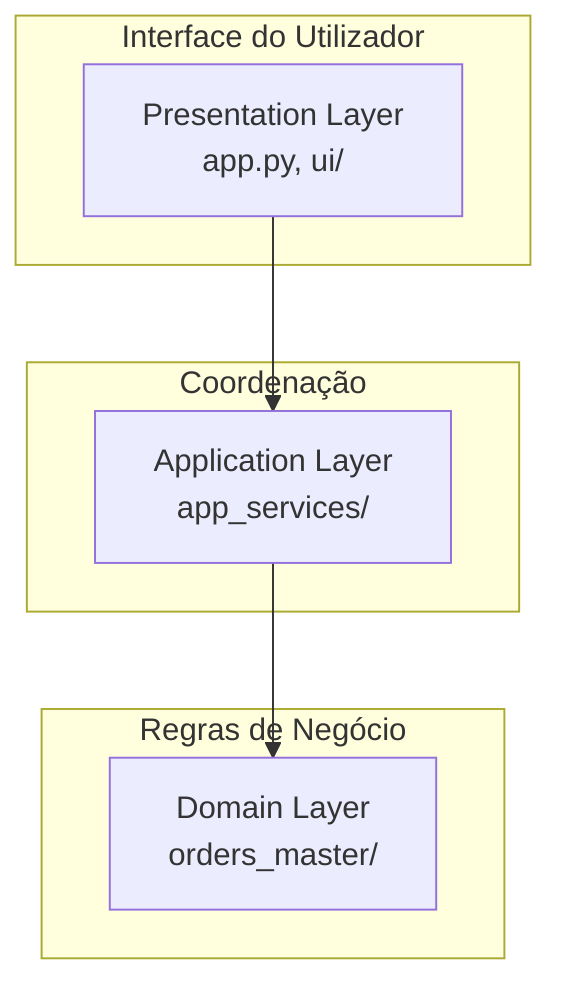
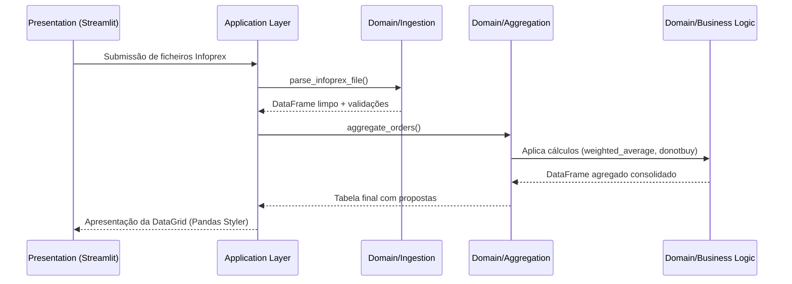

# Arquitectura e Padrões de Design

O projecto segue uma arquitectura em camadas com separação estrita entre domínio e apresentação. Todas as dependências apontam para o domínio; nenhum módulo de domínio importa código de apresentação. Isto permite o desacoplamento e a testabilidade das regras de negócio.

## Diagrama de Camadas



## Arquitectura em Camadas
- **Presentation (Apresentação):** `app.py` e a pasta `ui/`. Componentes puramente focados no Streamlit.
- **Application (Aplicação):** `orders_master/app_services/`. Coordena processos de ingestão, estado (Session State) e agregação.
- **Domain (Domínio):** Toda a pasta `orders_master/` (excepto app_services). Concentra as integrações externas, lógicas de limpeza, validações de schema e constantes. Esta camada **desconhece por completo a existência do Streamlit**.

## Fluxo de Dados (Data Flow)



## Estrutura de Directorias
```text
orders_master_infoprex/
├── app.py                          # Entry-point do Streamlit
├── config/                         # Configurações JSON/YAML editáveis em produção
├── orders_master/                  # Domínio puro (agnóstico de framework web)
│   ├── constants.py                # Centralização de constantes
│   ├── schemas.py                  # Schemas tipados (Pydantic)
│   ├── ingestion/                  # Lógica de parsing (txt, csv)
│   ├── aggregation/                # Lógica de agregação core
│   ├── business_logic/             # Cálculo de médias, limpeza e propostas
│   ├── integrations/               # Integrações externas (Google Sheets)
│   ├── config/                     # Loaders com validação de schemas
│   ├── formatting/                 # Fonte única de verdade de regras visuais
│   └── app_services/               # Lógica de coordenação (Application Layer)
├── ui/                             # Camada de apresentação Streamlit
└── tests/                          # Testes unitários e de integração
```

## Padrões de Design e Decisões Críticas
As decisões estruturais deste projeto encontram-se rigorosamente documentadas. Para um aprofundamento das mesmas, consulte o ficheiro de [ADRs (Architecture Decision Records)](adrs.md).

Decisões arquitecturais *key*:
- **Separação UI/Domínio ([ADR-002](adrs.md)):** Absoluta blindagem entre Streamlit e a lógica pura do negócio (Pandas/Python puro).
- **Single Source of Truth para formatações ([ADR-003](adrs.md)):** As regras de negócio residem centralmente num só local e ditam quer a apresentação Web, quer o documento exportado para o Excel.
- **Endereçamento Posicional ([ADR-004](adrs.md)):** Resiliência a calendários através do offset baseado na âncora relacional `T Uni`.
- **Aggregate-once + recalculate-in-memory ([ADR-005](adrs.md)):** Processamento pesado apenas no carregamento inicial; recálculos responsivos na filtragem.
