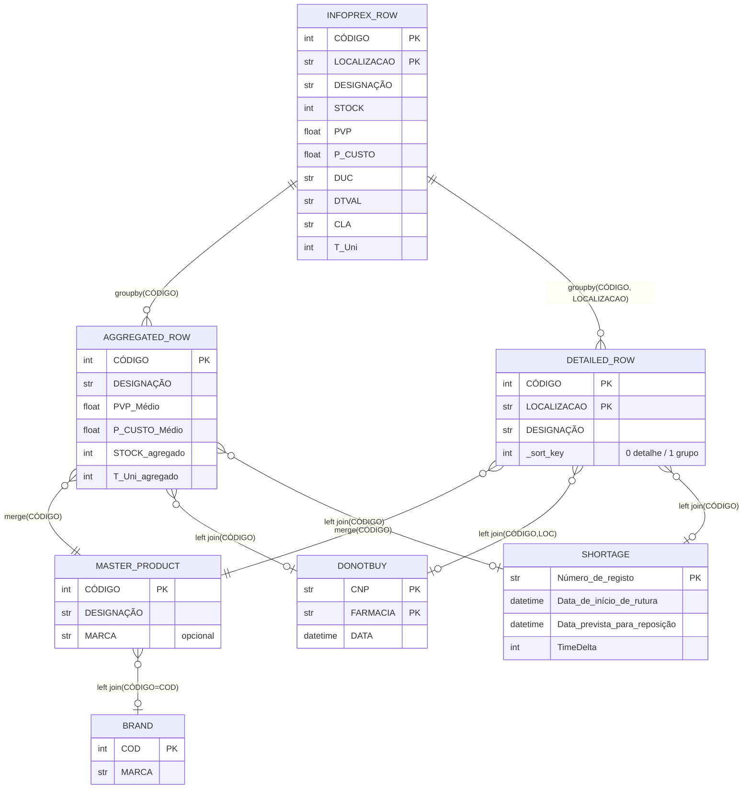

# PRD v2 — Orders Master Infoprex
> **Versão:** 2.0
> **Data:** 2026-05-04
> **Estado:** Activo (em redacção)
> **Âmbito:** Componente de Sell Out / Encomendas.
> **Exclusão Explícita:** Toda a componente de Redistribuição de Stocks está fora do âmbito deste documento.

---

## Aviso de Leitura

Este PRD foi construído para especificar um projecto **do zero**, num ambiente limpo, sem qualquer dependência ou referência ao código-fonte de implementações anteriores. Todas as regras, algoritmos e decisões aqui descritas devem ser reimplementados a partir da especificação, não copiados de qualquer base de código existente.

Quando for indispensável ilustrar uma regra de negócio através de um excerto de código, esse excerto é marcado como `[SNIPPET AUXILIAR]` e serve exclusivamente de orientação conceptual — **não é código de produção**.

---

## Índice

- [§1 — Visão e Objectivos](#1--visão-e-objectivos)
  - [§1.1 — Proposta de Valor](#11--proposta-de-valor)
  - [§1.2 — Objectivos de Negócio (mensuráveis)](#12--objectivos-de-negócio-mensuráveis)
  - [§1.3 — Fora de Âmbito (exclusões explícitas)](#13--fora-de-âmbito-exclusões-explícitas)
- [§2 — Utilizadores e Casos de Uso](#2--utilizadores-e-casos-de-uso)
  - [§2.1 — Perfis de Utilizador (personas)](#21--perfis-de-utilizador-personas)
  - [§2.2 — Casos de Uso Principais (user stories)](#22--casos-de-uso-principais-user-stories)
  - [§2.3 — Fluxos Críticos (passo a passo)](#23--fluxos-críticos-passo-a-passo)
- [§3 — Arquitectura do Sistema](#3--arquitectura-do-sistema)
  - [§3.1 — Diagrama de Arquitectura](#31--diagrama-de-arquitectura)
  - [§3.2 — Componentes Principais e Responsabilidades](#32--componentes-principais-e-responsabilidades)
  - [§3.3 — Padrões de Design Adoptados e Justificação](#33--padrões-de-design-adoptados-e-justificação)
  - [§3.4 — Estrutura de Directorias do Projecto](#34--estrutura-de-directorias-do-projecto)
- [§4 — Modelo de Dados](#4--modelo-de-dados)
  - [§4.1 — Entidades e Atributos](#41--entidades-e-atributos)
  - [§4.2 — Relações e Cardinalidades](#42--relações-e-cardinalidades)
  - [§4.3 — Regras de Validação de Dados](#43--regras-de-validação-de-dados)
- [§5 — Lógica de Negócio Core](#5--lógica-de-negócio-core)
  - [§5.1 — Ingestão e Pré-Processamento](#51--ingestão-e-pré-processamento)
  - [§5.2 — Filtragem Multi-Nível](#52--filtragem-multi-nível)
  - [§5.3 — Agregação (Vistas Agrupada e Detalhada)](#53--agregação-vistas-agrupada-e-detalhada)
  - [§5.4 — Cálculo de Propostas de Encomenda](#54--cálculo-de-propostas-de-encomenda)
  - [§5.5 — Sistema de Marcas (filtro UI)](#55--sistema-de-marcas-filtro-ui)
  - [§5.6 — Tratamento de Casos Extremos e Erros](#56--tratamento-de-casos-extremos-e-erros)
- [§6 — Interfaces e Integrações](#6--interfaces-e-integrações)
  - [§6.1 — Interface com o Utilizador](#61--interface-com-o-utilizador)
  - [§6.2 — APIs e Fontes Externas](#62--apis-e-fontes-externas)
  - [§6.3 — Formatos de Ficheiros Input/Output](#63--formatos-de-ficheiros-inputoutput)
- [§7 — Requisitos Não-Funcionais](#7--requisitos-não-funcionais)
  - [§7.1 — Performance](#71--performance)
  - [§7.2 — Segurança e Privacidade](#72--segurança-e-privacidade)
  - [§7.3 — Manutenibilidade](#73--manutenibilidade)
  - [§7.4 — Logging e Observabilidade](#74--logging-e-observabilidade)
- [§8 — Melhorias Integradas como Requisitos Core](#8--melhorias-integradas-como-requisitos-core)
  - [§8.1 — Arquitectura Modular Domain-vs-UI](#81--arquitectura-modular-domain-vs-ui)
  - [§8.2 — Constantes Centralizadas e Schema Tipado](#82--constantes-centralizadas-e-schema-tipado)
  - [§8.3 — Motor de Agregação Único](#83--motor-de-agregação-único)
  - [§8.4 — Pesos da Média Ponderada Configuráveis](#84--pesos-da-média-ponderada-configuráveis)
  - [§8.5 — Validação de Preços (PVP/P.CUSTO anómalos)](#85--validação-de-preços-pvppcusto-anómalos)
  - [§8.6 — Nome de Ficheiro Excel Descritivo](#86--nome-de-ficheiro-excel-descritivo)
  - [§8.7 — Scope Summary Bar](#87--scope-summary-bar)
  - [§8.8 — File Inventory Pós-Processamento](#88--file-inventory-pós-processamento)
  - [§8.9 — Barra de Progresso na Ingestão](#89--barra-de-progresso-na-ingestão)
  - [§8.10 — Lazy Merge da BD Esgotados](#810--lazy-merge-da-bd-esgotados)
  - [§8.11 — Parallel Parsing de Ficheiros Infoprex](#811--parallel-parsing-de-ficheiros-infoprex)
  - [§8.12 — Limpeza de Designações Vectorizada](#812--limpeza-de-designações-vectorizada)
  - [§8.13 — Bateria de Testes Unitários](#813--bateria-de-testes-unitários)
  - [§8.14 — Secrets via `st.secrets` / Secrets Manager](#814--secrets-via-stsecrets--secrets-manager)
  - [§8.15 — Schema-Validation de Configuração JSON](#815--schema-validation-de-configuração-json)
  - [§8.16 — Invalidação de Cache por `mtime` (consistente)](#816--invalidação-de-cache-por-mtime-consistente)
  - [§8.17 — Logging Estruturado](#817--logging-estruturado)
  - [§8.18 — Rótulo `Grupo` com Ordenação Desacoplada](#818--rótulo-grupo-com-ordenação-desacoplada)
  - [§8.19 — Match de Localização com Ancoragem](#819--match-de-localização-com-ancoragem)
- [§9 — Glossário e Definições](#9--glossário-e-definições)
- [§10 — Decisões de Arquitectura Registadas (ADRs)](#10--decisões-de-arquitectura-registadas-adrs)

---

## §1 — Visão e Objectivos

### §1.1 — Proposta de Valor

O **Orders Master Infoprex** é uma aplicação web interna destinada a um grupo de farmácias comunitárias. Transforma ficheiros de exportação de vendas do módulo Infoprex do Sifarma (software de gestão de farmácia) em **propostas de encomenda** consolidadas multi-loja, aplicando regras determinísticas de agregação, médias ponderadas sobre histórico de vendas e ajustes por rutura (BD oficial Infarmed) e por lista colaborativa de exclusões.

**Problema resolvido:** a consolidação manual de vendas entre várias lojas para preparar encomendas a fornecedores é um processo moroso, propenso a erros humanos (transcrição, soma, interpretação de histórico) e pouco auditável. Pequenas discrepâncias propagam-se até à compra final, resultando em rupturas por sub-encomenda ou stock excessivo por sobre-encomenda.

**Valor entregue:**
- **Tempo:** redução do tempo de preparação de propostas de horas para segundos.
- **Determinismo:** pipeline reprodutível — os mesmos inputs produzem sempre os mesmos outputs.
- **Auditabilidade:** cada número exibido é rastreável à sua fórmula e aos dados de origem.
- **Adaptabilidade:** o sistema ajusta automaticamente a proposta quando um produto está em rutura conhecida, cobrindo apenas o intervalo até à reposição prevista em vez de cobertura plena.
- **Prevenção:** sinaliza visualmente produtos em lista de "não comprar" e validades curtas, prevenindo compras indesejadas e perdas por caducidade.

→ TASK-01, TASK-02

### §1.2 — Objectivos de Negócio (mensuráveis)

Cada objectivo segue o formato `[OBJ-N] Enunciado → Indicador de sucesso mensurável`.

| ID | Objectivo | Indicador |
|---|---|---|
| OBJ-1 | Consolidar vendas multi-farmácia num único dataset | Aplicação aceita simultaneamente N ≥ 1 ficheiros Infoprex e produz uma tabela única com linha de detalhe por loja + linha de totais. |
| OBJ-2 | Permitir filtragem flexível de portefólio | Dois mecanismos suportados: (a) selecção de laboratórios via `multiselect`, (b) upload de lista explícita de CNPs em `.txt`. A presença de (b) tem prioridade absoluta sobre (a). |
| OBJ-3 | Calcular proposta de compra automaticamente | Para cada produto: `Proposta = round(Media_Ponderada × Meses_Previsão − Stock)` com 4 pesos configuráveis e 2 modos de janela (mês actual vs. mês anterior). |
| OBJ-4 | Integrar BD oficial de produtos esgotados | Produtos identificados na BD Infarmed usam fórmula alternativa baseada em `TimeDelta` (dias até reposição prevista), recalculado dinamicamente contra a data corrente. |
| OBJ-5 | Prevenir compras indesejadas | Produtos presentes na lista colaborativa "Não Comprar" (por `(CNP, Farmácia)` no modo detalhado, por `CNP` no modo agrupado) são visualmente destacados. |
| OBJ-6 | Alertar sobre validades curtas | Produtos com validade `≤ 4 meses` a partir da data corrente são destacados com cor distinta. |
| OBJ-7 | Paridade visual estrita Web↔Excel | O ficheiro Excel exportado deve reproduzir fielmente todas as cores, bold e formatação condicional visíveis na tabela web. |
| OBJ-8 | Escalabilidade por configuração externa | Novos laboratórios e aliases de farmácia são acrescentados editando ficheiros de configuração, sem alterar código Python. |
| OBJ-9 | Experiência de utilização fluida | Após o carregamento inicial (botão "Processar Dados"), toda e qualquer interacção subsequente (toggle, slider, filtro de marca) deve recalcular a tabela em tempo real (< 1 segundo de percepção) sem reprocessar ficheiros. |
| OBJ-10 | Testabilidade e qualidade | Cobertura de testes unitários da lógica de domínio ≥ 80% (`pytest` + `pytest-cov`). CI executa a suite a cada PR. |

→ TASK-01 a TASK-50 (a detalhar em `tasks.md`)

### §1.3 — Fora de Âmbito (exclusões explícitas)

As seguintes componentes **não** fazem parte deste projecto e não devem ser implementadas nem mencionadas em nenhum outro ponto deste PRD:

1. **Redistribuição Inteligente de Stocks entre Farmácias.** Toda a lógica de mover stock entre lojas (imunidade DUC, histerese de cobertura, destino forte, etc.) está excluída.
2. **Autenticação, autorização e multi-tenancy.** A aplicação é interna, corre localmente ou numa rede privada, e assume um único grupo de farmácias por instalação. Sem conceito de utilizadores, permissões ou tenants.
3. **Integração automática com APIs do Sifarma.** A integração é exclusivamente via upload manual de ficheiros `.txt` exportados pelo utilizador.
4. **Integração directa com o fornecedor.** O output do sistema é um Excel — a submissão da encomenda ao fornecedor é um passo manual subsequente fora do sistema.
5. **Gestão histórica de encomendas.** O sistema não persiste propostas geradas nem mantém histórico de decisões. Cada sessão é independente.
6. **Internacionalização (i18n).** A UI é exclusivamente em Português Europeu. Os dados são exclusivamente em Português (nomes de laboratórios, designações de produtos, nomes de meses).
7. **Mobile responsiveness.** A aplicação é desenhada para desktop (layout `wide` do Streamlit), requerendo ecrãs de pelo menos 1280px de largura.
8. **Análise preditiva avançada.** Não existe machine learning, redes neuronais, forecasting ARIMA/Prophet ou qualquer modelo estatístico além da média ponderada de 4 meses com pesos fixos (ou presets documentados).

→ ADR-001 (registo da decisão de exclusão da Redistribuição)

---

## §2 — Utilizadores e Casos de Uso

### §2.1 — Perfis de Utilizador (personas)

O sistema é usado por um conjunto reduzido e estável de perfis internos. Não existe registo nem autenticação; todos os utilizadores partilham o mesmo acesso.

**Persona P1 — Responsável de Compras (primary user)**
- Função: director(a) técnico(a) ou responsável de compras do grupo de farmácias.
- Contexto de uso: sessões semanais ou bi-semanais de preparação de encomendas.
- Nível técnico: médio. Confortável com Excel avançado. Não programa.
- Objectivos: gerar rapidamente uma proposta consolidada que possa rever manualmente e enviar a um fornecedor.
- Critério de sucesso: "em 5 minutos tenho um Excel pronto para partilhar".

**Persona P2 — Farmacêutico de Loja (ocasional)**
- Função: farmacêutico(a) que gere a exportação Infoprex de uma loja específica.
- Contexto de uso: esporádico, tipicamente só para consultar vendas da sua loja.
- Nível técnico: baixo. Quer interacção mínima.
- Objectivos: consultar sell-out da sua farmácia sem ter de interpretar dados agregados.
- Critério de sucesso: "activo o toggle de detalhe, vejo a minha loja, pronto".

**Persona P3 — Administrador de Dados (ocasional)**
- Função: pessoa responsável por manter `laboratorios.json`, `localizacoes.json`, a Google Sheet de "Não Comprar" e a ligação à BD Esgotados.
- Contexto de uso: raro, apenas para manutenção.
- Nível técnico: médio-alto. Edita JSON, sabe o que é uma URL pública.
- Objectivos: acrescentar um laboratório novo, corrigir um alias de loja, rever regras de caching.
- Critério de sucesso: "edito o JSON, recarrego a página, as alterações aparecem sem reiniciar o servidor".

### §2.2 — Casos de Uso Principais (user stories)

**US-01 — Geração de proposta para um laboratório único**
> Como Responsável de Compras (P1), quero seleccionar um laboratório (ex: "Mylan") e carregar os ficheiros Infoprex de todas as farmácias, para obter uma proposta consolidada de encomenda apenas para esse portefólio. → PRD §5.2, §5.4 → TASK-10, TASK-14, TASK-19

**US-02 — Geração de proposta para uma lista explícita de CNPs**
> Como P1, quero carregar um ficheiro `.txt` com CNPs específicos e obter a proposta apenas para esses produtos, ignorando qualquer selecção de laboratório, para preparar encomendas pontuais de produtos-chave. → PRD §5.2 → TASK-10, TASK-11

**US-03 — Ajuste do horizonte de cobertura**
> Como P1, quero ajustar o número de meses a prever (entre 1.0 e 6.0 com passo 0.1) para simular diferentes níveis de cobertura de stock. A proposta deve recalcular instantaneamente sem reprocessar ficheiros. → PRD §5.4 → TASK-20, TASK-27

**US-04 — Alternar entre mês actual e mês anterior**
> Como P1, quero alternar entre "média baseada nos 4 meses anteriores à data de venda mais recente" e "média saltando o mês corrente em curso (incompleto) e usando os 4 meses completos anteriores" para obter propostas conservadoras no final de cada mês. → PRD §5.4 → TASK-21

**US-05 — Visualização detalhada por farmácia**
> Como P2, quero activar um toggle de "Ver Detalhe" para passar da vista agregada (1 linha por produto) à vista detalhada (N linhas por produto, uma por loja + linha "Grupo") para analisar o comportamento por loja. → PRD §5.3, §6.1 → TASK-25, TASK-26

**US-06 — Filtragem dinâmica por marca comercial**
> Como P1, quero carregar CSVs auxiliares com associação `CÓDIGO → MARCA` e filtrar a tabela por uma ou mais marcas seleccionadas. As opções disponíveis devem reflectir apenas marcas presentes no portefólio visível, sem gerar selecções que produzam tabelas vazias. → PRD §5.5 → TASK-30, TASK-31

**US-07 — Destaque automático de produtos em rutura**
> Como P1, quero ver claramente (célula `Proposta` a vermelho) os produtos que estão em rutura segundo a BD oficial Infarmed, com indicação da Data de Início da Rutura (DIR) e Data Prevista de Reposição (DPR). A fórmula da proposta para estes produtos deve ser ajustada para cobrir apenas o intervalo até à reposição. → PRD §5.4.5, §6.2 → TASK-15, TASK-22

**US-08 — Destaque de produtos a não comprar**
> Como P1, quero ver em fundo roxo claro os produtos que foram marcados pela equipa como "não comprar" (com data da marcação visível), para evitar incluí-los na encomenda por engano. → PRD §6.2 → TASK-16

**US-09 — Alerta de validade curta**
> Como P1, quero ver em fundo laranja a célula de validade (DTVAL) dos produtos cuja validade expira em `≤ 4 meses` (incluindo já expirados), para gerir prioritariamente esses produtos. → PRD §5.4 → TASK-40

**US-10 — Exportação para Excel com paridade visual**
> Como P1, quero descarregar um Excel que reproduza exactamente o que vejo na tabela web (cores, bold, formatação condicional), para partilhar com colegas sem necessidade de explicações adicionais. → PRD §6.3 → TASK-41, TASK-42

**US-11 — Detecção de filtros obsoletos**
> Como P1, quero ser avisado quando alterei os filtros da sidebar (laboratório, ficheiro TXT) sem ter clicado em "Processar Dados", para não exportar dados desactualizados. → PRD §5.6, §6.1 → TASK-28

**US-12 — Manutenção do mapeamento de laboratórios**
> Como Administrador de Dados (P3), quero editar `laboratorios.json` em produção e ver as alterações reflectidas sem reiniciar o servidor (cache invalidation por `mtime` do ficheiro). → PRD §8.16 → TASK-06

**US-13 — Aviso de dados faltantes ou corrompidos**
> Como P1, quero que, se um ficheiro Infoprex estiver corrompido ou não tiver as colunas esperadas, o sistema processe os outros normalmente e apresente uma mensagem clara identificando o ficheiro problemático. → PRD §5.6 → TASK-13

**US-14 — Transparência do filtro activo**
> Como P1, quero ver em permanência um banner de resumo no topo da tabela que diga qual é o âmbito actual: "127 produtos | 4 farmácias | Laboratórios: Mylan, Teva | Janela: JAN-ABR 2026 | Previsão: 2.5 meses". → PRD §8.7 → TASK-33

**US-15 — File Inventory após processamento**
> Como P1, quero ver, após clicar "Processar Dados", uma tabela-resumo dos ficheiros carregados (farmácia reconhecida, nome do ficheiro, nº de linhas, data da venda mais recente detectada), para confirmar que não carreguei por engano o ficheiro errado. → PRD §8.8 → TASK-34

**US-16 — Barra de progresso na ingestão**
> Como P1, com 4-5 ficheiros Infoprex de 30MB cada, quero uma barra de progresso com texto ("a processar `Guia.txt` — 3/5") em vez de um spinner indefinido, para saber que o sistema está a trabalhar. → PRD §8.9 → TASK-12

### §2.3 — Fluxos Críticos (passo a passo)

#### §2.3.1 — Fluxo Principal: "Preparar encomenda para o laboratório Mylan"

1. Utilizador (P1) abre a aplicação no browser.
2. **Sidebar — Bloco 1 "Filtrar por Laboratório":** selecciona `Mylan` no `multiselect`.
3. **Sidebar — Bloco 2 "Filtrar por Códigos":** deixa vazio (prioriza o laboratório).
4. **Sidebar — Bloco 3 "Dados Base Infoprex":** carrega os ficheiros `Guia.txt`, `Ilha.txt`, `Colmeias.txt`, `Souto.txt`.
5. **Sidebar — Bloco 4 "Base de Marcas":** opcionalmente carrega `Infoprex_SIMPLES.csv`.
6. Clica no botão `🚀 Processar Dados`.
7. Sistema exibe **barra de progresso** (US-16) durante o parsing dos 4 ficheiros.
8. Sistema exibe **File Inventory** (US-15) confirmando as 4 lojas detectadas e a data de venda máxima de cada uma.
9. Sistema exibe o **Scope Summary Bar** (US-14) com o âmbito actual.
10. Sistema renderiza a tabela **Vista Agrupada** com:
    - Coluna `Proposta` calculada com pesos `[0.4, 0.3, 0.2, 0.1]` e `Meses_Previsão = 1.0` (default).
    - Produtos em rutura com célula `Proposta` a **vermelho** + colunas `DIR`/`DPR` preenchidas.
    - Produtos "não comprar" com fundo **roxo claro** até `T Uni`.
    - Produtos com validade curta com célula `DTVAL` a **laranja**.
11. Utilizador ajusta slider `Meses a prever` para `2.5`. Tabela **recalcula instantaneamente** (sem reprocessar ficheiros).
12. Utilizador activa toggle `Média com base no mês ANTERIOR?`. Tabela recalcula.
13. Utilizador activa toggle `Ver Detalhe de Sell Out?`. Sistema troca para Vista Detalhada (N linhas por produto, uma por loja + linha `Grupo`).
14. Utilizador clica em `Download Excel Encomendas` → descarrega `Sell_Out_Mylan_20260504_1430.xlsx` (US-10).
15. Utilizador fecha o browser. Nenhum estado é persistido.

#### §2.3.2 — Fluxo Alternativo: "Lista explícita de CNPs"

1–4: passos 1–2 saltados; no bloco 2, carrega `codigos_prioritarios.txt` contendo uma lista de CNPs (um por linha).
5. Sistema processa apenas os CNPs listados, **ignorando** qualquer selecção de laboratório.
6–15: idênticos ao fluxo principal.

#### §2.3.3 — Fluxo de Excepção: "Ficheiro Corrompido"

1–6: passos normais; entre os 4 ficheiros, `Souto.txt` está corrompido (encoding desconhecido ou sem as colunas `CPR`/`DUV`).
7. Durante o parse, o sistema apanha a excepção apenas desse ficheiro, acrescenta a mensagem de erro à lista `erros_ficheiros`, e continua com os 3 ficheiros válidos.
8. No final, mostra no topo da área de dados:
   - `❌ Erro no ficheiro 'Souto.txt': O ficheiro não contém as colunas estruturais esperadas (CPR, DUV).`
9. A tabela é gerada com apenas 3 lojas. A linha `Grupo` reflecte o total de 3 lojas.
10. O utilizador decide: corrigir o ficheiro e reprocessar, ou prosseguir com dados parciais.

#### §2.3.4 — Fluxo de Manutenção: "Adicionar novo laboratório"

1. Administrador (P3) abre `laboratorios.json` num editor de texto.
2. Acrescenta: `"NovoLab": ["12345", "67890"]`.
3. Guarda o ficheiro.
4. Na aplicação em execução, recarrega a página (F5).
5. Sistema detecta `mtime` alterado → invalida cache → recarrega JSON → `NovoLab` aparece no `multiselect`.

→ TASK-06

#### §2.3.5 — Fluxo de Excepção: "Filtros alterados sem reprocessamento"

1. Utilizador tem dados carregados e tabela visível de processamento anterior.
2. Altera a selecção no `multiselect` de Laboratórios.
3. Sistema detecta divergência entre `opcoes_sidebar['labs_selecionados']` e `st.session_state.last_labs`.
4. Exibe banner amarelo: `⚠️ Filtros Modificados! Os dados apresentados encontram-se desactualizados. Clique novamente em 'Processar Dados'.`
5. **A tabela não é apagada** — a decisão de reprocessar é do utilizador.

---

## §3 — Arquitectura do Sistema

### §3.1 — Diagrama de Arquitectura

O sistema segue uma arquitectura em camadas com separação rígida entre **domínio** (lógica de negócio pura) e **apresentação** (UI Streamlit). Todas as dependências apontam para o domínio; nenhum módulo de domínio importa código de apresentação.

```mermaid
flowchart TD
    subgraph Presentation["🖥️ Camada de Apresentação (app.py + ui/)"]
        UI_SIDEBAR["Sidebar<br/>(4 blocos: Labs, TXT, Infoprex, Marcas)"]
        UI_TABLE["Tabela Principal<br/>(Agrupada / Detalhada)"]
        UI_EXPORT["Botão Download Excel"]
        UI_SCOPE["Scope Summary Bar"]
        UI_INVENTORY["File Inventory"]
        UI_ALERTS["Avisos e Erros"]
    end

    subgraph Application["⚙️ Camada de Aplicação (orders_master/app_services/)"]
        SVC_PROCESS["process_orders_session()<br/>orquestra ingestão + agregação"]
        SVC_RECALC["recalculate_proposal()<br/>recálculo em memória"]
        SVC_STATE["SessionState<br/>dataclass tipada"]
    end

    subgraph Domain["🧠 Camada de Domínio (orders_master/)"]
        direction TB
        DOM_INGEST["ingestion/<br/>infoprex_parser<br/>codes_txt_parser<br/>brands_parser"]
        DOM_AGG["aggregation/<br/>aggregate() único"]
        DOM_BL["business_logic/<br/>weighted_average<br/>base_proposal<br/>shortage_proposal"]
        DOM_FMT["formatting/<br/>web_styler<br/>excel_formatter"]
        DOM_INT["integrations/<br/>shortages_sheet<br/>donotbuy_sheet"]
        DOM_CFG["config/<br/>labs_loader<br/>locations_loader"]
        DOM_CONST["constants.py<br/>Columns, Labels, Weights"]
        DOM_SCHEMA["schemas.py<br/>pydantic DataFrame schemas"]
    end

    subgraph External["🌐 Fontes Externas"]
        EXT_TXT[/"Ficheiros .txt Infoprex"/]
        EXT_CSV[/"CSVs Infoprex_SIMPLES"/]
        EXT_CODES[/"Ficheiro .txt de CNPs"/]
        EXT_JSON[("laboratorios.json<br/>localizacoes.json")]
        EXT_SECRETS[(".streamlit/secrets.toml")]
        EXT_GS1[/"Google Sheet<br/>BD Esgotados Infarmed"/]
        EXT_GS2[/"Google Sheet<br/>Produtos Não Comprar"/]
    end

    UI_SIDEBAR --> SVC_PROCESS
    UI_TABLE --> SVC_RECALC
    UI_EXPORT --> DOM_FMT
    SVC_PROCESS --> DOM_INGEST
    SVC_PROCESS --> DOM_AGG
    SVC_PROCESS --> SVC_STATE
    SVC_RECALC --> DOM_BL
    SVC_RECALC --> DOM_INT
    DOM_INGEST --> DOM_CONST
    DOM_INGEST --> DOM_SCHEMA
    DOM_AGG --> DOM_CONST
    DOM_BL --> DOM_CONST
    DOM_FMT --> DOM_CONST
    DOM_CFG --> DOM_CONST
    EXT_TXT --> DOM_INGEST
    EXT_CSV --> DOM_INGEST
    EXT_CODES --> DOM_INGEST
    EXT_JSON --> DOM_CFG
    EXT_SECRETS --> DOM_INT
    EXT_GS1 --> DOM_INT
    EXT_GS2 --> DOM_INT

    classDef pres fill:#e3f2fd,stroke:#1976d2,color:#000
    classDef app fill:#fff3e0,stroke:#ef6c00,color:#000
    classDef dom fill:#ede7f6,stroke:#5e35b1,color:#000
    classDef ext fill:#fce4ec,stroke:#c2185b,color:#000

    class UI_SIDEBAR,UI_TABLE,UI_EXPORT,UI_SCOPE,UI_INVENTORY,UI_ALERTS pres
    class SVC_PROCESS,SVC_RECALC,SVC_STATE app
    class DOM_INGEST,DOM_AGG,DOM_BL,DOM_FMT,DOM_INT,DOM_CFG,DOM_CONST,DOM_SCHEMA dom
    class EXT_TXT,EXT_CSV,EXT_CODES,EXT_JSON,EXT_SECRETS,EXT_GS1,EXT_GS2 ext
```



**Fluxo principal de dados (happy path):**

1. UI capta interacção do utilizador (sidebar + botão Processar).
2. `app_services.process_orders_session()` é invocado — coordena:
   - `domain.ingestion.parse_infoprex_file()` em paralelo por ficheiro.
   - `domain.ingestion.parse_codes_txt()` se aplicável.
   - `domain.ingestion.parse_brands_csv()` se aplicável.
   - `domain.aggregation.aggregate(df, detailed=False)` para a vista agrupada.
   - `domain.aggregation.aggregate(df, detailed=True)` para a vista detalhada.
   - Guarda resultado em `SessionState` (Streamlit `session_state` via façade tipada).
3. A cada interacção subsequente (slider, toggle, filtro marca):
   - `app_services.recalculate_proposal()` lê do `SessionState`, aplica `business_logic`, integra com `integrations.fetch_shortages()` e `integrations.fetch_donotbuy()`, devolve DataFrame final.
4. UI delega a renderização a `domain.formatting.web_styler()` e, sob pedido de download, a `domain.formatting.excel_formatter()`.

→ TASK-01, TASK-02, TASK-08

### §3.2 — Componentes Principais e Responsabilidades

| Componente | Tipo | Responsabilidade | Não-Responsabilidades |
|---|---|---|---|
| `orders_master/constants.py` | Domínio — Constantes | Define todos os literais de nomes de colunas, rótulos, cores, pesos, limites. | Não contém lógica. |
| `orders_master/schemas.py` | Domínio — Contratos | Define os schemas tipados (pydantic) das DataFrames: `InfoprexRowSchema`, `AggregatedRowSchema`, `ShortageRowSchema`, `DoNotBuyRowSchema`, `BrandRowSchema`. | Não valida dados em runtime dentro de loops quentes; validação é aplicada em fronteiras. |
| `orders_master/ingestion/infoprex_parser.py` | Domínio — Ingestão | Lê ficheiro `.txt` Infoprex, aplica fallback de encoding, filtra por localização (DUV máximo), inverte meses, renomeia colunas. Aceita filtros (CLA ou CNPs) para aplicar durante a leitura. | Não faz agregação. Não conhece Streamlit. |
| `orders_master/ingestion/codes_txt_parser.py` | Domínio — Ingestão | Lê lista de CNPs de um ficheiro `.txt`, aceitando linhas só-dígitos; descarta o resto. | — |
| `orders_master/ingestion/brands_parser.py` | Domínio — Ingestão | Lê um ou mais CSVs de marcas, consolida, deduplica por `COD`. | — |
| `orders_master/aggregation/aggregator.py` | Domínio — Agregação | Função única `aggregate(df, detailed: bool, master_products: DataFrame) -> DataFrame`. Aplica filtro anti-zombies, groupby soma, cálculo de médias, merge com master list de designações canónicas. | Não calcula propostas. |
| `orders_master/business_logic/averages.py` | Domínio — Lógica | Cálculo de média ponderada com pesos configuráveis; selecção de janela (mês actual vs anterior). | Não conhece o schema das DataFrames; recebe arrays. |
| `orders_master/business_logic/proposals.py` | Domínio — Lógica | `compute_base_proposal()` e `compute_shortage_proposal()`. | — |
| `orders_master/business_logic/cleaners.py` | Domínio — Lógica | `clean_designation()` vectorizado (`.str`, sem `.apply`). `remove_zombie_rows()` pós-agregação. | — |
| `orders_master/integrations/shortages.py` | Domínio — Integrações | `fetch_shortages_db()` com cache TTL. Recalcula `TimeDelta` dinamicamente contra `datetime.now()`. | Não tem UI. Falha silenciosa devolve `DataFrame` vazio com schema preservado. |
| `orders_master/integrations/donotbuy.py` | Domínio — Integrações | `fetch_donotbuy_list()` com cache TTL. Dedup `(CNP, FARMACIA)` mantendo `DATA` mais recente. | — |
| `orders_master/config/labs_loader.py` | Domínio — Config | Carrega `laboratorios.json` com validação de schema (pydantic). Invalidação de cache por `mtime`. | — |
| `orders_master/config/locations_loader.py` | Domínio — Config | Carrega `localizacoes.json`. **Invalidação por `mtime` (consistente com labs)**. Match por substring com ancoragem configurável. | — |
| `orders_master/formatting/web_styler.py` | Domínio — Formatação | Função `build_styler(df) -> pd.io.formats.style.Styler`. Encapsula as 4 regras visuais (grupo, não comprar, rutura, validade). | — |
| `orders_master/formatting/excel_formatter.py` | Domínio — Formatação | Função `build_excel(df) -> bytes`. As mesmas 4 regras traduzidas em openpyxl. | — |
| `orders_master/formatting/rules.py` | Domínio — Formatação | **Fonte única de verdade** para as regras condicionais (critério + cor). Consumida por `web_styler` e `excel_formatter`. | — |
| `orders_master/logger.py` | Transversal | Configuração central de `logging` com handler rotativo + stream. | — |
| `orders_master/app_services/session_service.py` | Aplicação | Orquestra ingestão + agregação. Popula `SessionState`. | — |
| `orders_master/app_services/recalc_service.py` | Aplicação | Orquestra o recálculo leve (propostas + integrações). | — |
| `orders_master/app_services/session_state.py` | Aplicação | Façade tipada sobre `st.session_state` (dataclass). | — |
| `app.py` | Apresentação | Entry-point Streamlit. Invoca `ui.render_sidebar()`, `ui.render_main()`. | Não contém lógica de negócio. |
| `ui/sidebar.py` | Apresentação | Renderiza os 4 blocos da sidebar. Devolve `SidebarSelection` tipada. | — |
| `ui/main_area.py` | Apresentação | Renderiza banner BD, expanders, toggles, tabela, botão download. | — |
| `ui/scope_bar.py` | Apresentação | Componente `Scope Summary Bar` (US-14). | — |
| `ui/file_inventory.py` | Apresentação | Componente `File Inventory` (US-15). | — |

→ TASK-02 (estrutura), TASK-05 (constantes + schemas), TASK-11 a TASK-17 (domain modules), TASK-23 a TASK-28 (app services + UI)

### §3.3 — Padrões de Design Adoptados e Justificação

**P1 — Layered Architecture (Presentation → Application → Domain).**
*Problema:* o original mistura Streamlit com Pandas numa teia impossível de testar isoladamente.
*Decisão:* dependências apontam para dentro (`UI → services → domain`), nunca ao contrário. `domain/*` não importa `streamlit`. Torna-se possível testar toda a lógica de negócio com `pytest` puro. → ADR-002

**P2 — Single Source of Truth para regras de formatação.**
*Problema:* no original, as regras visuais (grupo preto, não comprar roxo, rutura vermelho, validade laranja) estão duplicadas entre Styler e openpyxl, correndo risco de divergência silenciosa.
*Decisão:* `formatting/rules.py` define cada regra como uma dataclass (`HighlightRule(predicate, target_cells, colors)`). Ambos os renderers consomem a mesma lista. Acrescentar uma regra nova exige uma só alteração. → ADR-003

**P3 — Position-relative column addressing via âncora `T Uni`.**
*Problema:* os nomes dos meses (JAN, FEV, ...) são dinâmicos — dependem da data de venda mais recente detectada. Hardcoding de nomes cria bugs sazonais.
*Decisão:* qualquer cálculo sobre meses usa `index_of('T Uni') − N`. O contrato é: entre `T Uni − 5` e `T Uni − 1` têm de estar exclusivamente colunas de vendas; qualquer metadata (MARCA, etc.) tem de ser dropada antes. É um invariante testado por `tests/test_column_ordering.py`. → ADR-004

**P4 — Aggregate-once + recalculate-in-memory.**
*Problema:* se cada movimento de slider reprocessasse ficheiros de 30MB, a UX seria inaceitável.
*Decisão:* `process_orders_session` é pesado e corre só quando o utilizador clica `Processar Dados`. Todo o resto (slider, toggle, filtros de marca) invoca apenas `recalculate_proposal`, que trabalha sobre DataFrames já em `SessionState`. → ADR-005

**P5 — Decorator-based caching com invalidação por `mtime`.**
*Problema:* ficheiros JSON editáveis em produção exigem recarregamento sem restart do servidor.
*Decisão:* funções como `load_labs(mtime)` recebem `mtime` como argumento; o chamador obtém `os.path.getmtime(path)` e passa o valor. Qualquer edição ao ficheiro produz novo `mtime` → cache miss. Aplicado consistentemente a `laboratorios.json` **e** `localizacoes.json` (o original tinha-o só em labs). → ADR-006

**P6 — Defensive parsing com recolha de erros por item (não abortiva).**
*Problema:* um ficheiro corrompido não deve derrubar o processamento dos outros.
*Decisão:* o loop de ingestão faz `try/except` com excepções tipadas, regista os erros por ficheiro numa lista, e continua. Os erros são exibidos ao utilizador de forma amigável, não como stack trace. → ADR-007

**P7 — Sort-key auxiliar para desacoplar ordenação de rótulo.**
*Problema:* o original usa o prefixo `Z` em `'Zgrupo_Total'` para forçar ordenação alfabética a colocar a linha de total no fim, misturando identidade semântica com mecânica de ordenação.
*Decisão:* na agregação, acrescentar uma coluna `_sort_key ∈ {0, 1}` (0 para detalhe, 1 para linha de grupo). Ordenar por `[DESIGNAÇÃO, CÓDIGO, _sort_key, LOCALIZACAO]`. Dropar `_sort_key` antes de render. O rótulo exibido é `'Grupo'` desde o início. → ADR-008

**P8 — Domain types e schema validation nas fronteiras.**
*Problema:* DataFrames sem contrato tipado fazem typos silenciosos em `df['CODIGO']` vs `df['CÓDIGO']`.
*Decisão:* `schemas.py` define cada DataFrame como um pydantic model listando colunas obrigatórias, opcionais e dtypes. Entry-points (parsers, integradores) validam no ponto de entrada. Loops quentes não pagam custo de validação — acreditam no contrato. → ADR-009

**P9 — Parallel file parsing com `concurrent.futures`.**
*Problema:* com 4-5 ficheiros de 30MB, o parsing sequencial é linear no número de ficheiros.
*Decisão:* `ProcessPoolExecutor` com `max_workers = min(cpu_count, len(files))`. Cada worker devolve um DataFrame independente (ou uma mensagem de erro tipada). O merge é feito sequencialmente após todos terminarem. → ADR-010

**P10 — Vectorised operations only.**
*Problema:* `.apply(lambda ...)` do original em `clean_designation` é 5-10× mais lento que `.str` vectorizado.
*Decisão:* nenhuma função de domínio usa `.apply` com lambdas Python sobre colunas. Toda a limpeza de strings passa por `.str.normalize`, `.str.replace`, etc. → ADR-011

→ TASK-01 a TASK-05

### §3.4 — Estrutura de Directorias do Projecto

```
orders_master_infoprex/
├── app.py                          # Streamlit entry-point (thin)
├── pyproject.toml                  # Configuração de projecto (deps, tool config)
├── requirements.txt                # Dependências congeladas
├── README.md                       # Instruções de setup e uso
├── .gitignore                      # Garante exclusão de .env e secrets.toml
├── .streamlit/
│   └── secrets.toml                # URLs Google Sheets (NUNCA commitado)
├── config/
│   ├── laboratorios.json           # Mapping nome_lab → [códigos CLA]
│   ├── localizacoes.json           # Aliases farmácia
│   └── presets.yaml                # Presets de pesos (Conservador/Padrão/Agressivo)
├── orders_master/                  # ===== CAMADA DE DOMÍNIO =====
│   ├── __init__.py
│   ├── constants.py                # Columns, Labels, Weights, Colors, Limits
│   ├── schemas.py                  # Pydantic DataFrame schemas
│   ├── logger.py                   # logging setup
│   ├── ingestion/
│   │   ├── __init__.py
│   │   ├── infoprex_parser.py      # parse_infoprex_file()
│   │   ├── codes_txt_parser.py     # parse_codes_txt()
│   │   ├── brands_parser.py        # parse_brands_csv()
│   │   └── encoding_fallback.py    # try_read_with_fallback_encodings()
│   ├── aggregation/
│   │   ├── __init__.py
│   │   └── aggregator.py           # aggregate(df, detailed: bool)
│   ├── business_logic/
│   │   ├── __init__.py
│   │   ├── averages.py             # weighted_average(), select_window()
│   │   ├── proposals.py            # compute_base_proposal(), compute_shortage_proposal()
│   │   ├── cleaners.py             # clean_designation_vectorized(), remove_zombie_rows()
│   │   └── price_validation.py     # flag_price_anomalies()
│   ├── integrations/
│   │   ├── __init__.py
│   │   ├── shortages.py            # fetch_shortages_db() + merge logic
│   │   └── donotbuy.py             # fetch_donotbuy_list() + merge logic
│   ├── config/
│   │   ├── __init__.py
│   │   ├── labs_loader.py          # load_labs(mtime) com schema validation
│   │   └── locations_loader.py     # load_locations(mtime) com schema validation
│   ├── formatting/
│   │   ├── __init__.py
│   │   ├── rules.py                # HighlightRule dataclass + RULES: list
│   │   ├── web_styler.py           # build_styler(df)
│   │   └── excel_formatter.py      # build_excel(df) -> bytes
│   └── app_services/               # Camada de APLICAÇÃO
│       ├── __init__.py
│       ├── session_state.py        # SessionState dataclass + façade
│       ├── session_service.py      # process_orders_session()
│       └── recalc_service.py       # recalculate_proposal()
├── ui/                             # ===== CAMADA DE APRESENTAÇÃO =====
│   ├── __init__.py
│   ├── sidebar.py                  # render_sidebar() -> SidebarSelection
│   ├── main_area.py                # render_main(state)
│   ├── scope_bar.py                # render_scope_summary()
│   ├── file_inventory.py           # render_file_inventory()
│   ├── alerts.py                   # render_errors_and_warnings()
│   └── documentation.py            # render_help_expander()
└── tests/                          # ===== TESTES =====
    ├── conftest.py                 # Fixtures partilhadas
    ├── fixtures/
    │   ├── infoprex_mini.txt       # 3 produtos × 2 lojas × 15 meses
    │   ├── codigos_sample.txt
    │   ├── marcas_sample.csv
    │   ├── shortages_sample.xlsx
    │   └── donotbuy_sample.xlsx
    ├── unit/
    │   ├── test_encoding_fallback.py
    │   ├── test_infoprex_parser.py
    │   ├── test_codes_txt_parser.py
    │   ├── test_brands_parser.py
    │   ├── test_aggregator.py
    │   ├── test_averages.py
    │   ├── test_proposals.py
    │   ├── test_cleaners.py
    │   ├── test_price_validation.py
    │   ├── test_shortages_integration.py
    │   ├── test_donotbuy_integration.py
    │   ├── test_labs_loader.py
    │   ├── test_locations_loader.py
    │   ├── test_web_styler.py
    │   ├── test_excel_formatter.py
    │   └── test_column_ordering.py # valida invariante âncora T Uni (ADR-004)
    └── integration/
        ├── test_full_pipeline.py
        └── test_boundary_year.py   # renomeação de meses em fronteira de ano
```

**Notas estruturais:**
- **`config/` no root** (não dentro de `orders_master/`) — permite que utilizadores não-técnicos editem os JSONs sem navegar em estrutura Python.
- **`.streamlit/secrets.toml`** — localização standard do Streamlit, garante suporte nativo via `st.secrets`.
- **Testes separados em `unit/` e `integration/`** — unit não requer rede nem ficheiros > 1KB; integration pode usar fixtures maiores.
- **`pyproject.toml`** em vez de `setup.py` — standard moderno Python.

→ TASK-01, TASK-02

---

## §4 — Modelo de Dados

### §4.1 — Entidades e Atributos

O modelo de dados é baseado em DataFrames Pandas com **schemas explícitos**. Cada entidade tem um contrato tipado (pydantic ou dataclass) definido em `orders_master/schemas.py`. Os nomes das colunas são constantes, definidos em `constants.py::Columns`.

#### §4.1.1 — Entidade: **InfoprexRow** (linha individual de um ficheiro Infoprex pós-parsing)

Representa uma linha de produto + loja, após a ingestão e antes da agregação.

| Campo | Tipo | Obrigatório | Descrição | Origem |
|---|---|---|---|---|
| `CÓDIGO` | `int` | ✔ | Código Nacional do Produto (CNP). Convertido a partir de `CPR`. | Infoprex `CPR` |
| `DESIGNAÇÃO` | `str` | ✔ | Nome comercial do produto, normalizado (sem acentos, sem `*`, Title Case). | Infoprex `NOM` |
| `LOCALIZACAO` | `str` | ✔ | Alias curto da farmácia (via `localizacoes.json`). | Infoprex `LOCALIZACAO` |
| `STOCK` | `int` | ✔ | Stock actual da loja. | Infoprex `SAC` |
| `PVP` | `float` | ✔ | Preço de venda ao público. | Infoprex `PVP` |
| `P.CUSTO` | `float` | ✔ | Preço de custo. | Infoprex `PCU` |
| `DUC` | `str` ou `NaT` | ◯ | Data da Última Compra (formato `%d/%m/%Y`). | Infoprex `DUC` |
| `DTVAL` | `str` | ◯ | Data de Validade (formato `MM/YYYY`). | Infoprex `DTVAL` |
| `CLA` | `str` | ◯ | Código de classe/laboratório. Usado apenas para filtragem; removido antes de apresentação. | Infoprex `CLA` |
| `<MES_1>..<MES_15>` | `int` | ✔ | 15 colunas de vendas mensais (inteiros). Nomes dinâmicos — abreviaturas PT dos meses (JAN, FEV, ..., DEZ), com sufixo numérico (`MES.1`, `MES.2`) em caso de colisão (histórico > 12 meses). Ordem: mais antigo à esquerda, mais recente à direita. | Infoprex `V14..V0` invertido |
| `T Uni` | `int` | ✔ | Total de unidades vendidas no período (soma das 15 colunas de meses). | Calculado |

**Nota:** o campo `MARCA` (se disponível via CSVs) aparece temporariamente em DataFrames downstream, mas é **sempre dropado** antes do cálculo posicional e antes da apresentação (ver §5.5 e ADR-004).

**Regras de nomeação dinâmica de meses:** ver §5.1.

#### §4.1.2 — Entidade: **AggregatedRow** (linha agregada — vista única multi-loja)

Resultado de `aggregate(df, detailed=False)`. Uma linha por `CÓDIGO`, sem discriminação de loja.

| Campo | Tipo | Obrigatório | Descrição | Diferenças face a InfoprexRow |
|---|---|---|---|---|
| `CÓDIGO` | `int` | ✔ | — | — |
| `DESIGNAÇÃO` | `str` | ✔ | Designação canónica (primeira encontrada na master list). | Única designação, não múltiplas. |
| `PVP_Médio` | `float` | ✔ | Média aritmética simples do PVP entre lojas, arredondada a 2 casas. | Renomeado de `PVP`. |
| `P.CUSTO_Médio` | `float` | ✔ | Média aritmética simples de P.CUSTO, arredondada a 2 casas. | Renomeado de `P.CUSTO`. |
| `<MES_1>..<MES_15>` | `int` | ✔ | Soma das vendas por mês somadas entre as lojas. | Agregado. |
| `T Uni` | `int` | ✔ | Soma dos `T Uni` das lojas. | Agregado. |
| `STOCK` | `int` | ✔ | Stock total do grupo (soma de todas as lojas). | Agregado. |

**Colunas excluídas:** `LOCALIZACAO`, `DUC`, `DTVAL`, `CLA` — não fazem sentido agregar ou são irrelevantes à vista.

#### §4.1.3 — Entidade: **DetailedRow** (linha detalhada — vista com discriminação por loja)

Resultado de `aggregate(df, detailed=True)`. Contém uma linha por `(CÓDIGO, LOCALIZACAO)` + uma linha sumária por `CÓDIGO` com `LOCALIZACAO = 'Grupo'`.

| Campo | Tipo | Obrigatório | Descrição |
|---|---|---|---|
| `CÓDIGO` | `int` | ✔ | — |
| `DESIGNAÇÃO` | `str` | ✔ | Designação canónica. |
| `LOCALIZACAO` | `str` | ✔ | Nome da farmácia, ou literal `'Grupo'` para linha sumária. |
| `PVP_Médio` | `float` | ✔ | Média nos detalhes, soma re-agregada na linha `Grupo` (coerência com agrupada). |
| `P.CUSTO` | `float` | ✔ | Preço de custo individual por loja. Na linha `Grupo`, média. |
| `<MES_1>..<MES_15>` | `int` | ✔ | Vendas da loja (ou totais do grupo). |
| `T Uni` | `int` | ✔ | — |
| `STOCK` | `int` | ✔ | — |
| `DUC` | `str` | ◯ | Visível apenas nas linhas de detalhe. `NaT` ou ausente na linha `Grupo`. |
| `DTVAL` | `str` | ◯ | Idem. |

**Regras de ordenação:** `[DESIGNAÇÃO ASC, CÓDIGO ASC, _sort_key ASC, LOCALIZACAO ASC]`, onde `_sort_key = 0` para detalhe e `1` para linha `Grupo` (coluna auxiliar descartada antes de apresentação). → ADR-008

#### §4.1.4 — Entidade: **ShortageRecord** (BD de Esgotados do Infarmed)

Fonte: Google Sheet pública. Uma linha por produto em rutura conhecida.

| Campo | Tipo | Obrigatório | Descrição |
|---|---|---|---|
| `Número de registo` | `str` | ✔ | CNP — chave de merge com `CÓDIGO` (convertido a string em ambos os lados). |
| `Nome do medicamento` | `str` | ◯ | Informativo. Não exibido na tabela final. |
| `Data de início de rutura` | `datetime` → `str` | ✔ | Data em que a rutura começou. Renomeada para `DIR` após merge, formatada como `%d-%m-%Y`. |
| `Data prevista para reposição` | `datetime` | ✔ | Data estimada de fim da rutura. Renomeada para `DPR` após merge. |
| `TimeDelta` | `int` | ✔ (recalculado) | Dias até à reposição. **O valor original da sheet é descartado** — recalculado no runtime como `(Data_Reposição − datetime.now().date()).days`. |
| `Data da Consulta` | `str` | ◯ | Informativo. Exibido no banner BD Rupturas (`YYYY-MM-DD`). |

**Semântica de merge:**
- Left join: `CÓDIGO (int) == Número de registo (int)`.
- Produtos sem match → `DIR`, `DPR`, `TimeDelta` ficam `NaN` → fórmula base da proposta (§5.4.2).
- Produtos com match → fórmula de rutura (§5.4.3).

#### §4.1.5 — Entidade: **DoNotBuyRecord** (Produtos a Não Comprar)

Fonte: Google Sheet pública colaborativa. Uma linha por `(CNP, Farmácia)` a evitar.

| Campo | Tipo | Obrigatório | Descrição |
|---|---|---|---|
| `CNP` | `str` | ✔ | Código do produto. |
| `FARMACIA` | `str` | ✔ | Nome da farmácia (coerente com o alias produzido por `mapear_localizacao`). |
| `DATA` | `datetime` → `str` | ✔ | Data em que o produto foi marcado. Renomeada para `DATA_OBS` após merge (formato `%d-%m-%Y`). |

**Dedup:** se a mesma `(CNP, FARMACIA)` aparece várias vezes, mantém a `DATA` mais recente.

**Semântica de merge:**
- **Vista Detalhada:** `merge(left_on=['CÓDIGO', 'LOCALIZACAO'], right_on=['CNP', 'FARMACIA'])`.
- **Vista Agrupada:** primeiro deduplica por CNP (mantendo `DATA` mais recente), depois `merge(left_on='CÓDIGO', right_on='CNP')`.
- Linhas com match → `DATA_OBS` preenchida → aciona highlighting roxo.

#### §4.1.6 — Entidade: **BrandRecord** (ficheiros Infoprex_SIMPLES)

Fonte: upload de CSVs. Uma linha por `(CÓDIGO, MARCA)`.

| Campo | Tipo | Obrigatório | Descrição |
|---|---|---|---|
| `COD` | `int` | ✔ | Código do produto. Convertido para `int` após parsing. |
| `MARCA` | `str` | ✔ | Nome da marca comercial. Usado exclusivamente para filtragem UI. |

**Dedup:** por `COD`, mantém a primeira `MARCA` vista.

#### §4.1.7 — Entidade: **FinalProposalRow** (output final — o que o utilizador vê e exporta)

Resultado de `recalculate_proposal()`, combinando Aggregated/Detailed com integrações e cálculos.

| Campo | Tipo | Origem |
|---|---|---|
| `CÓDIGO`, `DESIGNAÇÃO`, `LOCALIZACAO` (só detalhada), `PVP_Médio`, `P.CUSTO_Médio`/`P.CUSTO`, `<MESES>`, `T Uni`, `STOCK` | Aggregated/Detailed |
| `DIR`, `DPR` | Shortages integration |
| `Proposta` | Calculada (base ou rutura) |
| `DATA_OBS` | DoNotBuy integration |
| `DUC`, `DTVAL` (só detalhada) | Aggregated/Detailed |

**Colunas descartadas antes de renderização:** `CLA`, `MARCA`, `_sort_key`, `CÓDIGO_STR` (aux. merge), `TimeDelta`.

#### §4.1.8 — Entidade: **SessionState** (estado persistido na sessão Streamlit)

Façade tipada (dataclass) sobre `st.session_state`.

| Campo | Tipo | Descrição |
|---|---|---|
| `df_aggregated` | `pd.DataFrame` | Vista agregada pós-processamento. |
| `df_detailed` | `pd.DataFrame` | Vista detalhada pós-processamento. |
| `df_master_products` | `pd.DataFrame` | Master list canónica `(CÓDIGO, DESIGNAÇÃO, MARCA?)`. |
| `last_labs_selection` | `list[str] \| None` | Último valor do multiselect de laboratórios aquando do processamento. Usado para detectar filtros obsoletos (US-11). |
| `last_codes_file_name` | `str \| None` | Nome do último ficheiro TXT de códigos processado. |
| `file_errors` | `list[FileError]` | Erros capturados durante ingestão, um por ficheiro. |
| `invalid_codes` | `list[str]` | Códigos rejeitados por não converterem a `int`. |
| `file_inventory` | `list[FileInventoryEntry]` | Para renderização de US-15. |
| `scope_context` | `ScopeContext` | Para renderização de US-14. |

### §4.2 — Relações e Cardinalidades



**Cardinalidades-chave:**

| Relação | Cardinalidade | Notas |
|---|---|---|
| `InfoprexRow` → `AggregatedRow` | N:1 | N linhas (uma por loja por produto) colapsam em 1 por produto. |
| `InfoprexRow` → `DetailedRow` | 1:1 + 1 adicional por `CÓDIGO` | Cada linha de input vai a 1 linha de detalhe; adicionalmente, para cada `CÓDIGO` é criada 1 linha `Grupo`. |
| `AggregatedRow` ↔ `MasterProduct` | N:1 | Muitos resultados agregados em épocas diferentes podem referenciar o mesmo produto. |
| `MasterProduct` ↔ `Brand` | 1:0..1 | Nem todo o produto tem marca associada (left join). |
| `FinalProposalRow` ↔ `Shortage` | 1:0..1 | Produto pode ou não estar em rutura. Left join preservando linha. |
| `FinalProposalRow` ↔ `DoNotBuy` | 1:0..1 (agrupada) / 1:0..1 (detalhada) | Left join. |

### §4.3 — Regras de Validação de Dados

A validação é aplicada **nas fronteiras** (ingestão de ficheiros, leitura de config, chegada de dados externos) e **não dentro** de loops quentes de agregação ou cálculo.

#### §4.3.1 — Validação na Ingestão Infoprex

Todas estas validações estão em `orders_master/ingestion/infoprex_parser.py`. → TASK-11

| Regra | Acção se falha | Severidade |
|---|---|---|
| Ficheiro abre-se com pelo menos um dos encodings `utf-16`, `utf-8`, `latin1` | Raise `InfoprexEncodingError` com nome do ficheiro | ERROR |
| Colunas estruturais presentes: `CPR` **e** `DUV` | Raise `InfoprexSchemaError` | ERROR |
| Coluna `DUV` tem pelo menos uma data válida (`%d/%m/%Y`) | Warning; processa sem filtrar localização | WARNING |
| `CPR` convertível para `int` após prefixo filter | Colecta códigos inválidos para exibir em `invalid_codes`; continua | WARNING |
| Códigos começados por `'1'` | Silent drop (regra de negócio: são códigos locais) | INFO (log) |
| Pelo menos 4 colunas de vendas presentes (`V0..V3`) | Warning; proposta pode não ser calculável | WARNING |

#### §4.3.2 — Validação de Preços (nova — §8.5)

Pós-ingestão, antes da agregação. Em `orders_master/business_logic/price_validation.py`. → TASK-18

| Regra | Acção |
|---|---|
| `P.CUSTO ≤ 0` | Marcar linha com flag `price_anomaly=True`. Excluir do cálculo da média de `P.CUSTO`. Ícone de aviso na célula visual. |
| `PVP < P.CUSTO` | Idem (regra anti-margem-negativa). |
| `PVP ≤ 0` | Marcar; excluir do cálculo de média. |
| Ambos válidos | Flag `False`, participa normalmente. |

**Implementação:** adiciona uma coluna booleana auxiliar `price_anomaly` que segue até à formatação visual, onde é consumida para renderizar um ícone "⚠️" na célula `PVP_Médio`. **Nunca entra em cálculos numéricos.**

#### §4.3.3 — Validação de Configuração JSON

Em `orders_master/config/labs_loader.py` e `locations_loader.py`. → TASK-06, TASK-07

**Schema pydantic para `laboratorios.json`:**

```python
# [SNIPPET AUXILIAR] — orientação conceptual, não código de produção
class LabsConfig(RootModel):
    root: dict[LabName, list[ClaCode]]

class LabName(str):
    # Title Case ou PascalCase
    min_length = 2
    pattern = r'^[A-Z][\w_]+$'

class ClaCode(str):
    min_length = 1
    max_length = 10
    pattern = r'^[A-Za-z0-9]+$'  # Alfanuméricos permitidos
```

**Regras adicionais no `labs_loader.py`:**

| Regra | Acção se falha |
|---|---|
| Ficheiro é JSON válido | Raise `ConfigError` com linha/coluna |
| Schema pydantic passa | Raise `ConfigError` com detalhe do campo |
| Dentro de cada lista de CLAs, sem duplicados (`list(set(lista)) == lista`) | Warning no log; dedup automático e continua |
| Chaves únicas | Garantido por ser `dict` JSON |
| Aviso se o mesmo CLA aparece em múltiplos laboratórios | Warning; no multiselect, comportamento definido é "primeiro match vence" |

**Schema para `localizacoes.json`:**

```python
# [SNIPPET AUXILIAR]
class LocationsConfig(RootModel):
    root: dict[SearchTerm, Alias]
    # SearchTerm: min 3 caracteres para evitar match por substring frágil (ADR-012)
```

#### §4.3.4 — Validação de Integrações Externas

Em `orders_master/integrations/shortages.py` e `donotbuy.py`. → TASK-15, TASK-16

| Regra | Acção se falha |
|---|---|
| URL responde com HTTP 200 e devolve XLSX parseável | Log warning; devolve DataFrame vazio com schema preservado (colunas presentes mas 0 linhas) |
| Colunas obrigatórias presentes na sheet | Log error; devolve DataFrame vazio |
| Datas parseáveis em `%d/%m/%Y` ou ISO | Linhas inválidas são descartadas com log |

**Princípio:** a aplicação **nunca** crasha por falha de integração externa. Degrada graciosamente para o comportamento "sem esgotados" ou "sem lista não-comprar".

#### §4.3.5 — Validação de DataFrames em Fronteira

Todas as funções públicas do domínio validam o DataFrame de entrada uma única vez:

```python
# [SNIPPET AUXILIAR]
def aggregate(df: pd.DataFrame, detailed: bool, master_products: pd.DataFrame) -> pd.DataFrame:
    InfoprexRowSchema.validate(df)  # pydantic
    MasterProductSchema.validate(master_products)
    # ... resto do processamento sem re-validação ...
```

→ TASK-05 (schemas), TASK-11 a TASK-17 (aplicação nas fronteiras)

---

## §5 — Lógica de Negócio Core

Toda a lógica de domínio está em `orders_master/` e é **independente do Streamlit**. Cada função é testável em isolamento com `pytest` puro.

### §5.1 — Ingestão e Pré-Processamento

Pipeline de `orders_master/ingestion/infoprex_parser.py::parse_infoprex_file(file_like, lista_cla, lista_codigos)`. → TASK-11

#### §5.1.1 — Sequência de Operações (ordem obrigatória)

A ordem é crítica — várias regras dependem do estado produzido pela regra anterior.

```
1. Abrir ficheiro com fallback de encoding
        │
        ▼
2. Ler CSV com tabulação como separador, usecols a colunas alvo
        │
        ▼
3. Validar presença de CPR + DUV
        │
        ▼
4. Parse de DUV para datetime, identificar data_max e localização alvo
        │
        ▼
5. Filtrar linhas: manter apenas as da localização alvo
        │
        ▼
6. Aplicar filtro de códigos (TXT) se presente — PRIORIDADE
   OU aplicar filtro de CLAs se presente
   (mutuamente exclusivos; TXT ganha)
        │
        ▼
7. Inverter cronologicamente V0..V14 → V14, V13, ..., V1, V0
        │
        ▼
8. Calcular T Uni = soma das vendas
        │
        ▼
9. Renomear colunas de vendas para abreviaturas PT dinâmicas (JAN, FEV, ...)
   com tratamento de duplicados via sufixo .1, .2, ...
        │
        ▼
10. Renomear colunas base: CPR→CÓDIGO, NOM→DESIGNAÇÃO, SAC→STOCK, PCU→P.CUSTO
        │
        ▼
11. Validar e converter CÓDIGO para int (drop linhas não-numéricas)
        │
        ▼
12. Mapear LOCALIZACAO para alias via localizacoes.json
        │
        ▼
13. Drop silencioso de CÓDIGOs começados por '1' (códigos locais)
        │
        ▼
14. Flag de anomalias de preço (price_anomaly column)
        │
        ▼
15. Devolver InfoprexRow DataFrame + FileInventoryEntry
```

**Regra de idempotência:** correr o parser duas vezes sobre o mesmo ficheiro produz DataFrames idênticos em conteúdo e ordem.

#### §5.1.2 — Fallback de Encoding

Sequência estrita de tentativas:

1. `utf-16` (default Sifarma/Windows com BOM).
2. `utf-8`.
3. `latin1`.

Se todos falharem → `raise InfoprexEncodingError("Codificação não suportada: {path}")`.

Implementação em `orders_master/ingestion/encoding_fallback.py::try_read_with_fallback_encodings()`. → TASK-09

#### §5.1.3 — Redução de Memória via `usecols`

Colunas-alvo a ler:

```
base       = ['CPR', 'NOM', 'LOCALIZACAO', 'SAC', 'PVP', 'PCU', 'DUC', 'DTVAL', 'CLA', 'DUV']
vendas     = ['V0', 'V1', ..., 'V14']
colunas_alvo = base + vendas
```

Passado a `pd.read_csv(usecols=lambda c: c in colunas_alvo)`. Efeito mensurado no original: redução de ~50% do footprint em memória.

#### §5.1.4 — Filtragem de Localização (DUV máximo)

Razão de negócio: um ficheiro Infoprex pode conter registos históricos de localizações já não activas (movimentações internas). O "dono" efectivo do ficheiro é a localização cuja data de última venda é a mais recente.

**Algoritmo:**

1. `DUV → datetime(format='%d/%m/%Y', errors='coerce')`. Valores inválidos → `NaT`.
2. `data_max = DUV.max()` (ignora `NaT`).
3. Se todas `NaT` → log warning + devolve DataFrame sem filtrar.
4. `localizacao_alvo = primeiro valor de LOCALIZACAO onde DUV == data_max`.
5. `df = df[LOCALIZACAO == localizacao_alvo]`.
6. Devolve `(df_filtrado, data_max)`. `data_max` é input do passo 9.

#### §5.1.5 — Inversão Cronológica das Colunas de Vendas

Razão: o Infoprex exporta com `V0` = mais recente, `V14` = mais antigo. Leitura humana natural é passado→presente da esquerda para a direita.

```python
# [SNIPPET AUXILIAR]
vendas_presentes = [c for c in VENDAS_COLS if c in df.columns]
vendas_invertidas = vendas_presentes[::-1]  # V14, V13, ..., V0
df = df[BASE_COLS_PRESENTES + vendas_invertidas]
```

#### §5.1.6 — Renomeação Dinâmica de Meses (PT)

Dicionário `MESES_PT = {1:'JAN', 2:'FEV', 3:'MAR', 4:'ABR', 5:'MAI', 6:'JUN', 7:'JUL', 8:'AGO', 9:'SET', 10:'OUT', 11:'NOV', 12:'DEZ'}`.

Para cada `V{i}` em `vendas_invertidas` (i.e., i = 14, 13, ..., 1, 0):
- `mes_alvo = data_max - relativedelta(months=i)` *(usar `dateutil.relativedelta` é mais robusto que `pd.DateOffset` em fronteira de ano; ver §8.13)*.
- `nome_base = MESES_PT[mes_alvo.month]`.

**Tratamento de duplicados** (inevitável com > 12 meses de histórico):

```python
# [SNIPPET AUXILIAR]
meses_vistos: dict[str, int] = {}
rename_dict: dict[str, str] = {}
for col_v in vendas_invertidas:
    nome_mes = compute_nome_mes(col_v, data_max)  # aplicar a regra acima
    count = meses_vistos.get(nome_mes, 0)
    novo_nome = f"{nome_mes}.{count}" if count > 0 else nome_mes
    meses_vistos[nome_mes] = count + 1
    rename_dict[col_v] = novo_nome
df = df.rename(columns=rename_dict)
```

**Invariante:** a primeira ocorrência (mais antiga, coluna da esquerda) fica com nome puro; repetições recebem sufixo `.1`, `.2`. Garante compatibilidade com PyArrow (backend do Streamlit para tabelas).

**Edge case crítico — fronteira de ano:** cobertura obrigatória por teste — `data_max = 15/01/2026` com 15 meses de histórico faz nomes atravessarem anos diferentes (2024→2026). Teste `tests/integration/test_boundary_year.py`. → TASK-37

#### §5.1.7 — Cálculo de `T Uni`

Depois da inversão e antes da renomeação:

```python
df['T Uni'] = df[vendas_presentes].sum(axis=1)
```

`T Uni` funciona como **âncora posicional** para tudo a jusante (ADR-004).

#### §5.1.8 — Renomeação Base

| Infoprex | Interno |
|---|---|
| `CPR` | `CÓDIGO` |
| `NOM` | `DESIGNAÇÃO` |
| `SAC` | `STOCK` |
| `PCU` | `P.CUSTO` |
| `PVP` | `PVP` (sem alteração aqui; vira `PVP_Médio` na agregação) |
| `DUC` | `DUC` (sem alteração) |
| `DTVAL` | `DTVAL` |
| `CLA` | `CLA` (será descartada antes de apresentação) |
| `LOCALIZACAO` | `LOCALIZACAO` |
| `DUV` | — (consumida e descartada no passo 4) |

#### §5.1.9 — Mapeamento de Localização (alias)

Em `orders_master/config/locations_loader.py::map_location(name, aliases)`. → TASK-07

Algoritmo:
1. `name_lower = name.lower().strip()`.
2. Iterar `aliases.items()`; para cada `(search_term, alias)`:
   - `if search_term.lower() in name_lower:` → `return alias.title()`.
3. Se nada bater → `return name.title()`.

**Melhoria ADR-012 (vs. original):** `SearchTerm` tem de ter `min_length=3` validado por schema, evitando falsos positivos (`"ilha"` bater em `"Vilha"`).

#### §5.1.10 — Descarte Silencioso de Códigos Locais

Regra de negócio: CNPs começados por `'1'` são códigos locais/internos, não registados no sistema nacional de medicamentos. Excluir sempre.

```python
# [SNIPPET AUXILIAR]
mask_local = df['CÓDIGO'].astype(str).str.strip().str.startswith('1')
df = df[~mask_local].copy()
```

Aplicado **após** o `concat` multi-ficheiro em `aggregation/aggregator.py`, não dentro do parser individual. Razão: evita I/O redundante (o parser descartaria um código que outro ficheiro não descartaria).

→ TASK-11, TASK-14

### §5.2 — Filtragem Multi-Nível

Aplicada em cascata para reduzir o volume de dados o mais cedo possível.

#### §5.2.1 — Nível 1: Ficheiro TXT de Códigos (PRIORIDADE ABSOLUTA)

**Parsing em** `orders_master/ingestion/codes_txt_parser.py::parse_codes_txt(file_like) -> list[int]`. → TASK-10

```python
# [SNIPPET AUXILIAR]
def parse_codes_txt(file_like) -> list[int]:
    content = file_like.read().decode("utf-8", errors="replace")
    codes = []
    for line in content.splitlines():
        stripped = line.strip()
        if stripped.isdigit():  # apenas dígitos
            codes.append(int(stripped))
    return codes
```

**Propriedades:**
- Cabeçalhos, comentários, linhas em branco, linhas mistas são descartados silenciosamente.
- Deduplicação garantida pelo filtro `isin()` downstream.

**Aplicação:** dentro de `parse_infoprex_file`, imediatamente após filtragem de localização:

```python
# [SNIPPET AUXILIAR]
if codigos_prioritarios:
    df = df[df['CPR'].astype(str).str.strip().isin([str(c) for c in codigos_prioritarios])]
```

**Regra de exclusividade:** se este filtro está activo, o filtro por CLA (§5.2.2) **não corre**.

#### §5.2.2 — Nível 2: Selecção de Laboratórios (CLA)

A partir do `multiselect` da sidebar, construir `lista_cla`:

```python
# [SNIPPET AUXILIAR]
lista_cla: list[str] = []
for lab in labs_selecionados:
    lista_cla.extend(labs_config.get(lab, []))
```

Aplicação (comparação case-insensitive em string):

```python
# [SNIPPET AUXILIAR]
elif lista_cla:  # só entra se filtro TXT está vazio
    df = df[df['CLA'].astype(str).str.strip().str.lower()
              .isin([c.strip().lower() for c in lista_cla])]
```

#### §5.2.3 — Nível 3: Descarte de Códigos Locais

Já descrito em §5.1.10. Corre **após concat multi-ficheiro**.

#### §5.2.4 — Nível 4: Filtro Anti-Zombies

Em `orders_master/business_logic/cleaners.py::remove_zombie_rows(df)`. → TASK-19

Zombie = produto com `STOCK == 0` **e** `T Uni == 0`. Sem valor analítico para propostas.

**Dois pontos de aplicação:**

a) **Dentro de `aggregate()` ANTES do groupby** — filtra linhas individuais (por loja × produto).
   ```python
   df = df[(df['STOCK'] != 0) | (df['T Uni'] != 0)]
   ```

b) **DEPOIS do groupby** (na vista agrupada e na detalhada) — filtra códigos cuja linha `Grupo` tem `STOCK == 0 AND T Uni == 0`.
   ```python
   # Identifica códigos zombie no agregado, remove todas as linhas desses códigos
   codigos_zombie = df_agregado[(df_agregado.STOCK == 0) & (df_agregado['T Uni'] == 0)]['CÓDIGO'].unique()
   df = df[~df['CÓDIGO'].isin(codigos_zombie)]
   ```

Razão: uma loja com stock residual de 1 unidade e zero vendas não é zombie individualmente, mas o grupo todo com essa característica é.

#### §5.2.5 — Nível 5: Filtro Dinâmico por Marca (UI)

Ver §5.5.

### §5.3 — Agregação (Vistas Agrupada e Detalhada)

Uma única função `orders_master/aggregation/aggregator.py::aggregate(df, detailed: bool, master_products: pd.DataFrame)`. → TASK-14

**Eliminação da duplicação original:** o código original tinha `sellout_total()` e `combina_e_agrega_df()` com ~80% de código repetido. A versão nova tem uma única implementação.

#### §5.3.1 — Master List Canónica (`df_master_products`)

Construída **uma vez** em `aggregator.py::build_master_products(df)`.

Pipeline:
1. Extrai `[CÓDIGO, DESIGNAÇÃO]`.
2. Aplica `clean_designation_vectorized()` (ver §5.3.2).
3. `drop_duplicates(subset=['CÓDIGO'], keep='first')`.
4. Reset index.

**Merge com marcas (opcional):** se existem CSVs de marcas:
```python
df_master = pd.merge(df_master, df_brands, left_on='CÓDIGO', right_on='COD', how='left')
df_master = df_master.drop(columns=['COD'])
```
Se não, `df_master['MARCA'] = pd.NA` (schema consistente).

#### §5.3.2 — Limpeza de Designações (vectorizado)

Em `orders_master/business_logic/cleaners.py::clean_designation_vectorized(series)`. → TASK-17

Melhoria vs original: **sem `.apply`**.

```python
# [SNIPPET AUXILIAR]
def clean_designation_vectorized(s: pd.Series) -> pd.Series:
    return (
        s.fillna('').astype(str)
         .str.normalize('NFD')
         .str.encode('ascii', 'ignore').str.decode('utf-8')
         .str.replace('*', '', regex=False)
         .str.strip()
         .str.title()
    )
```

Efeito: `"BEN-U-RON* 500mg"` → `"Ben-U-Ron 500Mg"`.

#### §5.3.3 — Algoritmo Central de Agregação

```python
# [SNIPPET AUXILIAR]
def aggregate(
    df: pd.DataFrame,
    detailed: bool,
    master_products: pd.DataFrame
) -> pd.DataFrame:
    # Schema validation em fronteira
    InfoprexRowSchema.validate(df)

    # 1. Filtro anti-zombies (nível individual)
    df = remove_zombie_rows(df)

    # 2. Identificar colunas a somar vs a preservar
    no_sum_cols = ['CÓDIGO', 'DESIGNAÇÃO', 'LOCALIZACAO', 'PVP', 'P.CUSTO',
                   'DUC', 'DTVAL', 'CLA', 'price_anomaly']
    sum_cols = [c for c in df.columns if c not in no_sum_cols]

    # 3. Agregação por grupo
    group_keys = ['CÓDIGO', 'LOCALIZACAO'] if detailed else ['CÓDIGO']
    df_sum = df.groupby(group_keys, as_index=False)[sum_cols].sum()

    # 4. Médias de PVP e P.CUSTO (excluindo linhas com price_anomaly)
    df_valid = df[~df['price_anomaly']]
    df_pvp = df_valid.groupby(group_keys, as_index=False)['PVP'].mean().round(2)
    df_pcusto = df_valid.groupby(group_keys, as_index=False)['P.CUSTO'].mean().round(2)

    # 5. Merge sum + médias
    df_agg = df_sum.merge(df_pvp, on=group_keys).merge(df_pcusto, on=group_keys)

    # 6. Se detailed: adicionar linha "Grupo" por CÓDIGO
    if detailed:
        df_group_row = df_agg.groupby('CÓDIGO', as_index=False)[sum_cols].sum()
        df_group_row['LOCALIZACAO'] = GROUP_ROW_LABEL  # 'Grupo'
        df_group_row_pvp = ...  # média das lojas
        df_group_row = df_group_row.merge(df_group_row_pvp, on='CÓDIGO')
        df_agg = pd.concat([df_agg, df_group_row], ignore_index=True)
        df_agg['_sort_key'] = (df_agg['LOCALIZACAO'] == GROUP_ROW_LABEL).astype(int)

    # 7. Merge com master products (injecta DESIGNAÇÃO canónica e MARCA)
    df_agg = df_agg.merge(master_products, on='CÓDIGO', how='left')

    # 8. Renomear PVP → PVP_Médio
    df_agg = df_agg.rename(columns={'PVP': 'PVP_Médio'})
    if not detailed:
        df_agg = df_agg.rename(columns={'P.CUSTO': 'P.CUSTO_Médio'})

    # 9. Reordenar colunas: CÓDIGO, DESIGNAÇÃO, (LOCALIZACAO), PVP_Médio, P.CUSTO, meses, T Uni, STOCK, ...
    df_agg = reorder_columns(df_agg, detailed)

    # 10. Filtro anti-zombie pós-agregação (nível grupo)
    df_agg = remove_zombie_aggregated(df_agg)

    # 11. Ordenar
    sort_cols = ['DESIGNAÇÃO', 'CÓDIGO'] + (['_sort_key', 'LOCALIZACAO'] if detailed else [])
    df_agg = df_agg.sort_values(by=sort_cols, ascending=True)

    return df_agg
```

**Observações:**
- `_sort_key` nunca é removido aqui; o drop final é feito **antes da apresentação** pela camada UI (ADR-008).
- `DESIGNAÇÃO` vem correctamente do merge com `master_products`, o que substitui designações inconsistentes entre lojas.

### §5.4 — Cálculo de Propostas de Encomenda

Em `orders_master/business_logic/proposals.py`. → TASK-20

Corre em tempo real a cada rerun do Streamlit (nunca cacheado), sobre DataFrames já em `SessionState`.

#### §5.4.1 — Indexação Posicional (invariante crítico)

Razão já documentada em §3.3 (P3) e ADR-004: nomes de meses são dinâmicos; o código **nunca** referencia colunas de mês por nome.

```python
# [SNIPPET AUXILIAR]
idx_tuni = df.columns.get_loc('T Uni')
```

**Contrato:** entre `idx_tuni - 5` e `idx_tuni - 1` só podem estar colunas de vendas. Qualquer metadata adicional (MARCA, CLA, _sort_key) tem de ser dropada antes de aceder a este bloco.

**Teste obrigatório:** `tests/unit/test_column_ordering.py::test_tuni_anchor_invariant` — força que o bloco de 4 posições antes de T Uni contenha apenas vendas numéricas. → TASK-36

#### §5.4.2 — Média Ponderada

Em `business_logic/averages.py::weighted_average(df, weights, window_offset)`. → TASK-21

**Pesos default:** `[0.4, 0.3, 0.2, 0.1]`. Configuráveis via preset (§8.4).

**Janela:**

| `window_offset` (ON/OFF do toggle "Mês Anterior") | Índices usados |
|---|---|
| `False` (default — "mês actual") | `[idx_tuni-1, idx_tuni-2, idx_tuni-3, idx_tuni-4]` |
| `True` ("mês anterior") | `[idx_tuni-2, idx_tuni-3, idx_tuni-4, idx_tuni-5]` |

```python
# [SNIPPET AUXILIAR]
def weighted_average(df: pd.DataFrame, weights: list[float], use_previous_month: bool) -> pd.Series:
    assert sum(weights) == 1.0, "Pesos devem somar 1.0"
    idx_tuni = df.columns.get_loc('T Uni')
    offset = 2 if use_previous_month else 1
    col_indices = [idx_tuni - offset - i for i in range(len(weights))]
    assert all(i >= 0 for i in col_indices), "Janela ultrapassa o início do histórico"
    cols = [df.columns[i] for i in col_indices]
    return df[cols].dot(weights)
```

#### §5.4.3 — Fórmula Base

$$\text{Proposta}_{\text{base}} = \text{round}(\text{Média} \times \text{Meses\_Previsão} - \text{STOCK})$$

```python
# [SNIPPET AUXILIAR]
df['Proposta'] = (df['Media'] * meses_previsao - df['STOCK']).round(0).astype(int)
```

**Interpretação:**
- `Proposta > 0` → comprar esta quantidade.
- `Proposta == 0` → stock cobre exactamente a previsão.
- `Proposta < 0` → **stock excedente**. Mantido como negativo (não fazemos `clamp(min=0)`) — a decisão fica explícita ao utilizador.

#### §5.4.4 — Fórmula de Rutura (aplicada se produto está em Esgotados)

$$\text{Proposta}_{\text{rutura}} = \text{round}\left(\frac{\text{Média}}{30} \times \text{TimeDelta} - \text{STOCK}\right)$$

onde `TimeDelta = (Data_Prevista_Reposição - datetime.now().date()).days`.

```python
# [SNIPPET AUXILIAR]
def compute_shortage_proposal(df: pd.DataFrame) -> pd.DataFrame:
    mask = df['TimeDelta'].notna()
    df.loc[mask, 'Proposta'] = (
        (df.loc[mask, 'Media'] / 30) * df.loc[mask, 'TimeDelta'] - df.loc[mask, 'STOCK']
    ).round(0).astype(int)
    return df
```

**Ordem:** calcular sempre a Proposta base primeiro; a de rutura **sobrescreve** apenas onde há match com Esgotados.

**Edge cases:**
- `TimeDelta < 0` (reposição já passou): proposta fica negativa/zero. Comportamento passivo — sugere não comprar.
- `TimeDelta == 0`: proposta = `-STOCK`.
- `TimeDelta is NaN` (produto não está em Esgotados): mantém proposta base.

#### §5.4.5 — Slider de "Meses a Prever"

**Parâmetros (PRD v2 — desvio do original):**
- `min_value = 1.0`
- `max_value = 6.0` (era 4.0 no original — ver §1.2 OBJ-3)
- `step = 0.1`
- `default = 1.0`
- `format = "%.1f"`

Widget: `st.number_input` (não slider verdadeiro — input numérico com incrementos discretos).

### §5.5 — Sistema de Marcas (filtro UI)

Em `orders_master/ingestion/brands_parser.py` + `ui/main_area.py`. → TASK-17, TASK-30

#### §5.5.1 — Ingestão dos CSVs

Aceita múltiplos ficheiros simultâneos. Separador `;`. Encoding UTF-8.

Pipeline:
1. Para cada ficheiro: `pd.read_csv(sep=';', usecols=['COD', 'MARCA'], dtype=str, on_bad_lines='skip')`.
2. Concat.
3. Strip + substituir `''`, `'nan'`, `'None'` por `pd.NA`.
4. `dropna(subset=['MARCA'])`.
5. Converter `COD` para numérico, dropar não-convertíveis.
6. Converter `COD` para `int`.
7. `drop_duplicates(subset=['COD'], keep='first')`.

#### §5.5.2 — Merge na Master List

```python
# [SNIPPET AUXILIAR]
if not df_brands.empty:
    df_master = pd.merge(df_master, df_brands, left_on='CÓDIGO', right_on='COD', how='left')
    df_master = df_master.drop(columns=['COD'])
else:
    df_master['MARCA'] = pd.NA
```

A coluna `MARCA` propaga-se automaticamente para as vistas agregada e detalhada via merge com `master_products`.

#### §5.5.3 — Widget Multiselect com Key Dinâmica

```python
# [SNIPPET AUXILIAR]
multiselect_key = "marcas_multiselect"
if st.session_state.last_labs_selection:
    multiselect_key += "_" + "_".join(st.session_state.last_labs_selection)
marcas_selecionadas = st.multiselect(
    "🏷️ Filtrar por Marca:",
    options=marcas_disponiveis,
    default=marcas_disponiveis,  # todas seleccionadas por defeito
    key=multiselect_key
)
```

**Razão da chave dinâmica:** evitar "state ghost" quando o utilizador troca de laboratório e as marcas anteriores deixam de existir.

#### §5.5.4 — Origem das Opções

**Decisão:** as opções vêm de `df_aggregated['MARCA']` (dataset **já filtrado** por labs/códigos e anti-zombies), **não** de `df_master_products['MARCA']`.

Razão: se viessem do master list, o utilizador podia seleccionar marcas que não têm produtos activos no contexto actual → tabela vazia inexplicável.

#### §5.5.5 — Isolamento Matemático (Drop Preventivo)

**Ordem obrigatória em `recalculate_proposal`:**

```python
# [SNIPPET AUXILIAR]
# 1. Filtrar pelas marcas seleccionadas
if marcas_selecionadas and 'MARCA' in df.columns:
    df = df[df['MARCA'].isin(marcas_selecionadas)].copy()

# 2. DROP IMEDIATO da coluna MARCA
if 'MARCA' in df.columns:
    df = df.drop(columns=['MARCA'])

# 3. Só depois calcular médias/propostas (dependentes de idx_tuni)
```

**Nota crítica para a linha Grupo (detalhada):** a linha `Grupo` tem `MARCA = NaN`. O filtro `.isin(marcas_selecionadas)` eliminaria essa linha. Duas opções de mitigação:

1. **Recomendada:** preservar explicitamente a linha `Grupo` antes do filtro:
   ```python
   mask_keep = (df['LOCALIZACAO'] == 'Grupo') | (df['MARCA'].isin(marcas_selecionadas))
   df = df[mask_keep].copy()
   ```

2. Alternativa: propagar a marca da primeira loja para a linha `Grupo` na agregação. Menos limpo semanticamente.

→ TASK-30, ADR-013

### §5.6 — Tratamento de Casos Extremos e Erros

#### §5.6.1 — Taxonomia de Erros

Em `orders_master/exceptions.py` (definido em TASK-03):

| Classe | Cenário | Visibilidade |
|---|---|---|
| `InfoprexEncodingError(Exception)` | Nenhum dos 3 encodings funciona. | `st.error` vermelho com nome do ficheiro. |
| `InfoprexSchemaError(Exception)` | Falta `CPR` ou `DUV`. | `st.error` com instrução ao utilizador. |
| `ConfigError(Exception)` | JSON inválido ou fora do schema. | `st.sidebar.error` no arranque. |
| `IntegrationError(Exception)` | Google Sheet indisponível ou schema inesperado. | `st.warning`; processamento continua. |
| `PriceAnomalyWarning(UserWarning)` | Preço fora de faixa normal. | Marcado silenciosamente com flag + ícone na UI. |

#### §5.6.2 — Estratégia de Recuperação por Ficheiro

Loop de ingestão em `app_services/session_service.py`:

```python
# [SNIPPET AUXILIAR]
errors: list[FileError] = []
dfs: list[pd.DataFrame] = []
for ficheiro in ficheiros:
    try:
        df, entry = parse_infoprex_file(ficheiro, ...)
        dfs.append(df)
        file_inventory.append(entry)
    except InfoprexEncodingError as e:
        errors.append(FileError(ficheiro.name, "encoding", str(e)))
        logger.exception("Encoding fail: %s", ficheiro.name)
    except InfoprexSchemaError as e:
        errors.append(FileError(ficheiro.name, "schema", str(e)))
        logger.exception("Schema fail: %s", ficheiro.name)
    except Exception as e:
        errors.append(FileError(ficheiro.name, "unknown", str(e)))
        logger.exception("Unexpected error: %s", ficheiro.name)
```

**Propriedade crítica:** um ficheiro corrompido **não aborta os outros**.

#### §5.6.3 — Política de Bare `except`

**Proibido.** Toda a excepção capturada é explicitamente tipada e logada. → ADR-014 (substitui a prática do original).

Em particular, o parsing de `DTVAL` (formato `MM/YYYY`) não usa `except: pass`:

```python
# [SNIPPET AUXILIAR]
def months_until_expiry(dtval_str: str) -> int | None:
    if not dtval_str or '/' not in dtval_str:
        return None
    try:
        parts = dtval_str.split('/')
        if len(parts) != 2:
            return None
        mes = int(parts[0])
        ano = int(parts[1])
        if not (1 <= mes <= 12 and 1900 <= ano <= 2200):
            return None
    except ValueError as e:
        logger.debug("DTVAL parse failed for '%s': %s", dtval_str, e)
        return None
    today = datetime.now()
    return (ano - today.year) * 12 + (mes - today.month)
```

#### §5.6.4 — Detecção de Filtros Obsoletos

Depois de processar, `SessionState` guarda `last_labs_selection` e `last_codes_file_name`.

Antes de renderizar, verifica:
```python
# [SNIPPET AUXILIAR]
is_stale = (
    state.last_labs_selection != current_labs or
    state.last_codes_file_name != current_codes_name
)
if is_stale and not state.df_aggregated.empty:
    st.warning("⚠️ Filtros Modificados! Clique novamente em 'Processar Dados'.")
```

**Princípio:** aviso informativo; **não bloqueia** o utilizador. A decisão é dele.

→ TASK-28

#### §5.6.5 — Invariantes de Integridade

| Invariante | Local de verificação |
|---|---|
| `idx_tuni >= 5` (há pelo menos 4 meses + buffer para toggle "mês anterior") | `weighted_average()` assertion |
| `sum(weights) == 1.0` | `weighted_average()` assertion |
| Colunas entre `idx_tuni-5` e `idx_tuni-1` são numéricas de vendas | Teste `test_tuni_anchor_invariant` |
| Nenhum `CÓDIGO` NaN chega à agregação | Schema validation em fronteira |
| `LOCALIZACAO` nunca NaN em DetailedRow | Schema validation |

→ TASK-36

---

## §6 — Interfaces e Integrações

### §6.1 — Interface com o Utilizador

Tecnologia: **Streamlit** (≥ 1.30). Layout `wide`, sidebar expandida por defeito.

#### §6.1.1 — Configuração da Página

```python
# [SNIPPET AUXILIAR] — em app.py
st.set_page_config(
    page_title="Orders Master Infoprex",
    page_icon="📦",
    layout="wide",
    initial_sidebar_state="expanded",
)
```

#### §6.1.2 — Sidebar (estrutura fixa, 4 blocos)

Renderizada por `ui/sidebar.py::render_sidebar() -> SidebarSelection`. → TASK-24

```
┌─ SIDEBAR ──────────────────────────────────────────┐
│ ⚙️ Configuração                                   │
│                                                    │
│ 1️⃣ Filtrar por Laboratório                        │
│    [multiselect: opções de labs.json]              │
│    <small>Ignorado se TXT de códigos for usado</small>│
│                                                    │
│ 2️⃣ Filtrar por Códigos (Prioridade)               │
│    [file_uploader: .txt]                           │
│    <small>Tem prioridade sobre Laboratórios</small>│
│                                                    │
│ ────────────────────────────                       │
│                                                    │
│ 3️⃣ Dados Base (Infoprex)                          │
│    [file_uploader: .txt, múltiplos]                │
│                                                    │
│ 4️⃣ Base de Marcas (Opcional)                      │
│    [file_uploader: .csv, múltiplos]                │
│    <small>Para filtrar a tabela por marca</small>  │
│                                                    │
│ ────────────────────────────                       │
│                                                    │
│ 🚀 [Processar Dados]  (primary, full-width)        │
└────────────────────────────────────────────────────┘
```

**Tipo de retorno (dataclass):**

```python
# [SNIPPET AUXILIAR]
@dataclass
class SidebarSelection:
    labs_selecionados: list[str]
    ficheiro_codigos: UploadedFile | None
    ficheiros_infoprex: list[UploadedFile]
    ficheiros_marcas: list[UploadedFile]
    processar_clicked: bool
```

#### §6.1.3 — Área Principal — Layout Vertical

Renderizada por `ui/main_area.py::render_main(state)`. → TASK-25

Ordem vertical (cada elemento condicional a estado):

```
1. Banner "BD Rupturas — Data Consulta: YYYY-MM-DD"        [sempre visível]
2. Expander "ℹ️ Documentação e Workflow"                   [sempre]
3. Scope Summary Bar (§8.7)                                [só após processamento]
4. File Inventory (§8.8)                                   [só após processamento]
5. Expander "🔬 Códigos CLA dos Laboratórios Selecionados" [sempre]
6. Avisos de filtros obsoletos (amarelo) — US-11           [condicional]
7. Erros (vermelho) + Warnings (amarelo)                   [condicional]
8. Toggle "Ver Detalhe de Sell Out?"                       [só após processamento]
9. Toggle "Média com base no mês ANTERIOR?"                [só após processamento]
10. Input "Meses a Prever" (1.0-6.0, step 0.1)             [só após processamento]
11. Feedback: "A Preparar encomenda para X.Y Meses"        [só após processamento]
12. Multiselect "🏷️ Filtrar por Marca:"                   [só se há marcas]
13. Tabela formatada (Styler)                              [só após processamento]
14. Botão "📥 Download Excel Encomendas"                   [só com tabela válida]
```

#### §6.1.4 — Scope Summary Bar (US-14, §8.7)

Componente fixo no topo da área de dados, mostrado após `Processar Dados`. Formato:

```
📊 A analisar: {n_produtos} produtos  |  {n_farmacias} farmácias  |
   Filtro: {descricao_filtro}  |  Janela: {primeiro_mes}–{ultimo_mes} {ano_range}  |
   Previsão: {meses} meses  |  Modo: {agrupada|detalhada}
```

**Exemplos:**
- `📊 A analisar: 127 produtos | 4 farmácias | Filtro: Laboratórios [Mylan, Teva] | Janela: JAN-ABR 2026 | Previsão: 2.5 meses | Modo: agrupada`
- `📊 A analisar: 32 produtos | 4 farmácias | Filtro: Lista TXT (32 códigos) | Janela: FEV-MAI 2026 | Previsão: 1.0 meses | Modo: detalhada`

#### §6.1.5 — File Inventory (US-15, §8.8)

Componente mostrado após `Processar Dados`. Tabela com:

| Ficheiro | Farmácia detectada | Linhas pós-filtro | Data mais recente (DUV) | Avisos |
|---|---|---|---|---|
| `Guia.txt` | Guia | 847 | 15-04-2026 | — |
| `Ilha.txt` | Ilha | 723 | 12-04-2026 | — |
| `Colmeias.txt` | Colmeias | 801 | 15-04-2026 | — |
| `Souto.txt` | Souto | 0 | — | ❌ Encoding inválido |

**Renderização:** `st.dataframe(inventory_df, use_container_width=True)` com Styler condicional (avisos vermelhos).

#### §6.1.6 — Tabela Principal (Styler)

Gerada por `orders_master/formatting/web_styler.py::build_styler(df_final)`. → TASK-41

**Regras aplicadas (em ordem de precedência):**

| Ordem | Condição | Efeito visual | Âmbito |
|---|---|---|---|
| 1 | `LOCALIZACAO == 'Grupo'` | Fundo preto `#000000`, letra branca, bold. | Toda a linha. |
| 2 | `DATA_OBS` não nulo | Fundo roxo claro `#E6D5F5`, letra preta. | Colunas de `CÓDIGO` até `T Uni` inclusive. |
| 3 | `DIR` não nulo (produto em rutura) | Fundo vermelho `#FF0000`, letra branca, bold. | Apenas célula `Proposta`. |
| 4 | `DTVAL` com `diff_meses ≤ 4` | Fundo laranja `#FFA500`, letra preta, bold. | Apenas célula `DTVAL`. |
| 5 | `price_anomaly == True` | Ícone "⚠️" prefixado + tooltip "Preço anómalo detectado". | Apenas célula `PVP_Médio`. |

**Precedência explícita:** se uma linha é `Grupo`, a regra 1 aplica-se e as 2-5 não entram para essa linha. As regras 2-5 são mutuamente exclusivas em âmbito (colunas diferentes).

**Configuração extra:** `pd.set_option("styler.render.max_elements", 1_000_000)` para permitir tabelas grandes.

#### §6.1.7 — Toggles e Input

| Widget | Texto | Key | Default | Efeito |
|---|---|---|---|---|
| `st.toggle` | "Ver Detalhe de Sell Out?" | `toggle_detail` | `False` | Troca entre `df_aggregated` e `df_detailed`. |
| `st.toggle` | "Média Ponderada com Base no mês ANTERIOR?" | `toggle_previous_month` | `False` | Altera `window_offset` no cálculo. |
| `st.number_input` | "Meses a Prever" | `input_meses` | `1.0` | `min=1.0, max=6.0, step=0.1`. |
| `st.selectbox` | "Preset de Pesos" | `select_preset` | `"Padrão"` | Opções: Conservador, Padrão, Agressivo, Custom (§8.4). |

#### §6.1.8 — Barra de Progresso (US-16, §8.9)

Durante `Processar Dados`, substitui `st.spinner` por:

```python
# [SNIPPET AUXILIAR]
progress_bar = st.progress(0.0, text="A iniciar processamento...")
for i, ficheiro in enumerate(ficheiros):
    progress_bar.progress((i + 1) / len(ficheiros),
                          text=f"A processar '{ficheiro.name}' ({i+1}/{len(ficheiros)})")
    # ... parse ...
progress_bar.empty()
```

Se parsing paralelo estiver activado (§8.11), o progresso é actualizado via callback.

### §6.2 — APIs e Fontes Externas

#### §6.2.1 — Google Sheet "BD Esgotados (Infarmed)"

URL pública configurada em `st.secrets["google_sheets"]["shortages_url"]` ou variável de ambiente `SHORTAGES_SHEET_URL`.

**Formato esperado:** XLSX (a sheet está "publicada na web" como XLSX).

**Integração em** `orders_master/integrations/shortages.py::fetch_shortages_db(mtime_of_trigger)`. → TASK-15

**Cache:** `@st.cache_data(ttl=3600, show_spinner="A carregar BD de Rupturas...")`.

**Optimização lazy** (§8.10): aceita parâmetro opcional `codigos_visible: set[int] | None` para filtrar a sheet **após** ler e **antes** de fazer merge — reduz footprint em filtros pequenos.

**Merge com DataFrame de sell out:**

```python
# [SNIPPET AUXILIAR]
df['CÓDIGO_STR'] = df['CÓDIGO'].astype(str)
df = df.merge(
    df_shortages,
    left_on='CÓDIGO_STR',
    right_on='Número de registo',
    how='left'
)
df = compute_shortage_proposal(df)  # fórmula §5.4.4 onde TimeDelta não é NaN
df['DIR'] = df['Data de início de rutura'].dt.strftime('%d-%m-%Y')
df['DPR'] = df['Data prevista para reposição'].dt.strftime('%d-%m-%Y')
df = df.drop(columns=[
    'CÓDIGO_STR', 'Número de registo', 'Nome do medicamento',
    'Data de início de rutura', 'Data prevista para reposição',
    'TimeDelta', 'Data da Consulta'
])
```

#### §6.2.2 — Google Sheet "Produtos Não Comprar"

URL em `st.secrets["google_sheets"]["donotbuy_url"]` ou `DONOTBUY_SHEET_URL`.

**Schema da sheet:** `CNP`, `FARMACIA`, `DATA`.

**Cache:** `@st.cache_data(ttl=3600)`.

**Pré-processamento ao ler:**

```python
# [SNIPPET AUXILIAR]
df = pd.read_excel(url, dtype={'CNP': str})
df['DATA'] = pd.to_datetime(df['DATA'], format='%d-%m-%Y', errors='coerce')
df['FARMACIA'] = df['FARMACIA'].map(lambda x: map_location(x, aliases))  # alinhar com nomes internos
df = df.sort_values(by=['CNP', 'FARMACIA', 'DATA'], ascending=[True, True, False])
df = df.drop_duplicates(subset=['CNP', 'FARMACIA'], keep='first')
```

**Merge em duas modalidades:**

| Vista | Chaves de merge | Pre-step |
|---|---|---|
| Agrupada | `('CÓDIGO', 'CNP')` | Dedup por CNP mantendo `DATA` mais recente: `df.sort_values('DATA', ascending=False).drop_duplicates('CNP', keep='first')` |
| Detalhada | `(['CÓDIGO', 'LOCALIZACAO'], ['CNP', 'FARMACIA'])` | Nenhum (já deduplicado) |

**Pós-merge:**
```python
df['DATA_OBS'] = df['DATA'].dt.strftime('%d-%m-%Y')
df = df.drop(columns=['CNP', 'FARMACIA', 'DATA'])
```

`DATA_OBS` é o sinal consumido pela formatação roxa (§6.1.6 regra 2).

#### §6.2.3 — Banner de Data de Consulta

No topo do painel principal:

```
┌─────────────────────────────────────────────────┐
│ 🗓️  Data Consulta BD Rupturas    2026-04-15     │
└─────────────────────────────────────────────────┘
```

Estilo: fundo gradiente suave (`#e0f7fa → #f1f8e9`), padding 15px, border-radius 15px, data em azul (`#0078D7`, 24px, bold).

Valor: primeiro `Data da Consulta` da sheet de Esgotados, formatado `YYYY-MM-DD`. Se a integração falhar: `"Não foi possível carregar a INFO"`.

### §6.3 — Formatos de Ficheiros Input/Output

#### §6.3.1 — Input: Ficheiros Infoprex `.txt`

| Propriedade | Valor |
|---|---|
| Extensão | `.txt` |
| Separador | Tab (`\t`) |
| Encoding | `utf-16` (default) / `utf-8` / `latin1` (fallback) |
| Origem | Módulo Infoprex do Sifarma — "Exportar para ficheiro" |
| Tamanho típico | 20–40 MB por loja |
| Colunas obrigatórias | `CPR`, `DUV` (validadas) |
| Colunas consumidas | `CPR`, `NOM`, `LOCALIZACAO`, `SAC`, `PVP`, `PCU`, `DUC`, `DTVAL`, `CLA`, `DUV`, `V0..V14` |
| Colunas ignoradas | Todas as outras (`usecols` no parser) |
| Formato de datas | `%d/%m/%Y` para `DUV`, `DUC`; `MM/YYYY` para `DTVAL` |

#### §6.3.2 — Input: Ficheiro TXT de Códigos (opcional)

| Propriedade | Valor |
|---|---|
| Extensão | `.txt` |
| Encoding | UTF-8 (com `errors='replace'`) |
| Estrutura | Uma linha por CNP. Cabeçalhos, comentários, linhas em branco ou linhas não-numéricas são descartados silenciosamente. |
| Exemplo | `1234567\n2345678\n3456789\n` |

#### §6.3.3 — Input: CSVs de Marcas (`Infoprex_SIMPLES*.csv`)

| Propriedade | Valor |
|---|---|
| Extensão | `.csv` |
| Separador | `;` |
| Encoding | UTF-8 |
| Colunas obrigatórias | `COD`, `MARCA` |
| Outras colunas | Ignoradas via `usecols` |
| `on_bad_lines` | `'skip'` — tolera linhas malformadas |

#### §6.3.4 — Input: Ficheiros de Configuração

**`config/laboratorios.json`:**
```json
{
  "Mylan": ["137", "2651", "2953"],
  "Zentiva": ["50N", "36Q", "7625"]
}
```
- Chaves: Title Case ou PascalCase (`^[A-Z][\w_]+$`).
- Valores: listas de strings alfanuméricas (1-10 chars).

**`config/localizacoes.json`:**
```json
{
  "NOVA da vila": "GUIA",
  "ilha": "Ilha",
  "Colmeias": "colmeias",
  "Souto": "Souto"
}
```
- Chaves: min 3 caracteres (§4.3.3, ADR-012).

**`config/presets.yaml`:**
```yaml
presets:
  Conservador: [0.5, 0.3, 0.15, 0.05]
  Padrão: [0.4, 0.3, 0.2, 0.1]
  Agressivo: [0.25, 0.25, 0.25, 0.25]
```

**`.streamlit/secrets.toml`:**
```toml
[google_sheets]
shortages_url = "https://docs.google.com/.../pub?output=xlsx"
donotbuy_url  = "https://docs.google.com/.../pub?output=xlsx"
```

#### §6.3.5 — Output: Ficheiro Excel

**Nome do ficheiro (§8.6):**

Template: `Sell_Out_{scope_tag}_{YYYYMMDD_HHMM}.xlsx`

| Contexto | `scope_tag` |
|---|---|
| Sem filtro específico | `GRUPO` |
| Um único lab | Nome do lab sanitizado (ex: `Mylan`) |
| Múltiplos labs | `Labs-{count}` (ex: `Labs-3`) |
| TXT de códigos activo | `TXT-{count_codigos}` (ex: `TXT-47`) |

**Exemplos:**
- `Sell_Out_Mylan_20260504_1430.xlsx`
- `Sell_Out_Labs-3_20260504_1515.xlsx`
- `Sell_Out_TXT-47_20260504_1530.xlsx`
- `Sell_Out_GRUPO_20260504_1600.xlsx`

**Construção:** em `orders_master/formatting/excel_formatter.py::build_excel(df, scope_tag)`. → TASK-42

```python
# [SNIPPET AUXILIAR]
def build_excel(df: pd.DataFrame, scope_tag: str) -> tuple[bytes, str]:
    output = io.BytesIO()
    df.to_excel(output, index=False)
    wb = load_workbook(output)
    ws = wb.active
    apply_excel_rules(ws, df)  # consumido de formatting/rules.py (SSOT)
    final = io.BytesIO()
    wb.save(final)
    timestamp = datetime.now().strftime('%Y%m%d_%H%M')
    filename = f"Sell_Out_{scope_tag}_{timestamp}.xlsx"
    return final.getvalue(), filename
```

**MIME type:** `application/vnd.openxmlformats-officedocument.spreadsheetml.sheet`.

**Botão de download:**

```python
# [SNIPPET AUXILIAR]
excel_bytes, filename = build_excel(df_view, scope_tag)
st.download_button(
    label="📥 Download Excel Encomendas",
    data=excel_bytes,
    file_name=filename,
    mime="application/vnd.openxmlformats-officedocument.spreadsheetml.sheet",
)
```

#### §6.3.6 — Paridade Visual Web↔Excel

Garantida pela `formatting/rules.py::RULES`, lista única consumida por ambos os renderers.

**Estrutura de cada regra:**

```python
# [SNIPPET AUXILIAR]
@dataclass
class HighlightRule:
    name: str
    predicate: Callable[[pd.Series], bool]  # avalia se a regra aplica à linha
    target_cells: Callable[[pd.DataFrame], list[str]]  # quais colunas pintar
    css_web: str                 # para Styler
    excel_fill: PatternFill      # para openpyxl
    excel_font: Font
    precedence: int              # 1 é o mais alto
```

**Validação automática de paridade:** teste `tests/unit/test_web_excel_parity.py` constrói uma DataFrame com todos os cenários e verifica que `Styler.to_html()` e `build_excel()` produzem as mesmas cores nas mesmas células. → TASK-43

→ TASK-41, TASK-42, TASK-43

---

## §7 — Requisitos Não-Funcionais

### §7.1 — Performance

| Requisito | Alvo | Medição |
|---|---|---|
| NFR-P1 — Tempo de processamento inicial (4 ficheiros × 30MB) | ≤ 15 segundos em laptop moderno (i5 + 8GB RAM) | Benchmark em `tests/performance/test_ingestion_benchmark.py`. |
| NFR-P2 — Tempo de recálculo em memória (mudança de slider/toggle) | ≤ 500 ms percebido pelo utilizador | Benchmark manual + `pytest-benchmark`. |
| NFR-P3 — Footprint de memória máximo | ≤ 2 GB de residente no processo Python em cenário típico (5 lojas × 40MB) | Medido com `memory_profiler` em CI. |
| NFR-P4 — Tamanho máximo de DataFrame renderizado | Até 1.000.000 de células (`styler.render.max_elements`) | Configuração estática. |
| NFR-P5 — Parallel parsing de ficheiros | Speedup ≥ 2× em máquinas com ≥ 4 cores vs sequencial | Benchmark comparativo. |

**Optimizações-chave:**
- `usecols` no `pd.read_csv` — reduz I/O e memória em ~50% (§5.1.3).
- Agregação pesada apenas on-demand, recálculo em memória (§3.3 P4).
- Operações vectorizadas (`.str`, `.dot`) — sem `.apply` com lambdas Python (§3.3 P10, §8.12).
- Lazy merge da BD Esgotados (§8.10): filtra por `CÓDIGO` visível antes do merge.
- Parallel parsing com `ProcessPoolExecutor` (§8.11).

→ TASK-12, TASK-37, TASK-49

### §7.2 — Segurança e Privacidade

| Requisito | Descrição |
|---|---|
| NFR-S1 — Secrets fora do VCS | `.streamlit/secrets.toml` e `.env` obrigatoriamente no `.gitignore`. `pre-commit` hook bloqueia commits com ficheiros suspeitos. |
| NFR-S2 — Sem persistência de dados de vendas | O sistema não grava em disco nenhum dado processado. Toda a informação vive em memória durante a sessão. Ao fechar o browser, tudo desaparece. |
| NFR-S3 — Acesso controlado ao deployment | Aplicação corre em rede interna (localhost ou VPN). Sem exposição à internet pública. |
| NFR-S4 — URLs das Google Sheets são "publicadas como web XLSX" (read-only sem autenticação) | Aceitável porque: (a) URLs ficam em secrets, (b) dados são não-críticos a nível de negócio individual, (c) acesso ao repo já é restrito. Documentado em ADR-015. |
| NFR-S5 — Sem PII de utilizadores | O sistema não recolhe, processa ou armazena dados pessoais. Apenas dados comerciais agregados (vendas, stocks). |
| NFR-S6 — Validação de input em fronteira | Todos os ficheiros carregados são validados contra schema antes de processamento (§4.3). Previne injection via CSV malformado. |
| NFR-S7 — Excepções não expõem internals | Mensagens de erro exibidas ao utilizador são genéricas e amigáveis. Stack traces vão apenas para o log (não UI). |

→ TASK-04, TASK-46

### §7.3 — Manutenibilidade

| Requisito | Descrição |
|---|---|
| NFR-M1 — Type hints em 100% das funções públicas do domínio | Verificado por `mypy --strict` em CI. |
| NFR-M2 — Cobertura de testes ≥ 80% no package `orders_master/` | Verificado por `pytest-cov` em CI. |
| NFR-M3 — Zero strings mágicas fora de `constants.py` | Verificado por `ruff` com regra custom ou grep em CI. |
| NFR-M4 — Zero `.apply` com lambdas Python no domínio | Verificado por grep/AST check em CI. |
| NFR-M5 — Zero bare `except:` | Verificado por `ruff` (`E722`). |
| NFR-M6 — Docstrings em todas as funções públicas | Formato Google/Sphinx-compatível. `pydocstyle` em CI. |
| NFR-M7 — Configuração externa (JSON, YAML) editável sem tocar em Python | Validado: adicionar laboratório é 1 linha em `laboratorios.json`. |
| NFR-M8 — Linting e formatting automatizados | `ruff` + `black` em pre-commit hook e em CI. |
| NFR-M9 — Dependências pinadas | `requirements.txt` com versões exactas + `pyproject.toml` com ranges. |
| NFR-M10 — Documentação de onboarding | `README.md` com setup em ≤ 5 passos. `docs/architecture.md` com overview para novos developers. |

→ TASK-01, TASK-47, TASK-48

### §7.4 — Logging e Observabilidade

| Requisito | Descrição |
|---|---|
| NFR-L1 — Logging centralizado | `orders_master/logger.py` configura `logging` uma vez. Todas as funções usam `logger = logging.getLogger(__name__)`. |
| NFR-L2 — Níveis semânticos | `DEBUG` (parsing detalhado), `INFO` (início/fim de fase), `WARNING` (anomalias recuperáveis), `ERROR` (falhas tipadas), `CRITICAL` (não deve acontecer). |
| NFR-L3 — Handler rotativo para ficheiro | `logs/orders_master.log` com rotação diária, max 7 ficheiros. Path configurável via env var `OM_LOG_DIR`. |
| NFR-L4 — Formato estruturado | `"%(asctime)s | %(levelname)s | %(name)s | %(message)s"`. Extensão futura para JSON lines (§8.17). |
| NFR-L5 — Session ID único por execução | Gerado no arranque (`uuid4`), incluído em todos os log records via `logging.Filter`. Permite correlacionar mensagens de uma mesma sessão. |
| NFR-L6 — Sem `print()` em produção | Verificado por grep em CI. Único uso aceitável: scripts standalone fora de `orders_master/`. |
| NFR-L7 — Substituição dos bare-except | Toda excepção capturada é logada com `logger.exception(...)` ou `logger.debug(...)` (§5.6.3). |
| NFR-L8 — Telemetria de performance opcional | Decorator `@timed()` em funções pesadas (ingestão, agregação) que loga duração em `DEBUG`. |

→ TASK-04, TASK-46

---

## §8 — Melhorias Integradas como Requisitos Core

Esta secção especifica em detalhe cada uma das 19 melhorias identificadas como lacunas no projecto original e agora integradas como **requisitos de primeira classe** do PRD v2. Nenhuma é tratada como "fase 2" ou "nice-to-have".

### §8.1 — Arquitectura Modular Domain-vs-UI

**Problema original:** 1049 linhas em `app.py` misturando UI, agregação, lógica de negócio e formatação. Impossível testar sem spin-up de Streamlit.

**Especificação:**
- Package `orders_master/` sem qualquer `import streamlit` nos módulos de domínio.
- Regra de dependência: `UI → app_services → domain`. Nunca ao contrário.
- `app.py` tem ≤ 100 linhas — apenas `st.set_page_config`, import dos módulos UI, invocação do pipeline.
- Cada módulo de domínio é testável em isolamento com `pytest` puro (sem fixtures Streamlit).

**Critério de aceitação:** `grep -r "import streamlit" orders_master/` devolve zero matches.

→ TASK-01, TASK-02, TASK-08; ADR-002

### §8.2 — Constantes Centralizadas e Schema Tipado

**Problema original:** literais `'Zgrupo_Total'`, `'CÓDIGO'`, `'T Uni'`, `'DATA_OBS'` repetidos em dezenas de pontos.

**Especificação:**

```python
# [SNIPPET AUXILIAR] — orders_master/constants.py
from enum import StrEnum

class Columns(StrEnum):
    CODIGO = 'CÓDIGO'
    DESIGNACAO = 'DESIGNAÇÃO'
    LOCALIZACAO = 'LOCALIZACAO'
    STOCK = 'STOCK'
    PVP = 'PVP'
    PVP_MEDIO = 'PVP_Médio'
    P_CUSTO = 'P.CUSTO'
    P_CUSTO_MEDIO = 'P.CUSTO_Médio'
    T_UNI = 'T Uni'
    DUC = 'DUC'
    DTVAL = 'DTVAL'
    CLA = 'CLA'
    DUV = 'DUV'
    MARCA = 'MARCA'
    DIR = 'DIR'
    DPR = 'DPR'
    DATA_OBS = 'DATA_OBS'
    PROPOSTA = 'Proposta'
    MEDIA = 'Media'
    TIME_DELTA = 'TimeDelta'
    PRICE_ANOMALY = 'price_anomaly'
    SORT_KEY = '_sort_key'

class GroupLabels(StrEnum):
    GROUP_ROW = 'Grupo'  # substitui 'Zgrupo_Total' (ADR-008)

class Weights:
    PADRAO = (0.4, 0.3, 0.2, 0.1)
    CONSERVADOR = (0.5, 0.3, 0.15, 0.05)
    AGRESSIVO = (0.25, 0.25, 0.25, 0.25)

class Highlight:
    GRUPO_BG = '#000000'
    GRUPO_FG = '#FFFFFF'
    NAO_COMPRAR_BG = '#E6D5F5'
    NAO_COMPRAR_FG = '#000000'
    RUTURA_BG = '#FF0000'
    RUTURA_FG = '#FFFFFF'
    VALIDADE_BG = '#FFA500'
    VALIDADE_FG = '#000000'

class Limits:
    MESES_PREVISAO_MIN = 1.0
    MESES_PREVISAO_MAX = 6.0
    MESES_PREVISAO_STEP = 0.1
    VALIDADE_ALERT_MONTHS = 4
    STYLER_MAX_ELEMENTS = 1_000_000
    CODIGO_LOCAL_PREFIX = '1'
    MESES_COUNT = 15
    MEDIA_WINDOW = 4
```

**Critério de aceitação:** grep CI verifica que literais como `'CÓDIGO'`, `'T Uni'`, `'Grupo'` só aparecem em `constants.py` e em testes.

→ TASK-05; ADR-009

### §8.3 — Motor de Agregação Único

**Problema original:** `sellout_total()` e `combina_e_agrega_df()` com ~80% de código duplicado.

**Especificação:** função única em `orders_master/aggregation/aggregator.py`:

```python
# [SNIPPET AUXILIAR]
def aggregate(
    df: pd.DataFrame,
    detailed: bool,
    master_products: pd.DataFrame,
) -> pd.DataFrame:
    """Agregação unificada (agrupada | detalhada) com a mesma lógica base."""
    # algoritmo completo em §5.3.3
```

O parâmetro `detailed` controla se:
- As chaves de `groupby` são `[CÓDIGO]` (agrupada) ou `[CÓDIGO, LOCALIZACAO]` (detalhada).
- Adiciona-se ou não a linha `Grupo` com `_sort_key`.

**Critério de aceitação:** zero duplicação estrutural — só existe uma função `aggregate`. Testes `test_aggregator.py::test_aggregated_view` e `::test_detailed_view` cobrem ambos os modos.

→ TASK-14; ADR-003

### §8.4 — Pesos da Média Ponderada Configuráveis

**Problema original:** pesos `[0.4, 0.3, 0.2, 0.1]` hardcoded.

**Especificação:**

- Presets definidos em `config/presets.yaml` (§6.3.4).
- UI: `st.selectbox("Preset de Pesos", ["Conservador", "Padrão", "Agressivo", "Custom"])`.
- Se `Custom`: expander com 4 `st.number_input` (um por peso), com validação de soma == 1.0 (tolerância ±0.001).
- Preset é passado como parâmetro a `weighted_average(df, weights, use_previous_month)`.
- Validação: `assert abs(sum(weights) - 1.0) < 1e-3`.

**Critério de aceitação:** mudar de preset no UI recalcula a tabela instantaneamente (sem reprocessar ficheiros). Teste `test_averages.py::test_all_presets_valid`.

→ TASK-21, TASK-29

### §8.5 — Validação de Preços (PVP/P.CUSTO anómalos)

**Problema original:** valores negativos ou zero passam directamente para a média sem check.

**Especificação:** função `flag_price_anomalies(df)` em `orders_master/business_logic/price_validation.py`.

```python
# [SNIPPET AUXILIAR]
def flag_price_anomalies(df: pd.DataFrame) -> pd.DataFrame:
    df = df.copy()
    df['price_anomaly'] = (
        (df['P.CUSTO'] <= 0) |
        (df['PVP'] <= 0) |
        (df['PVP'] < df['P.CUSTO'])
    )
    return df
```

**Efeitos:**
- Linhas com `price_anomaly=True` são **excluídas do cálculo de médias** em `aggregate()` (via `df_valid = df[~df['price_anomaly']]`).
- Na formatação (web + Excel), célula `PVP_Médio` recebe prefixo `⚠️` e tooltip "Preço anómalo detectado nos dados de origem".
- O contador de anomalias detectadas é incluído no File Inventory (§8.8).

**Critério de aceitação:** teste `test_price_validation.py` com fixture contendo produtos válidos, P.CUSTO zero, PVP negativo, PVP < P.CUSTO — confirma flags correctos.

→ TASK-18

### §8.6 — Nome de Ficheiro Excel Descritivo

**Problema original:** `Sell_Out_GRUPO.xlsx` fixo — downloads consecutivos indistinguíveis.

**Especificação:** template `Sell_Out_{scope_tag}_{YYYYMMDD_HHMM}.xlsx` detalhado em §6.3.5.

**Regra de `scope_tag`:**

```python
# [SNIPPET AUXILIAR]
def compute_scope_tag(labs: list[str], codes_file: UploadedFile | None, codes_count: int) -> str:
    if codes_file is not None:
        return f"TXT-{codes_count}"
    if not labs:
        return "GRUPO"
    if len(labs) == 1:
        return sanitize_filename(labs[0])
    return f"Labs-{len(labs)}"

def sanitize_filename(s: str) -> str:
    return re.sub(r'[^A-Za-z0-9_-]', '', s)
```

**Critério de aceitação:** teste `test_excel_formatter.py::test_filename_generation` cobre os 4 cenários.

→ TASK-42

### §8.7 — Scope Summary Bar

**Problema original:** contexto do filtro activo está disperso (sidebar + expander + toggles).

**Especificação:** componente `ui/scope_bar.py::render_scope_summary(state)` exibido no topo da área de dados, após processamento.

**Layout:** linha horizontal com emojis separadores, fundo gradiente subtil (`#f5f7fa → #c3cfe2`), padding 12px.

```
📊 {n_produtos} produtos  |  🏪 {n_farmacias} farmácias  |
🎯 {descricao_filtro}  |  📅 {janela}  |
⚖️ Pesos: {preset}  |  🔮 Previsão: {meses} m  |  👁️ {modo}
```

**Dados necessários:** `state.scope_context: ScopeContext`:

```python
# [SNIPPET AUXILIAR]
@dataclass
class ScopeContext:
    n_produtos: int
    n_farmacias: int
    filtro_descricao: str  # "Laboratórios: Mylan, Teva" ou "Lista TXT (47 códigos)"
    janela_meses: str      # "JAN-ABR 2026"
    preset_pesos: str      # "Padrão"
    meses_previsao: float
    modo_vista: str        # "agrupada" ou "detalhada"
```

**Critério de aceitação:** sempre visível após processamento; actualiza em tempo real quando o utilizador muda o preset, toggle ou slider.

→ TASK-33

### §8.8 — File Inventory Pós-Processamento

**Problema original:** sem indicação de qual farmácia pertence cada ficheiro.

**Especificação:** componente `ui/file_inventory.py::render_file_inventory(state)` exibido logo a seguir ao Scope Bar.

**Conteúdo da tabela:**

| Coluna | Tipo | Fonte |
|---|---|---|
| Ficheiro | `str` | Nome do upload. |
| Farmácia | `str` | Alias produzido por `map_location()`. |
| Linhas (pós-filtro) | `int` | Após ingestão e filtros. |
| Data mais recente | `str` (%d-%m-%Y) | `DUV.max()` detectada. |
| Anomalias preço | `int` | Contagem de `price_anomaly=True`. |
| Estado | `str` | ✓ OK / ❌ Erro: {tipo}. |

**Dados:** `state.file_inventory: list[FileInventoryEntry]`:

```python
# [SNIPPET AUXILIAR]
@dataclass
class FileInventoryEntry:
    filename: str
    farmacia: str | None
    linhas: int
    data_max: datetime | None
    anomalias_preco: int
    status: Literal["ok", "error"]
    error_message: str | None
```

**Critério de aceitação:** ficheiros com erro aparecem destacados a vermelho; ficheiros OK com ícone ✓.

→ TASK-34, TASK-13

### §8.9 — Barra de Progresso na Ingestão

**Problema original:** `st.spinner` indefinido, utilizador não sabe se está preso.

**Especificação:** ver snippet em §6.1.8.

- `st.progress(fraction, text=...)` actualizada por cada ficheiro processado.
- Texto: `"A processar '{filename}' ({i+1}/{n})"`.
- No fim, `progress_bar.empty()` remove-a.
- Se `parallel=True`, usa callback em `concurrent.futures.as_completed()` para actualizar conforme cada worker termina.

**Critério de aceitação:** visualmente testado; nunca fica em 0% parada.

→ TASK-12, TASK-37

### §8.10 — Lazy Merge da BD Esgotados

**Problema original:** BD inteira é carregada mesmo que o filtro seja de 10 produtos.

**Especificação:**

```python
# [SNIPPET AUXILIAR]
def fetch_shortages_db(
    mtime_trigger: float,
    codigos_visible: set[int] | None = None,
) -> pd.DataFrame:
    df = pd.read_excel(url_shortages, ...)
    if codigos_visible is not None:
        df = df[df['Número de registo'].astype(str).isin({str(c) for c in codigos_visible})]
    # ... resto do processamento (rename, datetime, TimeDelta recalc) ...
    return df
```

O chamador (em `recalc_service`) passa o conjunto de `CÓDIGO` presentes em `df_aggregated` / `df_detailed`. Em filtros pequenos (ex: 32 produtos), reduz a sheet de milhares para dezenas de linhas antes do merge.

**Cache:** a chave do cache inclui o `frozenset` dos códigos visíveis, para evitar cache hits espúrios.

**Critério de aceitação:** teste `test_shortages_integration.py::test_lazy_filter` com mock de sheet grande e filtro pequeno — verifica que o merge só processa as linhas relevantes.

→ TASK-15

### §8.11 — Parallel Parsing de Ficheiros Infoprex

**Problema original:** loop `for ficheiro in ficheiros` é sequencial.

**Especificação:**

```python
# [SNIPPET AUXILIAR]
from concurrent.futures import ProcessPoolExecutor, as_completed

def parse_infoprex_parallel(
    ficheiros: list[UploadedFile],
    lista_cla: list[str],
    lista_codigos: list[int],
    progress_callback: Callable[[int], None] | None = None,
) -> tuple[list[pd.DataFrame], list[FileError], list[FileInventoryEntry]]:
    max_workers = min(os.cpu_count() or 1, len(ficheiros))
    dfs, errors, entries = [], [], []
    with ProcessPoolExecutor(max_workers=max_workers) as executor:
        futures = {
            executor.submit(parse_infoprex_file, f, lista_cla, lista_codigos): f
            for f in ficheiros
        }
        for i, future in enumerate(as_completed(futures)):
            f = futures[future]
            try:
                df, entry = future.result()
                dfs.append(df)
                entries.append(entry)
            except (InfoprexEncodingError, InfoprexSchemaError) as e:
                errors.append(FileError(f.name, type(e).__name__, str(e)))
            except Exception as e:
                errors.append(FileError(f.name, "unknown", str(e)))
            if progress_callback:
                progress_callback(i + 1)
    return dfs, errors, entries
```

**Fallback:** se `max_workers == 1` ou em testes, usar execução sequencial.

**Critério de aceitação:** benchmark em `tests/performance/` mostra speedup ≥ 2× com 4+ ficheiros e 4+ cores.

→ TASK-37

### §8.12 — Limpeza de Designações Vectorizada

**Problema original:** `.apply(limpar_designacao)` lento.

**Especificação:** ver §5.3.2. Substituição de `.apply` por pipeline `.str.normalize → .str.encode → .str.decode → .str.replace → .str.strip → .str.title`.

**Critério de aceitação:** benchmark em `test_cleaners.py::test_vectorized_vs_apply` confirma speedup ≥ 5× em 10.000 linhas.

→ TASK-17

### §8.13 — Bateria de Testes Unitários

**Problema original:** `tests/` e `.pytest_cache` existiam mas cobertura residual.

**Especificação:**

**Estrutura de testes:** detalhada em §3.4.

**Cenários obrigatórios (listagem não-exaustiva):**

| Ficheiro de teste | Cenários |
|---|---|
| `test_encoding_fallback.py` | utf-16 válido; utf-8 válido; latin1 válido; todos falham → raise. |
| `test_infoprex_parser.py` | Parsing completo; CPR ausente; DUV ausente; múltiplas localizações com DUV max; 15 meses com colisão (duplicados); filtro TXT prioritário; filtro CLA; filtro nulo. |
| `test_codes_txt_parser.py` | Cabeçalho descartado; linha em branco; linha alfanumérica descartada; UTF-8 com BOM. |
| `test_brands_parser.py` | Múltiplos CSVs com `;`; `on_bad_lines='skip'`; dedup por COD. |
| `test_aggregator.py` | Vista agrupada; detalhada; filtro anti-zombies individual + grupo; `_sort_key` correcto; ordenação determinística. |
| `test_averages.py` | Pesos `[0.4, 0.3, 0.2, 0.1]`; todos os presets; toggle mês anterior; assertion de soma≠1 falha; janela ultrapassa início. |
| `test_proposals.py` | Fórmula base; fórmula rutura com TimeDelta > 0, = 0, < 0, NaN; stock excedente (proposta negativa). |
| `test_cleaners.py` | Acentos; asteriscos; Title Case; vectorizado vs apply benchmark. |
| `test_price_validation.py` | P.CUSTO ≤ 0; PVP ≤ 0; PVP < P.CUSTO; todos válidos. |
| `test_shortages_integration.py` | Merge; lazy filter; sheet indisponível → empty df; TimeDelta recalc. |
| `test_donotbuy_integration.py` | Merge agrupada; merge detalhada; dedup por data mais recente. |
| `test_labs_loader.py` | Schema válido; schema inválido; mtime invalidation; duplicados warned. |
| `test_locations_loader.py` | Match substring; min 3 chars; caso sensitivo; match case-insensitive. |
| `test_web_styler.py` | Todas as 4 regras de formatação; precedência Grupo > outras. |
| `test_excel_formatter.py` | Idem + filename generation. |
| `test_web_excel_parity.py` | Paridade visual completa Web↔Excel (§6.3.6). |
| `test_column_ordering.py` | Invariante âncora T Uni (ADR-004). |
| `test_full_pipeline.py` (integration) | 2 ficheiros → agregação → proposta → Excel. |
| `test_boundary_year.py` (integration) | `DUV max = 15/01/2026` + 15 meses → nomes correctos abrangendo 3 anos. |

**Target de cobertura:** ≥ 80% em `orders_master/`, verificado em CI.

**CI config:**
```yaml
# [SNIPPET AUXILIAR] — .github/workflows/ci.yml
on: [push, pull_request]
jobs:
  test:
    runs-on: ubuntu-latest
    steps:
      - uses: actions/checkout@v4
      - uses: actions/setup-python@v5
        with: {python-version: "3.11"}
      - run: pip install -r requirements.txt
      - run: ruff check orders_master/ ui/ tests/
      - run: mypy --strict orders_master/
      - run: pytest --cov=orders_master --cov-fail-under=80
```

→ TASK-35 a TASK-45

### §8.14 — Secrets via `st.secrets` / Secrets Manager

**Problema original:** `.env` no directório do projecto com risco de commit acidental.

**Especificação:**

**Hierarquia de lookup (primeiro vencedor):**

1. `st.secrets["google_sheets"]["shortages_url"]` / `["donotbuy_url"]`.
2. Variáveis de ambiente `SHORTAGES_SHEET_URL` / `DONOTBUY_SHEET_URL`.
3. Fallback para `.env` (só dev local).

```python
# [SNIPPET AUXILIAR]
def get_secret(key_path: str, env_var: str) -> str | None:
    try:
        section, key = key_path.split('.')
        return st.secrets[section][key]
    except (KeyError, FileNotFoundError):
        pass
    val = os.environ.get(env_var)
    if val:
        return val
    load_dotenv()  # idempotente
    return os.environ.get(env_var)
```

**Artefactos:**
- `.streamlit/secrets.toml.example` commitado (template).
- `.streamlit/secrets.toml` **no `.gitignore`**.
- `.env.example` commitado; `.env` no `.gitignore`.
- Pre-commit hook detecta URLs suspeitas em ficheiros staged.

**Critério de aceitação:** `git check-ignore .streamlit/secrets.toml .env` devolve ambos; teste CI falha se algum for commitado.

→ TASK-04

### §8.15 — Schema-Validation de Configuração JSON

**Problema original:** edição livre dos JSONs permite duplicados silenciosos e chaves inválidas.

**Especificação:** ver §4.3.3.

**Implementação:** pydantic models em `orders_master/config/schemas.py`. Validação executada:
- No arranque da aplicação (`app.py` → verificação eager, falha rápida).
- A cada invalidação de cache (`mtime` change).

**Output em caso de erro:**
- `st.sidebar.error("Configuração inválida: {detail}")` — aplicação não processa dados até correcção.
- Log `ERROR` com detalhe completo.

**Comandos CLI para validação offline:**

```bash
python -m orders_master.config.validate laboratorios.json
python -m orders_master.config.validate localizacoes.json
```

Exit code 0 se válido, 1 se erro, com mensagem em stdout.

**Critério de aceitação:** teste `test_labs_loader.py::test_schema_validation` cobre: ficheiro vazio, JSON malformado, chave inválida, código alfanumérico com chars ilegais, duplicados → warning log.

→ TASK-06, TASK-07

### §8.16 — Invalidação de Cache por `mtime` (consistente)

**Problema original:** `laboratorios.json` tem `mtime` invalidation; `localizacoes.json` não.

**Especificação:** **ambos** os loaders usam o mesmo padrão:

```python
# [SNIPPET AUXILIAR]
def get_file_mtime(path: Path) -> float:
    return path.stat().st_mtime if path.exists() else 0.0

@st.cache_data
def load_labs(mtime: float) -> LabsConfig:
    with open('config/laboratorios.json', 'r', encoding='utf-8') as f:
        return LabsConfig.model_validate(json.load(f))

@st.cache_data
def load_locations(mtime: float) -> LocationsConfig:
    with open('config/localizacoes.json', 'r', encoding='utf-8') as f:
        return LocationsConfig.model_validate(json.load(f))

# Uso consistente:
labs = load_labs(get_file_mtime(Path('config/laboratorios.json')))
locations = load_locations(get_file_mtime(Path('config/localizacoes.json')))
```

**Critério de aceitação:** teste `test_locations_loader.py::test_mtime_invalidation` — edita o ficheiro, invoca de novo, confirma que o cache foi invalidado.

→ TASK-06, TASK-07; ADR-006

### §8.17 — Logging Estruturado

**Problema original:** `print()` em produção; `LOG_ERRO.txt` morto; sem correlação.

**Especificação:** ver §7.4 (NFR-L1 a NFR-L8).

**Configuração de logger:**

```python
# [SNIPPET AUXILIAR] — orders_master/logger.py
import logging
import uuid
from logging.handlers import TimedRotatingFileHandler
from pathlib import Path

SESSION_ID = str(uuid.uuid4())[:8]

class SessionFilter(logging.Filter):
    def filter(self, record):
        record.session_id = SESSION_ID
        return True

def configure_logging(log_dir: Path = Path("logs")) -> None:
    log_dir.mkdir(exist_ok=True)
    formatter = logging.Formatter(
        "%(asctime)s | %(session_id)s | %(levelname)s | %(name)s | %(message)s"
    )
    file_handler = TimedRotatingFileHandler(
        log_dir / "orders_master.log", when="D", interval=1, backupCount=7
    )
    file_handler.setFormatter(formatter)
    stream_handler = logging.StreamHandler()
    stream_handler.setFormatter(formatter)
    for h in (file_handler, stream_handler):
        h.addFilter(SessionFilter())
    root = logging.getLogger("orders_master")
    root.setLevel(logging.INFO)
    root.addHandler(file_handler)
    root.addHandler(stream_handler)
```

**Decorator opcional de timing:**

```python
# [SNIPPET AUXILIAR]
def timed(func):
    @functools.wraps(func)
    def wrapper(*args, **kwargs):
        t0 = time.perf_counter()
        result = func(*args, **kwargs)
        elapsed = time.perf_counter() - t0
        logger.debug("%s executed in %.3fs", func.__name__, elapsed)
        return result
    return wrapper
```

Aplicado a `parse_infoprex_file`, `aggregate`, `fetch_shortages_db`, `build_excel`.

**Critério de aceitação:** verificação CI grep que não existem `print()` em `orders_master/`. Teste `test_logger.py` confirma que records têm `session_id`.

→ TASK-04

### §8.18 — Rótulo `Grupo` com Ordenação Desacoplada

**Problema original:** `'Zgrupo_Total'` — hack tipográfico misturando semântica com ordenação.

**Especificação:** adopção da **alternativa limpa** sugerida no original §20.7.

**Passos:**

1. Constante `GroupLabels.GROUP_ROW = 'Grupo'` (não `'Zgrupo_Total'`). Desde o início.
2. Em `aggregate(..., detailed=True)`:
   - Linha agregada recebe `LOCALIZACAO = 'Grupo'` directamente.
   - Adiciona coluna auxiliar `_sort_key` com 1 para linha `Grupo` e 0 para detalhe.
3. `sort_values(by=['DESIGNAÇÃO', 'CÓDIGO', '_sort_key', 'LOCALIZACAO'])` — o `_sort_key` garante que `Grupo` fica sempre depois dos detalhes.
4. Imediatamente antes da renderização (em `recalc_service` ou `formatting`), `df.drop(columns=['_sort_key'])`.
5. Regras de formatação (web + Excel) usam `LOCALIZACAO == 'Grupo'` — apenas um valor, sem variantes tipográficas (vs original que tolerava `'ZGrupo_Total'` + `'Zgrupo_Total'`).

**Teste específico:** `test_aggregator.py::test_group_row_always_last` — confirma que em qualquer permutação de lojas na entrada, a linha `Grupo` aparece em último para cada `CÓDIGO`.

**Critério de aceitação:** grep `'Zgrupo_Total'` no código devolve zero matches.

→ TASK-14, TASK-41, TASK-42; ADR-008

### §8.19 — Match de Localização com Ancoragem

**Problema original:** chave `"ilha"` bate em qualquer substring de 4 letras (ex: hipotético `"Vilha"`).

**Especificação:**

1. Schema pydantic para `LocationsConfig` força `SearchTerm` com `min_length=3`.
2. Algoritmo melhorado (ordem relevante):

```python
# [SNIPPET AUXILIAR]
def map_location(name: str, aliases: dict[str, str]) -> str:
    name_norm = name.lower().strip()
    # 1. Match exacto (case-insensitive)
    for term, alias in aliases.items():
        if term.lower() == name_norm:
            return alias.title()
    # 2. Match por palavra completa (word boundary)
    for term, alias in aliases.items():
        pattern = r'\b' + re.escape(term.lower()) + r'\b'
        if re.search(pattern, name_norm):
            return alias.title()
    # 3. Fallback: nome original em Title Case
    return name.title()
```

**Razão do word-boundary:** evita que `"ilha"` bate em `"Vilha"` (b de `\b` separa-o).

**Log:** se mais de uma regra bate, log WARNING com nome e aliases candidatos — primeiro match ganha.

**Critério de aceitação:** teste `test_locations_loader.py::test_word_boundary_matching`:
- `"Farmácia da Ilha"` + alias `"ilha"→"Ilha"` → `"Ilha"`.
- `"Farmácia Vilha"` + alias `"ilha"→"Ilha"` → `"Farmácia Vilha"` (sem match, fallback).

→ TASK-07; ADR-012

---

## §9 — Glossário e Definições

Termos de domínio, siglas e conceitos internos usados ao longo do PRD.

| Termo | Definição |
|---|---|
| **CNP** | Código Nacional do Produto. Identificador único de um medicamento ou produto farmacêutico em Portugal. Inteiro de 7 dígitos (tipicamente). Campo `CÓDIGO` no sistema. |
| **CPR** | Nome da coluna no ficheiro Infoprex que contém o CNP. Renomeada para `CÓDIGO` após ingestão. |
| **NOM** | Nome da coluna Infoprex com a designação do produto. Renomeada para `DESIGNAÇÃO`. |
| **SAC** | Stock Actual em Casa. Coluna Infoprex com o stock disponível numa loja. Renomeada para `STOCK`. |
| **PCU** | Preço de Custo (unitário). Renomeado para `P.CUSTO`. |
| **PVP** | Preço de Venda ao Público. |
| **DUC** | Data da Última Compra do produto (para reposição). Formato `%d/%m/%Y`. |
| **DUV** | Data da Última Venda. Usada para identificar a farmácia "dona" do ficheiro Infoprex (a localização com DUV mais recente). |
| **DTVAL** | Data de Validade do produto. Formato `MM/YYYY`. |
| **CLA** | Código de classe/laboratório. Usado para filtrar produtos por laboratório. Removido antes de apresentação. |
| **LOCALIZACAO** | Nome da farmácia a que uma linha pertence. Mapeado para um alias curto via `localizacoes.json`. |
| **V0..V14** | Colunas Infoprex com vendas mensais. `V0` é o mês mais recente, `V14` o mais antigo. Invertidas e renomeadas dinamicamente. |
| **T Uni** | Total de Unidades vendidas no período do histórico. Soma das 15 colunas de vendas. **Âncora posicional** para cálculos de proposta (ADR-004). |
| **Proposta** | Quantidade sugerida a comprar. Calculada pela fórmula base ou rutura. Inteiro; pode ser negativo (excesso de stock). |
| **Média Ponderada** | Média dos 4 meses mais recentes (ou mês anterior) com pesos `[0.4, 0.3, 0.2, 0.1]` (preset "Padrão"). |
| **Meses a Prever** | Parâmetro UI (1.0–6.0, step 0.1) que define o horizonte de cobertura. |
| **Mês Anterior (toggle)** | Quando activado, a janela da média salta o mês mais recente (em curso/incompleto) e usa os 4 meses completos anteriores. |
| **Zombie** | Produto com `STOCK == 0` E `T Uni == 0`. Sem relevância analítica. Removido por filtro anti-zombies. |
| **Vista Agrupada** | Uma linha por `CÓDIGO`, somando dados de todas as lojas. |
| **Vista Detalhada** | N linhas por `CÓDIGO` (uma por loja) + 1 linha sumária com `LOCALIZACAO = 'Grupo'`. |
| **Grupo (linha)** | Linha sintética na Vista Detalhada com totais multi-loja. Posicionada sempre em último dentro de cada `CÓDIGO` via `_sort_key` (ADR-008). |
| **`_sort_key`** | Coluna auxiliar interna usada para ordenação determinística (`0`=detalhe, `1`=Grupo). Descartada antes de apresentação. |
| **Master List / `df_master_products`** | Tabela dimensão `CÓDIGO → DESIGNAÇÃO canónica (+ MARCA opcional)`. Fonte única de verdade para designações. |
| **Designação Canónica** | A designação limpa (sem acentos, sem `*`, Title Case) escolhida como "oficial" para um dado CÓDIGO. Primeira ocorrência após limpeza. |
| **Infoprex** | Novo módulo do Sifarma (software de gestão de farmácia) que exporta ficheiros de vendas. |
| **Sifarma** | Sistema de gestão de farmácia usado pelas lojas. |
| **Infarmed** | Autoridade Nacional do Medicamento e Produtos de Saúde. Publica a BD oficial de produtos esgotados. |
| **BD Esgotados** | Base de Dados oficial do Infarmed com produtos em rutura. Consumida via Google Sheet pública. Campos-chave: `Número de registo`, `Data prevista para reposição`. |
| **Não Comprar (lista)** | Lista colaborativa da equipa com produtos a evitar, por `(CNP, Farmácia)`. Google Sheet pública. |
| **Rutura** | Estado em que um produto está indisponível no mercado. Detectado por presença na BD Esgotados. |
| **TimeDelta** | Número de dias entre a data corrente e a `Data prevista para reposição`. Recalculado no runtime (não usa valor da sheet). |
| **DIR** | Data de Início da Rutura. Apresentada na tabela para produtos em rutura. |
| **DPR** | Data Prevista de Reposição. Apresentada para produtos em rutura. |
| **DATA_OBS** | Coluna-sinal derivada do merge com "Não Comprar". Se preenchida, aciona highlighting roxo. |
| **price_anomaly** | Flag booleana que marca linhas com preços inválidos (PVP≤0, P.CUSTO≤0, PVP<P.CUSTO). Exclui a linha do cálculo de médias. |
| **Scope Summary Bar** | Componente UI (§8.7) que mostra sempre o contexto actual (produtos, farmácias, filtro, janela, previsão). |
| **File Inventory** | Componente UI (§8.8) com tabela-resumo dos ficheiros carregados. |
| **Preset de Pesos** | Conjunto pré-definido de 4 pesos para a média ponderada ("Conservador", "Padrão", "Agressivo", "Custom"). |
| **SessionState** | Façade tipada (dataclass) sobre `st.session_state` — estado persistido durante a sessão do utilizador. |
| **Streamlit** | Framework Python para UI web de data apps. Runtime deste projecto. |
| **Styler** | Objecto do Pandas para formatação condicional de DataFrames. Usado para renderização web. |
| **openpyxl** | Biblioteca Python para manipulação de Excel (`.xlsx`). Usada para exportação com formatação. |
| **mtime** | Modification time de um ficheiro no filesystem. Usado como chave de invalidação de cache (§8.16). |
| **ADR** | Architecture Decision Record. Documenta uma decisão técnica relevante com contexto, escolha e consequências. Ver §10. |
| **NFR** | Non-Functional Requirement. Requisito transversal (performance, segurança, manutenibilidade). Ver §7. |
| **SSOT** | Single Source of Truth. Princípio de ter uma fonte única e autoritativa para um dado conceito (ex: regras de formatação em `formatting/rules.py`). |

---

## §10 — Decisões de Arquitectura Registadas (ADRs)

Cada ADR segue o formato:
- **Contexto:** o problema/situação que força a decisão.
- **Decisão:** a escolha tomada.
- **Alternativas consideradas:** outras opções e porque foram rejeitadas.
- **Consequências:** positivas e negativas.

---

### ADR-001 — Exclusão Estrita da Redistribuição de Stocks

**Contexto:** O projecto original tinha duas áreas funcionais intercaladas: Sell Out / Encomendas e Redistribuição Inteligente. A Redistribuição exige regras de negócio substancialmente diferentes (imunidade DUC, histerese de cobertura, Destino_Forte) e inflava a complexidade de `app.py`.

**Decisão:** O PRD v2 e a implementação baseada nele excluem totalmente a Redistribuição. Nenhuma função, separador UI ou ficheiro de configuração relacionado é mencionado ou implementado.

**Alternativas:**
- Incluir Redistribuição como módulo separado com hook — rejeitado por aumentar escopo desnecessariamente.

**Consequências:**
- **(+)** Foco total em Sell Out; redução de complexidade.
- **(−)** Se no futuro a Redistribuição for necessária, será um projecto novo (mas pode partilhar `orders_master/` como dependência).

---

### ADR-002 — Arquitectura em Camadas (Presentation → Application → Domain)

**Contexto:** Projecto original tinha 1049 linhas de `app.py` com UI, agregação e lógica de negócio misturadas. Testes unitários impossíveis sem Streamlit.

**Decisão:** Separar rigidamente:
- `orders_master/` (domínio puro + `app_services/`) — sem `import streamlit`.
- `ui/` (componentes Streamlit).
- `app.py` (entry-point thin).

**Alternativas:**
- Manter tudo junto com docstrings a distinguir — rejeitado por não resolver problema de testes.
- MVC clássico com controladores explícitos — rejeitado por sobre-engenharia para esta escala.

**Consequências:**
- **(+)** Testabilidade total do domínio com pytest puro.
- **(+)** Reutilização futura em CLI ou notebook.
- **(−)** Um pouco mais de boilerplate (services como ponte).

→ §3.3 P1, §8.1

---

### ADR-003 — Single Source of Truth para Regras de Formatação

**Contexto:** No original, as 4 regras visuais (Grupo preto, Não Comprar roxo, Rutura vermelho, Validade laranja) estão duplicadas entre Styler (web) e openpyxl (Excel). Alterar uma regra exige editar em dois sítios; divergência silenciosa é risco real.

**Decisão:** `orders_master/formatting/rules.py::RULES: list[HighlightRule]` é SSOT. Ambos os renderers (`web_styler.py` e `excel_formatter.py`) consomem a mesma lista.

**Alternativas:**
- Gerador de CSS que funciona para web e Excel — inviável porque openpyxl não aceita CSS.
- Duplicar mas adicionar teste de paridade — rejeitado; melhor eliminar duplicação na origem.

**Consequências:**
- **(+)** Uma só alteração para adicionar/editar regra.
- **(+)** Teste automático de paridade (§8.13).
- **(−)** `HighlightRule` precisa de representar cor/fonte em formato abstracto e converter para cada renderer.

→ §3.3 P2, §6.3.6

---

### ADR-004 — Position-Relative Column Addressing via `T Uni`

**Contexto:** Nomes de colunas de meses são dinâmicos (`JAN`, `FEV`, ... calculados a partir de `DUV.max()`). Hardcoding de nomes cria bugs sazonais.

**Decisão:** Todas as operações sobre meses usam `idx_tuni = df.columns.get_loc('T Uni')` como âncora e offsets negativos. Entre `idx_tuni-5` e `idx_tuni-1` só podem estar colunas de vendas — contrato testado.

**Alternativas:**
- Nomes fixos `mes_1..mes_15` — rejeitado porque perde legibilidade humana na tabela.
- Objecto intermédio com metadata de posição — rejeitado por complexidade.

**Consequências:**
- **(+)** Invariante a datas de execução.
- **(−)** Qualquer manipulação de colunas (MARCA, flags) deve respeitar o contrato; tem de ser dropada antes.
- **Mitigação:** teste `test_column_ordering.py::test_tuni_anchor_invariant`.

→ §3.3 P3, §5.4.1

---

### ADR-005 — Aggregate-Once + Recalculate-in-Memory

**Contexto:** Ficheiros de 30MB+, agregação tem custo O(N) com N = milhares de linhas × lojas. Recalcular a cada interação do utilizador é inaceitável.

**Decisão:** Pipeline pesado (ingestão + agregação) corre só ao clicar "Processar Dados"; resultado persiste em `SessionState`. Recálculos subsequentes (slider, toggle, filtro marca) operam em memória sem tocar em ficheiros.

**Alternativas:**
- Reprocessar tudo a cada rerun — rejeitado por latência.
- Cache em disco — rejeitado; complexidade desnecessária para sessão efémera.

**Consequências:**
- **(+)** UX fluida.
- **(−)** Utilizador tem de lembrar de clicar em "Processar Dados" ao mudar filtros da sidebar. Mitigado pelo aviso "Filtros Modificados" (§5.6.4, US-11).

→ §3.3 P4

---

### ADR-006 — Cache Invalidation por `mtime` (Consistente)

**Contexto:** Ficheiros JSON editáveis em produção devem reflectir alterações sem restart.

**Decisão:** Loaders recebem `mtime` como argumento; `@st.cache_data` usa-o na chave de cache. Aplicado uniformemente a `laboratorios.json` E `localizacoes.json` (o original só tinha em labs).

**Alternativas:**
- Não cachear — rejeitado por custo de I/O repetido.
- Cache TTL com expiração periódica — rejeitado por não ser reactivo.

**Consequências:**
- **(+)** Edições em produção funcionam imediatamente.
- **(+)** Consistência entre os dois loaders.
- **(−)** Stat syscall em cada chamada (trivialmente barato).

→ §3.3 P5, §8.16

---

### ADR-007 — Defensive Parsing com Recolha de Erros por Item

**Contexto:** Um ficheiro Infoprex corrompido entre 4-5 não deve derrubar o processamento dos outros.

**Decisão:** Loop de parsing captura excepções tipadas por ficheiro, acumula em `file_errors: list[FileError]`, continua com os restantes. O utilizador vê os erros em `st.error` individualizados.

**Alternativas:**
- Fail-fast no primeiro erro — rejeitado; degradação não-graciosa.
- Catch-all genérico — rejeitado; mascarar bugs.

**Consequências:**
- **(+)** Degradação graciosa.
- **(+)** Utilizador sabe exactamente qual ficheiro falhou.
- **(−)** Necessário definir taxonomia de excepções (já feito em §5.6.1).

→ §3.3 P6, §5.6.2

---

### ADR-008 — Sort-Key Auxiliar em vez de Prefixo `'Zgrupo_Total'`

**Contexto:** Original usa literal `'Zgrupo_Total'` (prefixo `Z`) para forçar a linha de total a ficar em último na ordenação alfabética. Mistura semântica com mecânica.

**Decisão:** Linha de grupo rotulada `'Grupo'` desde o início. Ordenação usa coluna auxiliar `_sort_key: int (0|1)` concatenada em `sort_values`. Coluna descartada antes de render.

**Alternativas:**
- Manter `'Zgrupo_Total'` internamente e renomear no fim — rejeitado; hack perdura.
- Ordenar manualmente em Python após agregação — rejeitado; ineficiente e complexo.

**Consequências:**
- **(+)** Rótulo semanticamente limpo.
- **(+)** Ordenação desacoplada do nome (pode mudar para `'Σ'` ou `'Total Rede'` sem tocar em sort logic).
- **(−)** Coluna auxiliar no fluxo, mas é trivial de gerir.

→ §3.3 P7, §8.18

---

### ADR-009 — Schemas Tipados em Fronteiras (pydantic)

**Contexto:** DataFrames sem contrato tipado fazem typos silenciosos (`df['CODIGO']` vs `df['CÓDIGO']`).

**Decisão:** `orders_master/schemas.py` define cada DataFrame como pydantic model. Validação nos entry-points (parsers, integradores, funções públicas do domínio). Loops quentes não re-validam.

**Alternativas:**
- Typed dicts ou dataclasses sem validação — rejeitado; não apanha violações runtime.
- Pandera — considerado; pydantic escolhido por já ser usado para config.
- Sem validação — rejeitado por não apanhar erros.

**Consequências:**
- **(+)** Erros apanhados cedo com mensagens claras.
- **(+)** Documentação de schema é código.
- **(−)** Overhead trivial nas fronteiras.

→ §3.3 P8, §4.3.5

---

### ADR-010 — Parallel Parsing com `concurrent.futures`

**Contexto:** Parsing sequencial de 4-5 ficheiros de 30MB é linear no número de ficheiros.

**Decisão:** `ProcessPoolExecutor` com `max_workers = min(cpu_count, len(files))`. Fallback sequencial para tests e single-core.

**Alternativas:**
- `ThreadPoolExecutor` — rejeitado; GIL torna o parsing (CPU-bound) não-paralelo.
- `asyncio` — rejeitado; `pd.read_csv` não é async-friendly.

**Consequências:**
- **(+)** Speedup ≥ 2× em máquinas multi-core.
- **(−)** Processos pagam custo de serialização (dados cruzam process boundary). Mitigado porque ficheiros são lidos do disco por cada worker; apenas o resultado (DataFrame já filtrado, muito menor) é devolvido.

→ §3.3 P9, §8.11

---

### ADR-011 — Vectorised Operations Only (sem `.apply` com lambdas)

**Contexto:** `.apply(lambda ...)` em séries Pandas corre um loop Python; 5-10× mais lento que equivalentes `.str` vectorizados.

**Decisão:** Nenhuma função de domínio usa `.apply` com lambdas Python sobre séries/DataFrames. Alternativas: `.str.*`, `.dt.*`, `np.where`, `pd.cut`, etc.

**Alternativas:**
- Permitir `.apply` com justificação — rejeitado; disciplina mais fácil sem excepções.

**Consequências:**
- **(+)** Performance consistentemente boa.
- **(−)** Alguns algoritmos podem exigir truques para expressar vectorialmente.
- **Enforcement:** CI grep por `\.apply\(lambda` em `orders_master/`.

→ §3.3 P10, §8.12

---

### ADR-012 — Match de Localização com Word-Boundary e `min_length=3`

**Contexto:** Match por substring simples no original (`"ilha" in "Farmácia Vilha"`) gera falsos positivos.

**Decisão:** Dois reforços:
1. Schema pydantic exige `SearchTerm` com `min_length=3` (evita termos demasiado genéricos).
2. Match usa `re.search(r'\b' + term + r'\b', name)` (word boundary).

**Alternativas:**
- Match exacto only — rejeitado; perde utilidade para nomes longos do Infoprex.
- ML/fuzzy matching — rejeitado por complexidade.

**Consequências:**
- **(+)** Elimina falsos positivos conhecidos.
- **(−)** Exige que termos existentes com 1-2 chars sejam renomeados.

→ §8.19

---

### ADR-013 — Preservação Explícita da Linha Grupo no Filtro de Marcas

**Contexto:** A linha `'Grupo'` tem `MARCA = NaN` (é sintética, agregada). Um filtro `df[df['MARCA'].isin(marcas_selecionadas)]` elimina-a silenciosamente.

**Decisão:** Filtro de marcas aplica máscara composta que preserva explicitamente a linha Grupo:

```python
mask_keep = (df['LOCALIZACAO'] == 'Grupo') | (df['MARCA'].isin(marcas_selecionadas))
df = df[mask_keep].copy()
```

**Alternativas:**
- Propagar marca da primeira loja para a linha Grupo — rejeitado; semântica confusa (Grupo não tem uma marca única).
- Calcular linha Grupo dinamicamente após filtro — rejeitado; complexidade extra.

**Consequências:**
- **(+)** Vista Detalhada filtrada por marca mantém linha de totais.
- **(−)** Total da linha Grupo reflecte todas as lojas (incluindo produtos de marcas não seleccionadas); mitigação: recalcular o Grupo após filtro se necessário.

**Nota:** se se optar por recalcular Grupo pós-filtro, fazê-lo em `recalc_service` — não em aggregator (manter separação).

→ §5.5.5

---

### ADR-014 — Proibição de Bare `except:` — Excepções Tipadas + Logging

**Contexto:** Bare `except: pass` no original mascara bugs (ex: falha no parsing de `DTVAL` passa silenciosa, formatação laranja deixa de funcionar sem aviso).

**Decisão:** Política CI: `ruff` com regra `E722` activa. Qualquer `except` captura excepções tipadas e faz `logger.debug/warning/exception`.

**Alternativas:**
- Permitir bare-except com comentário justificativo — rejeitado; não passa revisão futura.

**Consequências:**
- **(+)** Bugs silenciosos ficam rastreáveis via log.
- **(−)** Ligeiro overhead de escrita (tipo da excepção).

→ §5.6.3, §8.17

---

### ADR-015 — Google Sheets Públicas como Fonte de Dados Externa

**Contexto:** BD Esgotados (Infarmed) e Lista Não Comprar (equipa) estão em Google Sheets publicadas como XLSX read-only. Não há API oficial acessível.

**Decisão:** Aceitar esta integração com as salvaguardas:
- URLs em `secrets.toml` (fora do VCS).
- Falha graciosa: se a sheet está indisponível ou schema mudou, devolve DataFrame vazio com schema preservado e log WARNING. A app continua a funcionar com fórmula base (sem ajuste de rutura).
- Cache TTL 3600s para reduzir dependência.

**Alternativas:**
- Exigir autenticação OAuth — rejeitado por complexidade e fricção no workflow da equipa.
- Replicar as sheets para BD local — rejeitado por overhead de sincronização manual.

**Consequências:**
- **(+)** Zero custo de infraestrutura.
- **(+)** Equipa mantém sheets sem tocar em código.
- **(−)** Dependência de um recurso que pode mudar estrutura sem aviso. Mitigado por: validação de schema + teste CI com mock.

→ §6.2, §7.2 NFR-S4

---

### ADR-016 — Slider "Meses a Prever" até 6.0 (em vez de 4.0)

**Contexto:** Original tinha `max_value=4.0`. O próprio PRD de reverse-engineering notou discrepância — o prompt inicial do projecto sugeria 6.0. Cenários farmacêuticos reais (produtos sazonais, promoções) justificam previsões > 4 meses.

**Decisão:** `max_value = 6.0` no novo projecto.

**Alternativas:**
- Manter 4.0 por compatibilidade — rejeitado; não há utilizadores existentes a migrar.
- Ir até 12.0 — rejeitado; média ponderada de 4 meses perde poder preditivo em horizontes muito longos.

**Consequências:**
- **(+)** Flexibilidade para cenários sazonais.
- **(−)** Utilizador pode gerar propostas muito grandes; mitigado por feedback visual (`st.write(f"A Preparar encomenda para {valor:.1f} Meses")`).

→ §1.2 OBJ-3, §5.4.5

---

*Fim da secção de ADRs. Novas decisões relevantes serão acrescentadas como ADR-017, ADR-018, etc., mantendo numeração estável (sem renumeração retroactiva).*

---

*Fim do documento `prdv2.md` versão 2.0.*
