# tasks.md — Plano de Implementação
> **Projecto:** Orders Master Infoprex
> **PRD:** [prdv2.md](./prdv2.md)
> **Versão:** 1.0
> **Data:** 2026-05-04
> **Estado:** Plano completo — todas as 50 tarefas detalhadas

---

## Convenções deste Ficheiro

- `[ ]` = Tarefa por fazer
- `[x]` = Tarefa concluída
- `→ PRD §X.Y` = Referência à secção correspondente em `prdv2.md`
- `TASK-NN` = Identificador único da tarefa (estável; novas tarefas recebem números sequenciais, não há renumeração retroactiva)
- `BLOQUEADO POR: TASK-YY` = dependência dura — a tarefa listada tem de estar concluída antes
- **Estimativa:** XS (≤30min) / S (≤2h) / M (≤1 dia) / L (≤3 dias) / XL (≥3 dias)

Cada tarefa segue o template:

```
### TASK-NN — [Nome da Tarefa]
**Objectivo:** [Uma frase]
**Referência PRD:** → PRD §X.Y [, §A.B, ...]
**Bloqueado por:** TASK-AA, TASK-BB (ou "—" se nenhuma dependência)
**Input:** [O que é necessário para começar]
**Output esperado:** [O que deve existir quando terminar]
**Critérios de Aceitação:**
- [ ] Critério verificável 1
- [ ] Critério verificável 2
**Notas de Implementação:** [Detalhes técnicos, armadilhas a evitar]
**Estimativa:** [XS/S/M/L/XL]
```

---

## Visão Geral das Fases

| Fase | Nome | TASKs | Objectivo |
|---|---|---|---|
| 1 | [x] Setup e Fundações | TASK-01 a TASK-08 | Estrutura do projecto, constantes, schemas, logging, secrets, config loaders. |
| 2 | Ingestão e Validação | TASK-09 a TASK-13 | Parsers Infoprex + códigos TXT + marcas + encoding fallback + parallel parsing. |
| 3 | Agregação e Lógica de Negócio | TASK-14 a TASK-22 | Motor de agregação único, limpeza vectorizada, médias, propostas, validação de preços. |
| 4 | Integrações Externas | TASK-15, TASK-16 (em fase 3 pela dependência), TASK-23 a TASK-24 | Google Sheets (Esgotados + Não Comprar), cache strategy, app services. |
| 5 | UI Streamlit | TASK-25 a TASK-34 | Sidebar, área principal, Scope Bar, File Inventory, toggles, filtros, progress bar. |
| 6 | Formatação e Exportação | TASK-40 a TASK-43 | Styler web, openpyxl Excel, SSOT de rules, nome dinâmico, teste de paridade. |
| 7 | Testes e Validação | TASK-35 a TASK-39, TASK-44 a TASK-50 | Testes unitários, integração, performance, CI/CD, docs, linting. |

---

## FASE 1 — Setup e Fundações

### TASK-01 — Bootstrap do projecto e tooling
**Objectivo:** Criar a raiz do projecto com ferramentas de qualidade configuradas (ruff, black, mypy, pytest, pre-commit).
**Referência PRD:** → PRD §3.4, §7.3 (NFR-M1, M8, M9)
**Bloqueado por:** —
**Input:** Directório com agents, docs, prdv2.md, tasks.md, GEMINI.m.
**Output esperado:**
- `pyproject.toml` com configuração de `ruff`, `black`, `mypy`, `pytest`.
- `requirements.txt` com dependências pinadas: `streamlit`, `pandas`, `openpyxl`, `pydantic`, `python-dotenv`, `pyyaml`, `python-dateutil`.
- `requirements-dev.txt` com `pytest`, `pytest-cov`, `pytest-benchmark`, `ruff`, `black`, `mypy`, `pre-commit`.
- `.gitignore` cobrindo `.env`, `.streamlit/secrets.toml`, `venv/`, `__pycache__/`, `.pytest_cache/`, `logs/`, `*.pyc`.
- `README.md` stub com secção Setup (5 passos).
**Critérios de Aceitação:**
- [x] `pip install -r requirements.txt -r requirements-dev.txt` completa sem erros num venv limpo.
- [x] `ruff check .` corre sem erros numa base vazia.
- [x] `mypy --strict orders_master/` corre (sem módulos ainda, apenas a infraestrutura).
- [x] `.gitignore` bloqueia `.env` e `secrets.toml`.
**Notas de Implementação:**
- `pyproject.toml::[tool.ruff]` deve incluir regra `E722` (bare-except) + regra `PL` (pylint).
- Python target: `3.11` (para `StrEnum` e sintaxe moderna).
- Não commitar ficheiros `.env.example` reais; usar placeholders.
**Estimativa:** S

---

### TASK-02 — Estrutura de directorias
**Objectivo:** Criar a árvore completa de directorias conforme §3.4 do PRD, com `__init__.py` vazios.
**Referência PRD:** → PRD §3.4
**Bloqueado por:** TASK-01
**Input:** Projecto com tooling.
**Output esperado:** Estrutura exacta em §3.4:
```
orders_master/
├── __init__.py
├── constants.py                 (stub)
├── schemas.py                   (stub)
├── exceptions.py                (stub)
├── logger.py                    (stub)
├── ingestion/__init__.py
├── aggregation/__init__.py
├── business_logic/__init__.py
├── integrations/__init__.py
├── config/__init__.py
├── formatting/__init__.py
└── app_services/__init__.py
ui/__init__.py
config/laboratorios.json         (template minimal)
config/localizacoes.json         (template minimal)
config/presets.yaml              (com 3 presets default)
.streamlit/secrets.toml.example  (template)
.env.example                     (template)
tests/unit/__init__.py
tests/integration/__init__.py
tests/fixtures/.gitkeep
docs/.gitkeep
```
**Critérios de Aceitação:**
- [x] `tree orders_master/` (ou `Get-ChildItem -Recurse`) coincide com §3.4.
- [x] `python -c "import orders_master"` não falha.
- [x] `config/presets.yaml` contém os 3 presets (Conservador, Padrão, Agressivo) conforme §6.3.4.
**Notas de Implementação:**
- Não criar `.streamlit/secrets.toml` real — apenas `.example`.
- `config/laboratorios.json` template: `{"Exemplo": ["1234"]}`.
- `config/localizacoes.json` template: `{"Exemplo": "Exemplo"}` (>= 3 chars).
**Estimativa:** XS

---

### TASK-03 — Taxonomia de excepções
**Objectivo:** Definir hierarquia de excepções tipadas do domínio em `orders_master/exceptions.py`.
**Referência PRD:** → PRD §5.6.1
**Bloqueado por:** TASK-02
**Input:** Estrutura criada.
**Output esperado:** Ficheiro `exceptions.py` com:
```python
class OrdersMasterError(Exception):
    """Base para todas as excepções do domínio."""

class InfoprexEncodingError(OrdersMasterError): ...
class InfoprexSchemaError(OrdersMasterError): ...
class ConfigError(OrdersMasterError): ...
class IntegrationError(OrdersMasterError): ...

class PriceAnomalyWarning(UserWarning): ...  # herda de UserWarning, não de Exception

class FileError(NamedTuple):
    filename: str
    type: str       # "encoding" | "schema" | "unknown"
    message: str
```
**Critérios de Aceitação:**
- [x] Todas as classes são importáveis a partir de `orders_master.exceptions`.
- [x] `isinstance(InfoprexEncodingError("..."), OrdersMasterError) is True`.
- [x] `FileError` é imutável (NamedTuple) e com docstring clara.
**Notas de Implementação:**
- Todas herdam de `OrdersMasterError` para facilitar `try/except OrdersMasterError` genérico quando apropriado.
- `PriceAnomalyWarning` é `UserWarning` (não Exception) porque é detectável mas não bloqueante — emitida com `warnings.warn()`.
**Estimativa:** XS

---

### TASK-04 — [x] Logger estruturado + secrets loader
**Objectivo:** Configurar logging central conforme §7.4 e helper de secrets conforme §8.14.
**Referência PRD:** → PRD §7.4 (NFR-L1 a L8), §8.14, §8.17
**Bloqueado por:** TASK-02, TASK-03
**Input:** Excepções definidas.
**Output esperado:**
- `orders_master/logger.py` com `configure_logging(log_dir)`, `SESSION_ID` (uuid4), `SessionFilter`, `@timed` decorator.
- `orders_master/secrets_loader.py` com `get_secret(key_path, env_var) -> str | None` (hierarquia `st.secrets → env → .env`).
- Invocação de `configure_logging(Path("logs"))` no ponto de entrada `app.py` (ainda stub).
**Critérios de Aceitação:**
- [x] Test `tests/unit/test_logger.py` confirma:
  - [x] Records têm atributo `session_id` não-vazio.
  - [x] Handler rotativo criado com rotação diária.
  - [x] `logger.getLogger("orders_master.foo")` herda configuração.
- [x] Test `test_secrets_loader.py`:
  - [x] Hierarquia respeita ordem (mock `st.secrets` → mock env → `.env`).
  - [x] Retorna `None` se nenhum hit.
- [x] Nenhum `print()` em `orders_master/` (grep CI).
**Notas de Implementação:**
- Usar `TimedRotatingFileHandler` com `when="D", interval=1, backupCount=7`.
- `SessionFilter` injecta `session_id` em cada record via `record.session_id = SESSION_ID`.
- `@timed` decorator usa `functools.wraps` e `time.perf_counter()`.
- `get_secret` deve ser resiliente a `FileNotFoundError` (quando não existe `secrets.toml`).
**Estimativa:** S

---

### TASK-05 — [x] Constantes e schemas tipados
**Objectivo:** Definir todas as constantes do domínio em `constants.py` e schemas pydantic em `schemas.py`.
**Referência PRD:** → PRD §4.1, §4.3.5, §8.2
**Bloqueado por:** TASK-02
**Input:** Estrutura criada.
**Output esperado:**
- `orders_master/constants.py` com classes:
  - `Columns(StrEnum)` — todos os nomes de colunas (ver §8.2 snippet).
  - `GroupLabels(StrEnum)` — `GROUP_ROW = 'Grupo'`.
  - `Weights` — tuplos de pesos por preset.
  - `Highlight` — códigos de cor hex.
  - `Limits` — valores de slider, alertas, prefixos.
- `orders_master/schemas.py` com modelos pydantic:
  - `InfoprexRowSchema` (valida DataFrame pós-ingestão).
  - `AggregatedRowSchema`.
  - `DetailedRowSchema`.
  - `ShortageRecordSchema`.
  - `DoNotBuyRecordSchema`.
  - `BrandRecordSchema`.
**Critérios de Aceitação:**
- [x] Todas as colunas mencionadas em §4.1 estão em `Columns`.
- [x] `Weights.PADRAO == (0.4, 0.3, 0.2, 0.1)` e `sum(Weights.PADRAO) == 1.0`.
- [x] Teste `test_schemas.py` valida um DataFrame conforme e rejeita um não-conforme para cada schema.
- [x] `GroupLabels.GROUP_ROW.value == 'Grupo'` (NÃO `'Zgrupo_Total'`.
**Notas de Implementação:**
- Usar `pandera` ou pydantic com custom `@validator`. **Decisão recomendada:** pydantic with `model_validator` custom que aceita `pd.DataFrame` e verifica colunas + dtypes.
- Schemas devem ser **lenient por omissão** (colunas extra permitidas) mas estritos em colunas obrigatórias.
- `Columns` usa `StrEnum` (Python 3.11+) para que `str(Columns.CODIGO) == 'CÓDIGO'` em contexto string.
**Estimativa:** M

---

### TASK-06 — [x] Labs loader com `mtime` + validação schema
**Objectivo:** Implementar `load_labs(mtime)` com validação pydantic e invalidação de cache por timestamp.
**Referência PRD:** → PRD §4.3.3, §8.15, §8.16; ADR-006
**Bloqueado por:** TASK-03, TASK-05
**Input:** Schema e excepções disponíveis.
**Output esperado:**
- `orders_master/config/labs_loader.py` com:
  - `LabsConfig` (pydantic model).
  - `get_file_mtime(path: Path) -> float`.
  - `@st.cache_data def load_labs(mtime: float) -> LabsConfig`.
  - CLI: `python -m orders_master.config.validate laboratorios.json`.
- Avisos para duplicados (não erro).
- `ConfigError` para JSON inválido, schema violado, chaves inválidas.
**Critérios de Aceitação:**
- [x] Teste `test_labs_loader.py`:
  - [x] `load_labs` com JSON válido devolve `LabsConfig` correcto.
  - [x] JSON malformado → `ConfigError`.
  - [x] Duplicados em lista CLA → warning log + dedup automático.
  - [x] `mtime` diferente → cache miss → recarrega.
- [x] Validador CLI: `exit 0` se válido, `exit 1` se erro + mensagem clara.
**Notas de Implementação:**
- Schema: `LabsConfig(RootModel[dict[str, list[str]]])` com `model_validator` a verificar:
  - Chaves: regex `^[A-Z][\w_]+$`, min length 2.
  - Valores: strings alfanuméricas, max 10 chars.
  - Dedup automático com log.
- Em Streamlit, `@st.cache_data` usa o argumento `mtime` como chave.
- Fora de Streamlit (CLI / testes), função pode ser invocada directamente.
**Estimativa:** M

---

### TASK-07 — [x] Locations loader com `mtime` + word-boundary matching
**Objectivo:** Implementar `load_locations(mtime)` + `map_location(name, aliases)` com word-boundary.
**Referência PRD:** → PRD §4.3.3, §5.1.9, §8.16, §8.19; ADR-012
**Bloqueado por:** TASK-03, TASK-05
**Input:** Schema e excepções.
**Output esperado:**
- `orders_master/config/locations_loader.py` com:
  - `LocationsConfig` (pydantic model com `SearchTerm: min_length=3`).
  - `@st.cache_data def load_locations(mtime: float) -> LocationsConfig`.
  - `map_location(name: str, aliases: dict[str, str]) -> str` com:
    1. Exact match (case-insensitive).
    2. Word boundary (`re.search(r'\b' + term + r'\b', name_lower)`).
    3. Fallback: `name.title()`.
**Critérios de Aceitação:**
- [x] Teste `test_locations_loader.py`:
  - [x] Schema: termos com < 3 chars rejeitados.
  - [x] `map_location("Farmácia da Ilha", {"ilha": "Ilha"})` → `"Ilha"`.
  - [x] `map_location("Farmácia Vilha", {"ilha": "Ilha"})` → `"Farmácia Vilha"` (sem match).
  - [x] Multi-match: log WARNING + primeiro vence.
  - [x] `mtime` invalidation funciona.
**Notas de Implementação:**
- `re.escape(term)` essencial para evitar regex injection caso um termo contenha chars especiais.
- Comparação lowercase consistente em ambos os lados.
**Estimativa:** M

---

### TASK-08 — [x] App services: SessionState tipada + façade
**Objectivo:** Criar dataclass `SessionState` e façade sobre `st.session_state`.
**Referência PRD:** → PRD §4.1.8, §3.2 (app_services)
**Bloqueado por:** TASK-05
**Input:** Schemas e constantes.
**Output esperado:**
- `orders_master/app_services/session_state.py` com:
  - Dataclass `SessionState` com todos os campos de §4.1.8.
  - Classe `ScopeContext` (§8.7).
  - Classe `FileInventoryEntry` (§8.8).
  - Função `get_state() -> SessionState` que faz lazy-init em `st.session_state`.
  - Função `reset_state()` utilitária.
**Critérios de Aceitação:**
- [x] Teste `test_session_state.py`:
  - [x] `get_state()` devolve instância válida mesmo na primeira chamada.
  - [x] Actualizações persistem entre chamadas (via `st.session_state`).
  - [x] `reset_state()` limpa tudo.
- [x] Import funciona sem Streamlit instalado (apenas a dataclass — o façade pode falhar sem Streamlit).
**Notas de Implementação:**
- `SessionState` é pura dataclass — facilmente usada em testes sem Streamlit.
- O façade `get_state()` encapsula a coerção entre `st.session_state` (dict) e `SessionState` (typed).
- Usar `@dataclass(slots=True)` para performance e imutabilidade parcial.
**Estimativa:** S

---

## FASE 2 — Ingestão e Validação

### TASK-09 — [x] Encoding fallback helper
**Objectivo:** Implementar helper que tenta abrir um ficheiro com sequência de encodings (`utf-16 → utf-8 → latin1`), devolvendo o DataFrame ou levantando `InfoprexEncodingError`.
**Referência PRD:** → PRD §5.1.2, §6.3.1
**Bloqueado por:** TASK-03
**Input:** Excepções definidas (`InfoprexEncodingError`).
**Output esperado:**
- `orders_master/ingestion/encoding_fallback.py` com:
  - `try_read_with_fallback_encodings(file_like, sep='\t', usecols=...) -> pd.DataFrame`.
  - Sequência estrita: `utf-16` → `utf-8` → `latin1`.
  - Se todos falharem → `raise InfoprexEncodingError(f"Codificação não suportada: {filename}")`.
**Critérios de Aceitação:**
- [x] Teste `tests/unit/test_encoding_fallback.py`:
  - [x] Ficheiro UTF-16 válido → lido correctamente.
  - [x] Ficheiro UTF-8 válido (sem BOM UTF-16) → lido correctamente.
  - [x] Ficheiro Latin-1 válido → lido correctamente.
  - [x] Ficheiro com encoding desconhecido (ex: binário aleatório) → `InfoprexEncodingError`.
  - [x] `usecols` é respeitado (colunas não listadas não aparecem no DataFrame).
**Notas de Implementação:**
- Cada tentativa deve fazer `file_like.seek(0)` antes de re-tentar (ficheiro Streamlit `UploadedFile` suporta seek).
- Usar `pd.read_csv(file_like, sep='\t', encoding=enc, usecols=...)`.
- O `usecols` aceita `lambda c: c in colunas_alvo` para tolerância a colunas extra.
- Não silenciar encoding errors — usar `errors='strict'` para detecção correcta.
**Estimativa:** S

---

### TASK-10 — [x] Codes TXT parser
**Objectivo:** Implementar parser de ficheiro `.txt` com lista de CNPs (um por linha), devolvendo `list[int]`.
**Referência PRD:** → PRD §5.2.1, §6.3.2
**Bloqueado por:** TASK-02
**Input:** Estrutura de directorias criada.
**Output esperado:**
- `orders_master/ingestion/codes_txt_parser.py` com:
  - `parse_codes_txt(file_like) -> list[int]`.
  - Descarta cabeçalhos, linhas em branco, linhas não-numéricas (silenciosamente).
  - Decode com `utf-8` + `errors='replace'`.
**Critérios de Aceitação:**
- [x] Teste `tests/unit/test_codes_txt_parser.py`:
  - [x] Ficheiro com 5 CNPs válidos → lista de 5 ints.
  - [x] Cabeçalho textual descartado silenciosamente.
  - [x] Linhas em branco descartadas.
  - [x] Linhas alfanuméricas mistas descartadas.
  - [x] UTF-8 com BOM funciona.
  - [x] Ficheiro vazio → lista vazia.
**Notas de Implementação:**
- `stripped.isdigit()` como critério — apenas linhas 100% dígitos.
- Dedup downstream via `isin()` — não precisa deduplicar aqui..
- `file_like.read().decode("utf-8", errors="replace")`.
**Estimativa:** XS

---

### TASK-11 — [x] Infoprex parser (core)
**Objectivo:** Implementar o parser completo de ficheiros Infoprex conforme pipeline §5.1.1 (15 passos).
**Referência PRD:** → PRD §5.1.1 a §5.1.10, §4.1.1, §4.3.1
**Bloqueado por:** TASK-05, TASK-07, TASK-09, TASK-10
**Input:** Encoding fallback, codes parser, locations loader, constantes e schemas.
**Output esperado:**
- `orders_master/ingestion/infoprex_parser.py` com:
  - `parse_infoprex_file(file_like, lista_cla, lista_codigos, locations_aliases) -> tuple[pd.DataFrame, FileInventoryEntry]`.
  - Pipeline de 15 passos em ordem obrigatória (§5.1.1).
  - Devolve DataFrame conforme `InfoprexRowSchema` + metadata `FileInventoryEntry`.
**Critérios de Aceitação:**
- [x] Teste `tests/unit/test_infoprex_parser.py`:
  - [x] Parsing completo com fixture mini (3 produtos × 2 lojas × 15 meses).
  - [x] Falta de `CPR` → `InfoprexSchemaError`.
  - [x] Falta de `DUV` → `InfoprexSchemaError`.
  - [x] Múltiplas localizações → filtra pela com `DUV.max()`.
  - [x] 15 meses com colisão de nomes → sufixos `.1`, `.2` correctos.
  - [x] Filtro TXT prioritário (ignora CLA quando TXT presente).
  - [x] Filtro CLA quando TXT ausente.
  - [x] Sem filtros → devolve tudo.
  - [x] Códigos começados por `'1'` **não** são dropados aqui (feito em aggregator §5.1.10).
  - [x] `CÓDIGO` não-numérico → colectado em lista de inválidos, continuação.
  - [x] Colunas renomeadas: `CPR→CÓDIGO`, `NOM→DESIGNAÇÃO`, `SAC→STOCK`, `PCU→P.CUSTO`.
  - [x] `T Uni` calculado = soma das colunas de vendas.
  - [x] `FileInventoryEntry` preenchido correctamente (filename, farmácia, linhas, data_max).
  - [x] Idempotência: parser duas vezes → DataFrames idênticos.
**Notas de Implementação:**
- Usar `dateutil.relativedelta` para cálculo de meses (mais robusto em fronteiras de ano que `pd.DateOffset`).
- Colunas-alvo para `usecols`: `['CPR', 'NOM', 'LOCALIZACAO', 'SAC', 'PVP', 'PCU', 'DUC', 'DTVAL', 'CLA', 'DUV'] + ['V0'...'V14']`.
- Inversão cronológica: `V14, V13, ..., V0` (mais antigo à esquerda).
- Tratamento de duplicados de nomes de meses com dicionário `meses_vistos`.
- `DUV` é consumida e descartada (não aparece no output).
- `flag_price_anomalies()` invocada no passo 14 (TASK-18).
**Estimativa:** L

---

### TASK-12 — Integração de progress bar na ingestão
**Objectivo:** Substituir `st.spinner` por `st.progress` com texto descritivo durante o parsing de ficheiros.
**Referência PRD:** → PRD §6.1.8, §8.9
**Bloqueado por:** TASK-11, TASK-25
**Input:** Parser funcional, entry-point `app.py`.
**Output esperado:**
- Callback pattern em `session_service.py` que actualiza `st.progress(fraction, text=...)`.
- Texto: `"A processar '{filename}' ({i+1}/{n})"`.
- No fim: `progress_bar.empty()`.
- Compatível com parallel parsing (callback via `as_completed`).
**Critérios de Aceitação:**
- [ ] Barra de progresso visível durante processamento de 2+ ficheiros.
- [ ] Texto actualiza por cada ficheiro concluído.
- [ ] Barra desaparece após conclusão.
- [ ] Nunca fica em 0% sem avançar.
**Notas de Implementação:**
- O callback é passado de `ui/` (onde existe o objecto `st.progress`) para `session_service`.
- Em modo paralelo, `as_completed` garante actualização à medida que cada worker termina.
- Em modo sequencial, actualização síncrona no loop.
**Estimativa:** S

---

### [x] TASK-13 — Recolha tipada de erros e File Inventory
**Objectivo:** Implementar o padrão de recolha de erros por ficheiro (não-abortiva) e popular `FileInventoryEntry` por cada ficheiro processado.
**Referência PRD:** → PRD §5.6.2, §8.8, ADR-007
**Bloqueado por:** TASK-03, TASK-08, TASK-11
**Input:** Parser, excepções tipadas, `SessionState` com `file_errors` e `file_inventory`.
**Output esperado:**
- Loop em `app_services/session_service.py` com `try/except` por ficheiro:
  - `InfoprexEncodingError` → `FileError(filename, "encoding", msg)`.
  - `InfoprexSchemaError` → `FileError(filename, "schema", msg)`.
  - `Exception` genérica → `FileError(filename, "unknown", msg)` + `logger.exception`.
- `FileInventoryEntry` populado para cada ficheiro (ok ou erro).
- Erros acumulados em `state.file_errors`, inventário em `state.file_inventory`.
**Critérios de Aceitação:**
- [x] Teste `tests/unit/test_session_service.py`:
  - [x] 3 ficheiros válidos + 1 corrompido → 3 DataFrames + 1 `FileError`.
  - [x] Erros tipados (encoding vs schema) correctamente classificados.
  - [x] `FileInventoryEntry` com status `"error"` para ficheiros falhados.
  - [x] `FileInventoryEntry` com status `"ok"` e dados preenchidos para ficheiros válidos.
  - [x] Processamento dos 3 ficheiros válidos não é afectado pelo corrompido.
**Notas de Implementação:**
- Nunca usar bare `except:` — sempre `except Exception as e:` no nível mais exterior (ADR-014).
- `logger.exception(...)` para stack trace completo no log.
- `FileInventoryEntry.error_message` preenchido apenas para status `"error"`.
- Contagem de `anomalias_preco` (de TASK-18) incluída no `FileInventoryEntry`.
**Estimativa:** M

---

## FASE 3 — Agregação e Lógica de Negócio

### [x] TASK-14 — Motor de agregação único
**Objectivo:** Implementar função única `aggregate(df, detailed, master_products)` que produz tanto a vista agrupada como a detalhada, eliminando duplicação do original.
**Referência PRD:** → PRD §5.3.3, §8.3, §8.18; ADR-003, ADR-008
**Bloqueado por:** TASK-05, TASK-17, TASK-19
**Input:** DataFrame pós-ingestão (`InfoprexRowSchema`), `master_products`, `cleaners`.
**Output esperado:**
- `orders_master/aggregation/aggregator.py` com:
  - `aggregate(df, detailed: bool, master_products: pd.DataFrame) -> pd.DataFrame`.
  - `build_master_products(df, df_brands=None) -> pd.DataFrame`.
  - `reorder_columns(df, detailed: bool) -> pd.DataFrame`.
- Pipeline conforme §5.3.3 (10 passos).
- Descarte de códigos locais (prefixo `'1'`) no passo inicial (§5.1.10).
**Critérios de Aceitação:**
- [x] Teste `tests/unit/test_aggregator.py`:
  - [x] Vista agrupada: 1 linha por `CÓDIGO`, vendas somadas, `PVP_Médio` e `P.CUSTO_Médio` arredondados a 2 casas.
  - [x] Vista detalhada: N linhas por `CÓDIGO` (uma por loja) + 1 linha `'Grupo'`.
  - [x] Filtro anti-zombies individual e grupo aplicado.
  - [x] `_sort_key` correcto: `0` para detalhe, `1` para `Grupo`.
  - [x] Ordenação determinística: `[DESIGNAÇÃO, CÓDIGO, _sort_key, LOCALIZACAO]`.
  - [x] Linha `Grupo` sempre em último dentro de cada `CÓDIGO`.
  - [x] Linhas com `price_anomaly=True` excluídas do cálculo de médias PVP/P.CUSTO.
  - [x] Merge com `master_products` injecta designação canónica e MARCA.
  - [x] `PVP` renomeado para `PVP_Médio`; `P.CUSTO` para `P.CUSTO_Médio` (só agrupada).
  - [x] Códigos começados por `'1'` descartados.
- [x] Zero duplicação estrutural — só existe uma função `aggregate`.
**Notas de Implementação:**
- `group_keys = ['CÓDIGO', 'LOCALIZACAO'] if detailed else ['CÓDIGO']`.
- Médias de preços calculadas em `df_valid = df[~df['price_anomaly']]`.
- Linha `Grupo` na detalhada: groupby `'CÓDIGO'` sobre somas, com `LOCALIZACAO = GroupLabels.GROUP_ROW`.
- `_sort_key` é preservado até render — drop feito pela camada de apresentação.
- Colunas `DUC`, `DTVAL` presentes só na vista detalhada (linhas de detalhe); `NaN` na linha `Grupo`.
**Estimativa:** L

---

### TASK-17 — [x] Brands parser + cleaner vectorizado
**Objectivo:** Implementar parser de CSVs de marcas (`Infoprex_SIMPLES`) e função de limpeza vectorizada de designações.
**Referência PRD:** → PRD §5.5.1, §5.3.2, §8.12; ADR-011
**Bloqueado por:** TASK-02, TASK-05
**Input:** Constantes e schemas.
**Output esperado:**
- `orders_master/ingestion/brands_parser.py` com:
  - `parse_brands_csv(files_like: list) -> pd.DataFrame` — lê múltiplos CSVs `;`, consolida, dedup por `COD`.
- `orders_master/business_logic/cleaners.py` com:
  - `clean_designation_vectorized(s: pd.Series) -> pd.Series` — pipeline `.str` sem `.apply`.
  - `remove_zombie_rows(df) -> pd.DataFrame` — filtra `STOCK==0 AND T_Uni==0`.
  - `remove_zombie_aggregated(df) -> pd.DataFrame` — filtra códigos zombie pós-agregação.
**Critérios de Aceitação:**
- [x] Teste `tests/unit/test_brands_parser.py`:
  - [x] Múltiplos CSVs com `;` → concat + dedup por `COD` (`keep='first'`).
  - [x] `on_bad_lines='skip'` tolera linhas malformadas.
  - [x] `COD` convertido para `int`; não-numéricos descartados.
  - [x] `MARCA` vazia/`'nan'`/`'None'` → descartada.
- [x] Teste `tests/unit/test_cleaners.py`:
  - [x] `"BEN-U-RON* 500mg"` → `"Ben-U-Ron 500Mg"`.
  - [x] Acentos removidos (NFD normalize → ASCII).
  - [x] Asteriscos removidos.
  - [x] Title Case aplicado.
  - [x] Benchmark: vectorizado ≥ 5× mais rápido que `.apply` em 10.000 linhas.
  - [x] Zombie rows removidas correctamente (individual e grupo).
**Notas de Implementação:**
- Brands: `pd.read_csv(sep=';', usecols=['COD', 'MARCA'], dtype=str, on_bad_lines='skip')`.
- Strip + substituir `''`, `'nan'`, `'None'` por `pd.NA` antes de `dropna(subset=['MARCA'])`.
- Cleaner vectorizado: `s.fillna('').astype(str).str.normalize('NFD').str.encode('ascii', 'ignore').str.decode('utf-8').str.replace('*', '', regex=False).str.strip().str.title()`.
**Estimativa:** M

---

### TASK-18 — Price validation flags
**Objectivo:** Implementar `flag_price_anomalies(df)` que marca linhas com preços inválidos.
**Referência PRD:** → PRD §4.3.2, §8.5
**Bloqueado por:** TASK-05
**Input:** Constantes.
**Output esperado:**
- `orders_master/business_logic/price_validation.py` com:
  - `flag_price_anomalies(df: pd.DataFrame) -> pd.DataFrame`.
  - Adiciona coluna `price_anomaly: bool`.
  - Regras: `P.CUSTO ≤ 0` | `PVP ≤ 0` | `PVP < P.CUSTO`.
**Critérios de Aceitação:**
- [x] Teste `tests/unit/test_price_validation.py`:
  - [x] `P.CUSTO = 0` → `price_anomaly = True`.
  - [x] `P.CUSTO = -5` → `True`.
  - [x] `PVP = 0` → `True`.
  - [x] `PVP = -1` → `True`.
  - [x] `PVP = 3, P.CUSTO = 5` (margem negativa) → `True`.
  - [x] `PVP = 10, P.CUSTO = 5` (válido) → `False`.
  - [x] DataFrame original não é mutado (retorna cópia).
**Notas de Implementação:**
- `df = df.copy()` obrigatório.
- Coluna `price_anomaly` nunca entra em cálculos numéricos.
- Consumida pela agregação (exclusão de médias) e pela formatação (ícone `⚠️`).
**Estimativa:** XS

---

### TASK-19 — [x] Filtro anti-zombies (individual + grupo)
**Objectivo:** Implementar lógica de remoção de "zombies" em dois pontos: pré-groupby (individual) e pós-groupby (grupo).
**Referência PRD:** → PRD §5.2.4
**Bloqueado por:** TASK-05
**Input:** Constantes (`Columns.STOCK`, `Columns.T_UNI`).
**Output esperado:**
- Funções em `orders_master/business_logic/cleaners.py` (partilhado com TASK-17):
  - `remove_zombie_rows(df) -> pd.DataFrame` — remove linhas com `STOCK == 0 AND T Uni == 0`.
  - `remove_zombie_aggregated(df) -> pd.DataFrame` — identifica códigos cuja linha de grupo tem `STOCK == 0 AND T Uni == 0`, remove todas as linhas desses códigos.
**Critérios de Aceitação:**
- [x] Teste `tests/unit/test_cleaners.py`:
  - [x] Individual: linha com `STOCK=0, T_Uni=0` → removida.
  - [x] Individual: linha com `STOCK=1, T_Uni=0` → mantida.
  - [x] Individual: linha com `STOCK=0, T_Uni=5` → mantida.
  - [x] Grupo: código onde todas as linhas somam `STOCK=0, T_Uni=0` → código inteiro removido.
  - [x] Grupo: código com uma loja com `STOCK=1` → código mantido.
**Notas de Implementação:**
- Anti-zombie individual corre ANTES do groupby (dentro de `aggregate()`).
- Anti-zombie grupo corre DEPOIS do groupby (no resultado agregado).
- Usar `Columns.STOCK` e `Columns.T_UNI` em vez de literais.
**Estimativa:** S

---

### [x] TASK-20 — Proposta base
**Objectivo:** Implementar fórmula base de proposta: `round(Media × Meses_Previsão − STOCK)`.
**Referência PRD:** → PRD §5.4.3
**Bloqueado por:** TASK-05, TASK-21
**Input:** Coluna `Media` (de TASK-21), constantes.
**Output esperado:**
- `orders_master/business_logic/proposals.py` com:
  - `compute_base_proposal(df, meses_previsao: float) -> pd.DataFrame`.
  - `Proposta = round(Media × meses_previsao − STOCK)`.
  - Proposta pode ser negativa (stock excedente — decisão explícita ao utilizador).
**Critérios de Aceitação:**
- [x] Teste `tests/unit/test_proposals.py`:
  - [x] Media=10, Meses=2, Stock=5 → Proposta=15.
  - [x] Media=10, Meses=1, Stock=15 → Proposta=-5 (negativo mantido).
  - [x] Media=0, Meses=3, Stock=0 → Proposta=0.
  - [x] Proposta é `int` (arredondada).
**Notas de Implementação:**
- `df['Proposta'] = (df['Media'] * meses_previsao - df['STOCK']).round(0).astype(int)`.
- Não clamp a zero — negativo é informação valiosa para o utilizador.
**Estimativa:** XS

---

### TASK-21 — [x] Média ponderada + presets + janela
**Objectivo:** Implementar cálculo de média ponderada com 4 pesos configuráveis e selecção de janela (mês actual vs mês anterior).
**Referência PRD:** → PRD §5.4.2, §8.4; ADR-004
**Bloqueado por:** TASK-05, TASK-06
**Input:** Constantes (`Weights`, `Limits.MEDIA_WINDOW`), presets YAML.
**Output esperado:**
- `orders_master/business_logic/averages.py` com:
  - `weighted_average(df, weights: tuple[float,...], use_previous_month: bool) -> pd.Series`.
  - `select_window(df, use_previous_month: bool) -> list[str]` — helper para extrair nomes das colunas-alvo.
  - `load_presets(path) -> dict[str, tuple[float,...]]` — loader de `config/presets.yaml`.
- Usa indexação posicional via âncora `T Uni` (ADR-004).
**Critérios de Aceitação:**
- [x] Teste `tests/unit/test_averages.py`:
  - [x] Pesos `[0.4, 0.3, 0.2, 0.1]` → resultado determinístico com fixture conhecida.
  - [x] Todos os 3 presets (Conservador, Padrão, Agressivo) → `sum(weights) == 1.0`.
  - [x] Toggle mês anterior: índices deslocam-se 1 posição para a esquerda.
  - [x] `sum(weights) != 1.0` → assertion error.
  - [x] Janela ultrapassa início do histórico → assertion error.
  - [x] Presets YAML carregados correctamente.
**Notas de Implementação:**
- `idx_tuni = df.columns.get_loc('T Uni')`.
- `offset = 2 if use_previous_month else 1`.
- `col_indices = [idx_tuni - offset - i for i in range(len(weights))]`.
- `return df[cols].dot(weights)` — operação vectorizada (sem `.apply`).
- Validação: `assert abs(sum(weights) - 1.0) < 1e-3`.
- Tolerância de ±0.001 para Custom weights (floating point).
**Estimativa:** M

---

### TASK-22 — Proposta rutura
**Objectivo:** Implementar fórmula de proposta para produtos em rutura: `round(Media/30 × TimeDelta − STOCK)`.
**Referência PRD:** → PRD §5.4.4
**Bloqueado por:** TASK-20
**Input:** Proposta base calculada, coluna `TimeDelta` (de merge com Esgotados).
**Output esperado:**
- Função adicional em `orders_master/business_logic/proposals.py`:
  - `compute_shortage_proposal(df) -> pd.DataFrame`.
  - Sobrescreve `Proposta` apenas onde `TimeDelta` não é `NaN`.
  - `Proposta_rutura = round((Media / 30) × TimeDelta − STOCK)`.
**Critérios de Aceitação:**
- [ ] Teste `tests/unit/test_proposals.py`:
  - [ ] `TimeDelta = 60, Media = 30, Stock = 10` → `Proposta = round(30/30 × 60 - 10) = 50`.
  - [ ] `TimeDelta < 0` (reposição já passou) → proposta negativa/zero (comportamento passivo).
  - [ ] `TimeDelta == 0` → `Proposta = -Stock`.
  - [ ] `TimeDelta = NaN` → mantém proposta base (sem sobrescrita).
  - [ ] Proposta base é calculada primeiro; rutura sobrescreve depois.
**Notas de Implementação:**
- `mask = df['TimeDelta'].notna()`.
- `df.loc[mask, 'Proposta'] = ((df.loc[mask, 'Media'] / 30) * df.loc[mask, 'TimeDelta'] - df.loc[mask, 'STOCK']).round(0).astype(int)`.
- Ordem de execução: base → rutura (a rutura sobrescreve onde aplicável).
**Estimativa:** S

---

## FASE 4 — Integrações Externas

### TASK-15 — [x] Shortages integration (com lazy filter)
**Objectivo:** Implementar `fetch_shortages_db()` que lê a Google Sheet de Esgotados (Infarmed), recalcula `TimeDelta` dinamicamente e suporta lazy filter por códigos visíveis.
**Referência PRD:** → PRD §6.2.1, §8.10, §4.1.4, §4.3.4; ADR-015
**Bloqueado por:** TASK-04, TASK-05
**Input:** Secrets loader, schemas, constantes.
**Output esperado:**
- `orders_master/integrations/shortages.py` com:
  - `fetch_shortages_db(url: str, codigos_visible: set[int] | None = None) -> pd.DataFrame`.
  - Cache TTL: `@st.cache_data(ttl=3600)` (ou equivalente fora de Streamlit).
  - Lê XLSX da URL, valida colunas obrigatórias.
  - Recalcula `TimeDelta = (Data_Prevista_Reposição - datetime.now().date()).days` (descarta valor original da sheet).
  - Se `codigos_visible` fornecido → filtra antes do merge (lazy, §8.10).
  - Se URL indisponível ou schema inesperado → log warning + devolve DataFrame vazio com schema preservado.
  - `merge_shortages(df_sell_out, df_shortages) -> pd.DataFrame` — left join + renomeação DIR/DPR + drop de colunas auxiliares.
**Critérios de Aceitação:**
- [x] Teste `tests/unit/test_shortages_integration.py`:
  - [x] Merge com mock sheet → colunas `DIR`, `DPR`, `TimeDelta` presentes.
  - [x] `TimeDelta` recalculado (não o da sheet).
  - [x] Lazy filter: com `codigos_visible={123}` → apenas linhas com CNP 123 retidas.
  - [x] Sheet indisponível (mock HTTP error) → DataFrame vazio com colunas correctas.
  - [x] Schema inesperado (colunas em falta) → DataFrame vazio + log error.
  - [x] Banner data: `Data da Consulta` extraída para display.
**Notas de Implementação:**
- `pd.read_excel(url, dtype={'Número de registo': str})`.
- Colunas obrigatórias: `'Número de registo'`, `'Data de início de rutura'`, `'Data prevista para reposição'`.
- Conversão de datas com `pd.to_datetime(..., errors='coerce')`.
- Merge: `left_on='CÓDIGO' (str), right_on='Número de registo' (str)`.
- Pós-merge: `DIR = Data_início.dt.strftime('%d-%m-%Y')`, `DPR = Data_reposição.dt.strftime('%d-%m-%Y')`.
- Drop: `CÓDIGO_STR`, `Número de registo`, `Nome do medicamento`, datas originais, `TimeDelta`, `Data da Consulta`.
**Estimativa:** M

---

### TASK-16 — [x] DoNotBuy integration (merge dual-mode)
**Objectivo:** Implementar `fetch_donotbuy_list()` com merge em dois modos (agrupada vs detalhada) e dedup por data mais recente.
**Referência PRD:** → PRD §6.2.2, §4.1.5, §4.3.4; ADR-015
**Bloqueado por:** TASK-04, TASK-05, TASK-07
**Input:** Secrets loader, locations loader (para alinhar nomes de farmácia), schemas.
**Output esperado:**
- `orders_master/integrations/donotbuy.py` com:
  - `fetch_donotbuy_list(url: str, aliases: dict[str, str]) -> pd.DataFrame`.
  - Cache TTL: `@st.cache_data(ttl=3600)`.
  - Dedup: `(CNP, FARMACIA)` → mantém `DATA` mais recente.
  - `FARMACIA` alinhada com `map_location()`.
  - `merge_donotbuy(df_sell_out, df_donotbuy, detailed: bool) -> pd.DataFrame`.
    - Agrupada: dedup por `CNP` (mantendo `DATA` mais recente), merge por `CÓDIGO`.
    - Detalhada: merge por `[CÓDIGO, LOCALIZACAO]` × `[CNP, FARMACIA]`.
  - Pós-merge: `DATA_OBS = DATA.dt.strftime('%d-%m-%Y')`, drop `CNP`, `FARMACIA`, `DATA`.
  - Se falha → DataFrame vazio + log warning.
**Critérios de Aceitação:**
- [x] Teste `tests/unit/test_donotbuy_integration.py`:
  - [x] Merge agrupada: dedup por CNP, `DATA_OBS` preenchida.
  - [x] Merge detalhada: merge por `(CÓDIGO, LOCALIZACAO)`, `DATA_OBS` preenchida.
  - [x] Dedup: duplicado `(CNP, FARMACIA)` com datas diferentes → mantém mais recente.
  - [x] `FARMACIA` alinhada com aliases de `localizacoes.json`.
  - [x] Sheet indisponível → DataFrame vazio.
**Notas de Implementação:**
- `pd.read_excel(url, dtype={'CNP': str})`.
- `df['DATA'] = pd.to_datetime(df['DATA'], format='%d-%m-%Y', errors='coerce')`.
- `df['FARMACIA'] = df['FARMACIA'].map(lambda x: map_location(x, aliases))`.
- Sort + `drop_duplicates(subset=['CNP', 'FARMACIA'], keep='first')` (após sort desc por DATA).
- Agrupada pre-step: `sort_values('DATA', ascending=False).drop_duplicates('CNP', keep='first')`.
**Estimativa:** M

---

### TASK-23 — Session service (orquestração ingestão + agregação)
**Objectivo:** Implementar `process_orders_session()` que orquestra o pipeline pesado: parse → concat → aggregate (agrupada + detalhada) → popular `SessionState`.
**Referência PRD:** → PRD §3.2 (session_service), §3.3 P4; ADR-005
**Bloqueado por:** TASK-08, TASK-11, TASK-13, TASK-14, TASK-17
**Input:** Parser, aggregator, cleaners, brands parser, SessionState.
**Output esperado:**
- `orders_master/app_services/session_service.py` com:
  - `process_orders_session(files, codes_file, brands_files, labs_config, locations_aliases, progress_callback) -> SessionState`.
  - Sequência:
    1. Parse codes TXT (se presente).
    2. Construir `lista_cla` a partir de labs selecionados.
    3. Parse Infoprex files (sequencial ou paralelo).
    4. Concat DataFrames válidos.
    5. Build master products + merge brands.
    6. `aggregate(df, detailed=False, master)` → `df_aggregated`.
    7. `aggregate(df, detailed=True, master)` → `df_detailed`.
    8. Popular `SessionState` (DataFrames, file_errors, file_inventory, scope_context).
  - Suporta `progress_callback` para barra de progresso.
**Critérios de Aceitação:**
- [ ] Teste `tests/unit/test_session_service.py`:
  - [ ] 2 ficheiros válidos → `df_aggregated` e `df_detailed` populados.
  - [ ] `file_inventory` com 2 entries `"ok"`.
  - [ ] `scope_context` preenchido (n_produtos, n_farmacias, etc.).
  - [ ] Ficheiro corrompido → processamento continua com os restantes.
**Notas de Implementação:**
- Este é o "pipeline pesado" — corre só ao clicar `Processar Dados`.
- Não calcula propostas — isso é feito em `recalc_service` (TASK-24).
- Parallel parsing: se `len(files) > 1 and os.cpu_count() > 1`, usar `ProcessPoolExecutor`.
- `@timed` decorator para logging de performance.
**Estimativa:** L

---

### TASK-24 — Recalc service (orquestração recálculo em memória)
**Objectivo:** Implementar `recalculate_proposal()` que opera sobre DataFrames em `SessionState` sem reprocessar ficheiros.
**Referência PRD:** → PRD §3.2 (recalc_service), §3.3 P4; ADR-005
**Bloqueado por:** TASK-08, TASK-15, TASK-16, TASK-20, TASK-21, TASK-22
**Input:** `SessionState` com DataFrames, integrações, propostas.
**Output esperado:**
- `orders_master/app_services/recalc_service.py` com:
  - `recalculate_proposal(state, detailed, weights, use_previous_month, meses_previsao, marcas, shortages_url, donotbuy_url, aliases) -> pd.DataFrame`.
  - Sequência:
    1. Seleccionar `df_aggregated` ou `df_detailed` conforme toggle.
    2. Filtrar por marcas (se presentes), preservando linha Grupo (ADR-013).
    3. Drop coluna `MARCA` imediatamente após filtro.
    4. Calcular média ponderada (`weighted_average`).
    5. Calcular proposta base (`compute_base_proposal`).
    6. Merge com Esgotados (`merge_shortages`) — lazy filter.
    7. Calcular proposta rutura (sobrescreve onde aplicável).
    8. Merge com Não Comprar (`merge_donotbuy`).
    9. Drop colunas auxiliares (`_sort_key`, `CÓDIGO_STR`, `TimeDelta`, `CLA`).
    10. Devolver DataFrame final (`FinalProposalRow`).
**Critérios de Aceitação:**
- [ ] Teste `tests/unit/test_recalc_service.py`:
  - [ ] Mudança de slider `meses_previsao` → proposta recalcula sem re-parse.
  - [ ] Toggle `detailed` → troca entre vistas.
  - [ ] Toggle `use_previous_month` → janela de média desloca.
  - [ ] Filtro de marcas aplicado → produtos filtrados, linha Grupo preservada.
  - [ ] Integrações falham → processamento continua com proposta base.
**Notas de Implementação:**
- Este é o "pipeline leve" — corre a cada interacção do utilizador (slider, toggle, filtro marca).
- Deve completar em < 500ms para UX fluida (NFR-P2).
- Nunca toca em ficheiros — trabalha exclusivamente sobre DataFrames em memória.
- Ordem crítica: filtro marcas → drop MARCA → cálculos posicionais (ADR-004).
**Estimativa:** L

---

## FASE 5 — UI Streamlit

### [x] TASK-25 — `app.py` entry-point thin
**Objectivo:** Criar `app.py` como entry-point fino (≤100 linhas) que configura a página, invoca `configure_logging`, e delega para `ui.sidebar` e `ui.main_area`.
**Referência PRD:** → PRD §6.1.1, §8.1; ADR-002
**Bloqueado por:** TASK-04, TASK-08
**Input:** Logger, SessionState, estrutura de directorias.
**Output esperado:**
- `app.py` com:
  - `st.set_page_config(page_title="Orders Master Infoprex", page_icon="📦", layout="wide", initial_sidebar_state="expanded")`.
  - `configure_logging(Path("logs"))`.
  - `selection = render_sidebar(...)`.
  - Lógica de `Processar Dados` → invoca `process_orders_session()`.
  - `render_main(state)`.
  - `pd.set_option("styler.render.max_elements", 1_000_000)`.
**Critérios de Aceitação:**
- [x] `app.py` tem ≤ 100 linhas.
- [x] Nenhuma lógica de negócio dentro de `app.py`.
- [x] `grep "import streamlit" app.py` → apenas `import streamlit as st`.
- [x] `grep -r "import streamlit" orders_master/` → zero matches directos (apenas lazy/guarded imports).
- [x] Aplicação arranca sem erros: `streamlit run app.py`.
**Notas de Implementação:**
- `app.py` é o único ficheiro que importa simultaneamente `streamlit` e os módulos de `ui/`.
- A lógica do botão `Processar Dados` é minimal: extrai dados da `SidebarSelection` e chama `session_service`.
- Recálculos (slider, toggle) são delegados a `recalc_service` invocado dentro de `ui/main_area.py`.
**Estimativa:** S

---

### TASK-26 — Sidebar com 4 blocos
**Objectivo:** Implementar `ui/sidebar.py::render_sidebar()` que devolve `SidebarSelection` tipada com os 4 blocos conforme §6.1.2.
**Referência PRD:** → PRD §6.1.2
**Bloqueado por:** TASK-06, TASK-25
**Input:** Labs loader (para opções do multiselect), estrutura UI.
**Output esperado:**
- `ui/sidebar.py` com:
  - `render_sidebar(labs_config, ...) -> SidebarSelection`.
  - Bloco 1: `st.multiselect("Filtrar por Laboratório", options=sorted(labs_config.keys()))`.
  - Bloco 2: `st.file_uploader("Filtrar por Códigos", type=['txt'])`.
  - Bloco 3: `st.file_uploader("Dados Base Infoprex", type=['txt'], accept_multiple_files=True)`.
  - Bloco 4: `st.file_uploader("Base de Marcas", type=['csv'], accept_multiple_files=True)`.
  - Botão: `st.button("🚀 Processar Dados", type="primary", use_container_width=True)`.
- `SidebarSelection` dataclass em `ui/sidebar.py`.
**Critérios de Aceitação:**
- [ ] 4 blocos renderizados na ordem correcta com separadores.
- [ ] `SidebarSelection` contém todos os campos necessários.
- [ ] Texto informativo sob bloco 2: "Tem prioridade sobre Laboratórios".
- [ ] Multiselect reflecte labs de `laboratorios.json` (cache invalidation by mtime).
**Notas de Implementação:**
- `with st.sidebar:` para todo o conteúdo.
- `st.markdown("---")` como separador entre blocos.
- `SidebarSelection.processar_clicked` captura o resultado do `st.button`.
**Estimativa:** S

---

### TASK-27 — Main area layout vertical
**Objectivo:** Implementar `ui/main_area.py::render_main(state)` com layout vertical de 14 componentes conforme §6.1.3.
**Referência PRD:** → PRD §6.1.3, §6.1.7
**Bloqueado por:** TASK-25, TASK-24
**Input:** SessionState populado, recalc_service.
**Output esperado:**
- `ui/main_area.py` com:
  - `render_main(state, labs_config, locations_aliases, ...)`.
  - Ordem vertical dos 14 componentes conforme §6.1.3.
  - Toggles, input numérico, selectbox de preset (condicionais a `state` ter dados).
  - Invocação de `recalculate_proposal()` a cada rerun.
  - Renderização da tabela via `build_styler(df_final)`.
  - Botão download via `build_excel(df_final, scope_tag)`.
**Critérios de Aceitação:**
- [ ] Componentes condicionais: toggles/slider só visíveis após processamento.
- [ ] Toggle "Ver Detalhe" → troca entre vista agrupada e detalhada.
- [ ] Toggle "Mês Anterior" → recalcula média.
- [ ] Input "Meses a Prever" → recalcula proposta instantaneamente.
- [ ] Selectbox de preset → altera pesos e recalcula.
- [ ] Feedback textual: `"A Preparar encomenda para X.Y Meses"`.
**Notas de Implementação:**
- Cada toggle/slider altera `st.session_state` → Streamlit rerun → `recalculate_proposal` é chamada.
- A tabela é renderizada via `st.dataframe(styler, use_container_width=True)`.
- O download button recebe `bytes` de `build_excel()`.
**Estimativa:** L

---

### TASK-28 — Detecção de filtros obsoletos
**Objectivo:** Implementar aviso `⚠️ Filtros Modificados!` quando o utilizador altera a sidebar sem reprocessar.
**Referência PRD:** → PRD §5.6.4, US-11
**Bloqueado por:** TASK-08, TASK-26
**Input:** `SessionState.last_labs_selection`, `SessionState.last_codes_file_name`.
**Output esperado:**
- Lógica em `ui/main_area.py` ou `ui/alerts.py`:
  - Comparar `state.last_labs_selection` vs selecção actual.
  - Comparar `state.last_codes_file_name` vs ficheiro actual.
  - Se divergente e `state.df_aggregated` não vazio → `st.warning("⚠️ Filtros Modificados! ...")`.
  - Aviso informativo — **não bloqueia** o utilizador.
  - A tabela **não é apagada**.
**Critérios de Aceitação:**
- [ ] Banner amarelo aparece quando labs mudam sem reprocessar.
- [ ] Banner amarelo aparece quando ficheiro TXT muda sem reprocessar.
- [ ] Banner desaparece após clicar `Processar Dados`.
- [ ] Tabela antiga permanece visível (decisão do utilizador reprocessar).
**Notas de Implementação:**
- Comparação simples de listas/strings.
- Usar `st.warning()` com ícone.
- Verificar `not state.df_aggregated.empty` antes de mostrar aviso.
**Estimativa:** XS

---

### TASK-29 — Widget de preset de pesos + custom
**Objectivo:** Implementar selectbox de presets de pesos (Conservador, Padrão, Agressivo, Custom) com expander para pesos custom.
**Referência PRD:** → PRD §8.4, §6.1.7
**Bloqueado por:** TASK-21, TASK-27
**Input:** Presets carregados de `config/presets.yaml`.
**Output esperado:**
- Widget em `ui/main_area.py`:
  - `st.selectbox("Preset de Pesos", ["Conservador", "Padrão", "Agressivo", "Custom"])`.
  - Se `Custom`: expander com 4 `st.number_input` (peso 1 a 4).
  - Validação: soma == 1.0 (tolerância ±0.001). Se inválido → `st.error`.
  - Pesos passados a `recalculate_proposal()`.
**Critérios de Aceitação:**
- [ ] Selectbox mostra os 3 presets + Custom.
- [ ] Mudar preset → tabela recalcula instantaneamente.
- [ ] Custom com soma != 1.0 → erro visual + bloqueio de cálculo.
- [ ] Custom com soma válida → cálculo funciona.
**Notas de Implementação:**
- `st.number_input` com `min_value=0.0, max_value=1.0, step=0.05`.
- Validação: `abs(sum(custom_weights) - 1.0) < 1e-3`.
- Weights passados como `tuple[float, float, float, float]`.
**Estimativa:** S

---

### TASK-30 — Filtro dinâmico por marca
**Objectivo:** Implementar multiselect de marcas com key dinâmica, opções derivadas do dataset filtrado, e preservação da linha Grupo.
**Referência PRD:** → PRD §5.5.3, §5.5.4, §5.5.5; ADR-013
**Bloqueado por:** TASK-17, TASK-27
**Input:** Coluna `MARCA` no DataFrame agregado/detalhado.
**Output esperado:**
- Widget em `ui/main_area.py`:
  - `st.multiselect("🏷️ Filtrar por Marca:", options=marcas_disponiveis, default=marcas_disponiveis, key=dynamic_key)`.
  - Opções derivadas de `df_aggregated['MARCA']` (dataset filtrado, não master).
  - Key dinâmica: `"marcas_multiselect_" + "_".join(last_labs)`.
  - Filtro preserva linha `Grupo` explicitamente (ADR-013).
  - Drop de `MARCA` imediato após filtro (antes de cálculos posicionais).
**Critérios de Aceitação:**
- [ ] Multiselect só aparece se há marcas no dataset.
- [ ] Todas as marcas seleccionadas por defeito.
- [ ] Filtrar por 1 marca → tabela mostra apenas produtos dessa marca + linhas Grupo.
- [ ] Linha Grupo preservada mesmo com filtro activo.
- [ ] Trocar de laboratório → key muda → marcas resetam (sem "state ghost").
**Notas de Implementação:**
- `marcas_disponiveis = sorted(df['MARCA'].dropna().unique().tolist())`.
- Máscara: `(df['LOCALIZACAO'] == 'Grupo') | (df['MARCA'].isin(marcas_selecionadas))`.
- Drop `MARCA` antes de qualquer cálculo posicional (`idx_tuni`).
**Estimativa:** M

---

### TASK-31 — Tabela renderizada + download button
**Objectivo:** Integrar `build_styler()` para renderização web e `build_excel()` + `st.download_button` para exportação.
**Referência PRD:** → PRD §6.1.6, §6.3.5
**Bloqueado por:** TASK-27, TASK-40, TASK-41, TASK-42
**Input:** DataFrame final, web_styler, excel_formatter.
**Output esperado:**
- Em `ui/main_area.py`:
  - `styler = build_styler(df_final)` → `st.dataframe(styler, use_container_width=True)`.
  - `excel_bytes, filename = build_excel(df_final, scope_tag)`.
  - `st.download_button("📥 Download Excel Encomendas", data=excel_bytes, file_name=filename, mime=XLSX_MIME)`.
**Critérios de Aceitação:**
- [ ] Tabela web renderizada com todas as regras de formatação (grupo, não comprar, rutura, validade).
- [ ] Botão download produz ficheiro `.xlsx` com nome dinâmico.
- [ ] Ficheiro Excel reproduz visualmente o que está na web.
**Notas de Implementação:**
- `scope_tag` derivado de `compute_scope_tag(labs, codes_file, codes_count)`.
- MIME: `application/vnd.openxmlformats-officedocument.spreadsheetml.sheet`.
- Só mostrar botão quando `df_final` não está vazio.
**Estimativa:** S

---

### TASK-32 — Banner BD Rupturas + documentação expander
**Objectivo:** Implementar banner no topo com data de consulta da BD Esgotados e expander de documentação/workflow.
**Referência PRD:** → PRD §6.2.3, §6.1.3 (items 1-2)
**Bloqueado por:** TASK-15, TASK-25
**Input:** Data de consulta da BD Esgotados (de `fetch_shortages_db`).
**Output esperado:**
- `ui/main_area.py` ou `ui/documentation.py`:
  - Banner estilizado: `"🗓️ Data Consulta BD Rupturas — {data}"`.
  - Fundo gradiente (`#e0f7fa → #f1f8e9`), border-radius 15px.
  - Data em azul `#0078D7`, 24px, bold.
  - Se falha de integração: `"Não foi possível carregar a INFO"`.
  - Expander `"ℹ️ Documentação e Workflow"` com instruções de utilização.
**Critérios de Aceitação:**
- [ ] Banner sempre visível (mesmo antes de processar).
- [ ] Data correcta extraída da sheet.
- [ ] Fallback gracioso se integração falha.
- [ ] Expander com conteúdo útil (workflow resumido).
**Notas de Implementação:**
- Usar `st.markdown(html, unsafe_allow_html=True)` para estilização customizada.
- `Data da Consulta` é o primeiro valor da coluna `'Data da Consulta'` da sheet de Esgotados.
- Cache da integração (TTL 3600s) evita chamadas repetidas.
**Estimativa:** S

---

### TASK-33 — Scope Summary Bar
**Objectivo:** Implementar componente `ui/scope_bar.py` que mostra contexto do filtro activo em barra horizontal.
**Referência PRD:** → PRD §8.7, §6.1.4, US-14
**Bloqueado por:** TASK-08, TASK-25
**Input:** `SessionState.scope_context: ScopeContext`.
**Output esperado:**
- `ui/scope_bar.py` com:
  - `render_scope_summary(state)`.
  - Formato: `"📊 {n_produtos} produtos | 🏪 {n_farmacias} farmácias | 🎯 {filtro} | 📅 {janela} | ⚖️ Pesos: {preset} | 🔮 Previsão: {meses} m | 👁️ {modo}"`.
  - Fundo gradiente subtil (`#f5f7fa → #c3cfe2`), padding 12px.
  - Actualiza em tempo real (a cada rerun).
**Critérios de Aceitação:**
- [ ] Visível após processamento.
- [ ] Informação correcta: n_produtos, n_farmacias, filtro, janela, preset, meses, modo.
- [ ] Actualiza quando toggle/slider muda.
- [ ] Filtro por TXT → mostra `"Lista TXT (N códigos)"`.
- [ ] Filtro por labs → mostra `"Laboratórios: [Lab1, Lab2]"`.
**Notas de Implementação:**
- `ScopeContext` populado em `session_service` e actualizado em `recalc_service`.
- `st.markdown(html, unsafe_allow_html=True)` para estilização.
**Estimativa:** S

---

### TASK-34 — File Inventory component
**Objectivo:** Implementar componente `ui/file_inventory.py` que mostra tabela-resumo dos ficheiros processados.
**Referência PRD:** → PRD §8.8, §6.1.5, US-15
**Bloqueado por:** TASK-08, TASK-13, TASK-25
**Input:** `SessionState.file_inventory: list[FileInventoryEntry]`.
**Output esperado:**
- `ui/file_inventory.py` com:
  - `render_file_inventory(state)`.
  - Tabela com colunas: Ficheiro, Farmácia, Linhas, Data mais recente, Anomalias preço, Estado.
  - Ficheiros com erro destacados a vermelho.
  - Ficheiros OK com ícone ✓.
**Critérios de Aceitação:**
- [ ] Tabela renderizada após processamento.
- [ ] Ficheiros com erro mostram `❌ Erro: {tipo}`.
- [ ] Ficheiros OK mostram `✓ OK`.
- [ ] Contagem de anomalias de preço visível.
- [ ] Data mais recente (DUV max) formatada como `dd-MM-YYYY`.
**Notas de Implementação:**
- Construir DataFrame a partir de `list[FileInventoryEntry]`.
- Styler condicional: vermelho em linhas com `status == "error"`.
- `st.dataframe(inventory_df, use_container_width=True)`.
**Estimativa:** S

---

## FASE 6 — Formatação e Exportação

### TASK-40 — [x] `formatting/rules.py` (SSOT)
**Objectivo:** Criar fonte única de verdade (SSOT) para regras de formatação condicional consumida por web_styler e excel_formatter.
**Referência PRD:** → PRD §6.1.6, §6.3.6; ADR-003
**Bloqueado por:** TASK-05
**Input:** Constantes (`Highlight`, `GroupLabels`, `Columns`).
**Output esperado:**
- `orders_master/formatting/rules.py` com:
  - Dataclass `HighlightRule(name, predicate, target_cells, css_web, excel_fill, excel_font, precedence)`.
  - Lista `RULES: list[HighlightRule]` com as 5 regras (em ordem de precedência):
    1. **Grupo** (precedência 1): `LOCALIZACAO == 'Grupo'` → fundo preto, letra branca, bold. Toda a linha.
    2. **Não Comprar** (precedência 2): `DATA_OBS not null` → fundo roxo `#E6D5F5`. De `CÓDIGO` até `T Uni`.
    3. **Rutura** (precedência 3): `DIR not null` → fundo vermelho `#FF0000`, letra branca, bold. Apenas `Proposta`.
    4. **Validade Curta** (precedência 4): `DTVAL ≤ 4 meses` → fundo laranja `#FFA500`, bold. Apenas `DTVAL`.
    5. **Preço Anómalo** (precedência 5): `price_anomaly == True` → ícone `⚠️` + tooltip. Apenas `PVP_Médio`.
**Critérios de Aceitação:**
- [x] Todas as 5 regras definidas com predicados, targets e cores.
- [x] Precedência: Grupo > Não Comprar > Rutura > Validade > Preço.
- [x] Regra Grupo aplica-se a toda a linha — as outras não entram.
- [x] `HighlightRule` contém representações abstractas (CSS string + openpyxl objects).
- [x] Acrescentar uma regra nova = editar apenas este ficheiro.
**Notas de Implementação:**
- `predicate: Callable[[pd.Series], bool]` — recebe uma linha e devolve bool.
- `target_cells: Callable[[pd.DataFrame], list[str]]` — devolve nomes de colunas a pintar.
- `css_web: str` — ex: `"background-color: #000000; color: #FFFFFF; font-weight: bold"`.
- `excel_fill: PatternFill` e `excel_font: Font` do openpyxl.
- Validação de validade usa helper `months_until_expiry(dtval_str)` — parsing `MM/YYYY`.
**Estimativa:** M

---

### TASK-41 — Web Styler
**Objectivo:** Implementar `build_styler(df)` que aplica as regras de `rules.py` ao Pandas Styler para renderização web.
**Referência PRD:** → PRD §6.1.6
**Bloqueado por:** TASK-40
**Input:** DataFrame final, `RULES`.
**Output esperado:**
- `orders_master/formatting/web_styler.py` com:
  - `build_styler(df: pd.DataFrame) -> pd.io.formats.style.Styler`.
  - Aplica as 5 regras de `RULES` em ordem de precedência.
  - Configura `pd.set_option("styler.render.max_elements", 1_000_000)`.
**Critérios de Aceitação:**
- [ ] Teste `tests/unit/test_web_styler.py`:
  - [ ] Linha `Grupo` → fundo preto, letra branca, bold em toda a linha.
  - [ ] Linha com `DATA_OBS` → fundo roxo de `CÓDIGO` até `T Uni`.
  - [ ] Célula `Proposta` com `DIR` preenchido → fundo vermelho.
  - [ ] Célula `DTVAL` com validade ≤ 4 meses → fundo laranja.
  - [ ] Célula `PVP_Médio` com `price_anomaly` → prefixo `⚠️`.
  - [ ] Precedência: linha Grupo não recebe regras 2-5.
**Notas de Implementação:**
- Usar `Styler.apply()` row-wise para regra Grupo.
- Usar `Styler.applymap()` ou `Styler.apply()` cell-wise para regras 2-5.
- Performance: evitar loops Python — usar vectorizações do Styler.
**Estimativa:** M

---

### TASK-42 — Excel Formatter + filename dinâmico
**Objectivo:** Implementar `build_excel(df, scope_tag)` que gera ficheiro Excel com formatação idêntica ao web e nome dinâmico.
**Referência PRD:** → PRD §6.3.5, §8.6
**Bloqueado por:** TASK-40
**Input:** DataFrame final, `RULES`, scope_tag.
**Output esperado:**
- `orders_master/formatting/excel_formatter.py` com:
  - `build_excel(df: pd.DataFrame, scope_tag: str) -> tuple[bytes, str]`.
  - Aplica as 5 regras de `RULES` via openpyxl (PatternFill, Font).
  - Gera nome: `Sell_Out_{scope_tag}_{YYYYMMDD_HHMM}.xlsx`.
  - `compute_scope_tag(labs, codes_file, codes_count) -> str`.
  - `sanitize_filename(s) -> str` — remove chars especiais.
**Critérios de Aceitação:**
- [ ] Teste `tests/unit/test_excel_formatter.py`:
  - [ ] Formatação: mesmas 5 regras aplicadas via openpyxl.
  - [ ] Filename: `Sell_Out_Mylan_20260504_1430.xlsx` para 1 lab.
  - [ ] Filename: `Sell_Out_Labs-3_...` para múltiplos labs.
  - [ ] Filename: `Sell_Out_TXT-47_...` para TXT activo.
  - [ ] Filename: `Sell_Out_GRUPO_...` para sem filtro.
  - [ ] Output é `bytes` válido (abrível por openpyxl/Excel).
**Notas de Implementação:**
- Pipeline: `df.to_excel(output) → load_workbook(output) → apply_excel_rules(ws, df) → wb.save(final)`.
- `apply_excel_rules` itera as `RULES` e aplica `PatternFill` + `Font` por célula.
- `sanitize_filename`: `re.sub(r'[^A-Za-z0-9_-]', '', s)`.
**Estimativa:** M

---

### TASK-43 — Teste de paridade Web↔Excel
**Objectivo:** Criar teste automatizado que verifica que `build_styler()` e `build_excel()` produzem as mesmas cores nas mesmas células.
**Referência PRD:** → PRD §6.3.6, §8.13
**Bloqueado por:** TASK-41, TASK-42
**Input:** Ambos os formatters implementados.
**Output esperado:**
- `tests/unit/test_web_excel_parity.py` com:
  - Fixture DataFrame cobrindo todos os cenários (Grupo, Não Comprar, Rutura, Validade, Preço anómalo, normal).
  - Verifica que para cada célula, a cor aplicada pelo Styler CSS e a cor aplicada pelo openpyxl são equivalentes.
**Critérios de Aceitação:**
- [ ] Teste passa com fixture que contém todos os 5 tipos de regra.
- [ ] Qualquer divergência de cor → teste falha com mensagem clara indicando a célula e as cores divergentes.
**Notas de Implementação:**
- Extrair cores CSS do `Styler.to_html()` (parse background-color).
- Extrair cores openpyxl do workbook gerado (`ws.cell(row, col).fill.fgColor`).
- Comparar em formato normalizado (hex uppercase sem `#`).
- Este teste é o guardião da regra SSOT — se alguém adicionar uma regra em `rules.py`, este teste valida que ambos os renderers a consomem.
**Estimativa:** M

---

## FASE 7 — Testes, CI e Docs

### TASK-35 — [x] Fixtures de teste (CSVs minimalistas)
**Objectivo:** Criar ficheiros de fixture minimalistas para testes unitários e de integração.
**Referência PRD:** → PRD §8.13, §3.4 (tests/fixtures/)
**Bloqueado por:** TASK-02
**Input:** Estrutura de directorias com `tests/fixtures/`.
**Output esperado:**
- `tests/fixtures/infoprex_mini.txt` — 3 produtos × 2 lojas × 15 meses (tab-separated, UTF-16).
- `tests/fixtures/codigos_sample.txt` — 5 CNPs válidos + 2 linhas inválidas + 1 em branco.
- `tests/fixtures/marcas_sample.csv` — 5 produtos com `COD;MARCA` (separador `;`).
- `tests/fixtures/shortages_sample.xlsx` — 3 produtos em rutura (mock).
- `tests/fixtures/donotbuy_sample.xlsx` — 3 entries `(CNP, FARMACIA, DATA)`.
- `tests/conftest.py` — fixtures pytest partilhadas (load fixture helpers, mock `st.session_state`).
**Critérios de Aceitação:**
- [x] Cada fixture é minimalista (< 50 linhas) mas cobre os cenários necessários.
- [x] `infoprex_mini.txt` contém: pelo menos 2 localizações, códigos válidos e 1 código local (começa por `'1'`), valores de stock e vendas variados.
- [x] `conftest.py` tem fixture `sample_infoprex_df` que devolve DataFrame já parsed.
- [x] Fixtures são determinísticas (mesmos dados sempre).
**Notas de Implementação:**
- UTF-16 com BOM para `infoprex_mini.txt` (simula export real do Sifarma).
- `shortages_sample.xlsx` e `donotbuy_sample.xlsx` criados via openpyxl (ou commitados como binários).
- `conftest.py` usa `@pytest.fixture(scope="session")` para fixtures pesadas.
**Estimativa:** M

---

### TASK-36 — Teste invariante âncora T Uni
**Objectivo:** Criar teste que valida o invariante ADR-004: entre `idx_tuni-5` e `idx_tuni-1` só existem colunas numéricas de vendas.
**Referência PRD:** → PRD §5.4.1, §5.6.5; ADR-004
**Bloqueado por:** TASK-14, TASK-35
**Input:** Fixtures, aggregator.
**Output esperado:**
- `tests/unit/test_column_ordering.py` com:
  - `test_tuni_anchor_invariant` — verifica que as 4 colunas antes de `T Uni` são numéricas (int).
  - `test_no_metadata_before_tuni` — verifica que `MARCA`, `CLA`, `_sort_key` não estão no bloco.
  - Teste corre com fixture de `df_aggregated` e `df_detailed`.
**Critérios de Aceitação:**
- [ ] Teste falha se qualquer coluna não-numérica inserida no bloco `[idx_tuni-5, idx_tuni-1]`.
- [ ] Teste passa com DataFrame correctamente ordenado.
- [ ] Cobre ambas as vistas (agrupada e detalhada).
**Notas de Implementação:**
- `idx_tuni = df.columns.get_loc('T Uni')`.
- `for i in range(1, 6): assert pd.api.types.is_numeric_dtype(df.iloc[:, idx_tuni - i])`.
- `assert df.columns[idx_tuni - i] not in ['MARCA', 'CLA', '_sort_key', 'price_anomaly']`.
**Estimativa:** S

---

### TASK-37 — Teste fronteira de ano + parallel parsing benchmark
**Objectivo:** Criar teste de integração para renomeação de meses em fronteira de ano e benchmark de parallel parsing.
**Referência PRD:** → PRD §5.1.6, §8.11, §8.13
**Bloqueado por:** TASK-11, TASK-35
**Input:** Parser, fixtures.
**Output esperado:**
- `tests/integration/test_boundary_year.py` com:
  - `test_month_names_across_years` — `data_max = 15/01/2026` com 15 meses → nomes de OUT.1 2024 a JAN 2026 correctos.
  - `test_no_duplicate_month_names_collision` — sufixos `.1`, `.2` quando > 12 meses.
- `tests/integration/test_parallel_parsing.py` (ou `tests/performance/`) com:
  - Benchmark sequencial vs paralelo com 4 fixtures.
  - Speedup ≥ 2× em máquinas com ≥ 4 cores.
**Critérios de Aceitação:**
- [ ] Fronteira de ano: nomes de meses abrangem 2024-2026 correctamente.
- [ ] Duplicados: JAN aparece 2× → segundo é `JAN.1`.
- [ ] Benchmark: parallel ≥ 2× speedup (ou skip se < 4 cores).
**Notas de Implementação:**
- Para boundary year, criar fixture com `DUV = 15/01/2026` e `V14` = OUT 2024.
- Benchmark: `pytest-benchmark` com `group` para comparação.
- Se `os.cpu_count() < 4`, marcar benchmark como `pytest.mark.skip`.
**Estimativa:** M

---

### TASK-38 — Testes de integração end-to-end
**Objectivo:** Criar teste que executa o pipeline completo: 2 ficheiros → agregação → proposta → Excel.
**Referência PRD:** → PRD §8.13
**Bloqueado por:** TASK-23, TASK-24, TASK-35, TASK-42
**Input:** Session service, recalc service, excel formatter, fixtures.
**Output esperado:**
- `tests/integration/test_full_pipeline.py` com:
  - `test_full_pipeline_aggregated` — 2 ficheiros → `process_orders_session` → `recalculate_proposal` → `build_excel` → output válido.
  - `test_full_pipeline_detailed` — idem com `detailed=True`.
  - Verifica: schema do output, colunas presentes, proposta calculada, Excel abrível.
**Critérios de Aceitação:**
- [ ] Pipeline completo sem erros para fixtures válidas.
- [ ] Output Excel abrível por openpyxl.
- [ ] Coluna `Proposta` presente e inteira.
- [ ] Colunas auxiliares (`_sort_key`, `CÓDIGO_STR`, etc.) ausentes do output.
**Notas de Implementação:**
- Usar mock para integrações externas (shortages, donotbuy) → DataFrames vazios.
- `build_excel()` produz bytes → validar com `load_workbook(BytesIO(bytes))`.
**Estimativa:** M

---

### TASK-39 — Testes de performance
**Objectivo:** Criar benchmarks de performance para validar NFR-P1 (ingestão ≤15s) e NFR-P2 (recálculo ≤500ms).
**Referência PRD:** → PRD §7.1
**Bloqueado por:** TASK-23, TASK-24, TASK-35
**Input:** Session service, recalc service, fixtures grandes.
**Output esperado:**
- `tests/performance/test_ingestion_benchmark.py` com:
  - Benchmark de ingestão de 4 ficheiros de tamanho realista.
  - Target: ≤ 15s em hardware padrão.
- `tests/performance/test_recalc_benchmark.py` com:
  - Benchmark de `recalculate_proposal` com DataFrame de 1000+ linhas.
  - Target: ≤ 500ms.
**Critérios de Aceitação:**
- [ ] Benchmarks correm com `pytest-benchmark`.
- [ ] Resultados reportados em CI (informativo, não bloqueante inicialmente).
- [ ] Fixtures de tamanho realista (geradas programaticamente se necessário).
**Notas de Implementação:**
- Pode usar `pytest.mark.slow` para evitar correr em cada commit.
- Fixtures grandes: gerar DataFrame com `np.random` de tamanho similar ao real.
- `pytest-benchmark` com `--benchmark-min-rounds=3`.
**Estimativa:** M

---

### [x] TASK-44 — Pre-commit hooks (ruff, black, mypy)
**Objectivo:** Configurar `.pre-commit-config.yaml` com hooks de qualidade.
**Referência PRD:** → PRD §7.3 (NFR-M8)
**Bloqueado por:** TASK-01
**Input:** `pyproject.toml` com configuração de tools.
**Output esperado:**
- `.pre-commit-config.yaml` com:
  - `ruff` (lint + format).
  - `black` (formatting).
  - `mypy` (type checking — `orders_master/` apenas).
  - Hook custom: detecção de `secrets.toml` ou `.env` em staged files.
**Critérios de Aceitação:**
- [x] `pre-commit run --all-files` passa numa base limpa.
- [x] Commit com bare `except:` → bloqueado por ruff (`E722`).
- [x] Commit com `print()` em `orders_master/` → bloqueado (grep hook ou ruff).
- [x] Commit de `secrets.toml` → bloqueado.
**Notas de Implementação:**
- `rev:` pinados a versões estáveis.
- Hook custom de secrets: `files: '(secrets\.toml|\.env)$'` → `fail_message`.
**Estimativa:** S

---

### TASK-45 — GitHub Actions CI
**Objectivo:** Configurar pipeline CI no GitHub Actions conforme §8.13.
**Referência PRD:** → PRD §8.13
**Bloqueado por:** TASK-44
**Input:** Pre-commit hooks, pyproject.toml.
**Output esperado:**
- `.github/workflows/ci.yml` com:
  - Trigger: `push` + `pull_request`.
  - Python 3.11.
  - Steps: `pip install`, `ruff check`, `mypy --strict orders_master/`, `pytest --cov=orders_master --cov-fail-under=80`.
**Critérios de Aceitação:**
- [ ] CI corre em cada push e PR.
- [ ] Falha se cobertura < 80%.
- [ ] Falha se ruff ou mypy reportam erros.
- [ ] Não corre benchmarks pesados (apenas unit + integration rápidos).
**Notas de Implementação:**
- Separar jobs se necessário (lint, type-check, test).
- Usar cache de pip para performance.
- Excluir `tests/performance/` dos testes CI padrão (`-m "not slow"`).
**Estimativa:** S

---

### [x] TASK-46 — Documentação README + architecture.md
**Objectivo:** Escrever README com setup em ≤5 passos e `docs/architecture.md` com overview para novos developers.
**Referência PRD:** → PRD §7.3 (NFR-M10)
**Bloqueado por:** TASK-01
**Input:** Projecto funcional.
**Output esperado:**
- `README.md` actualizado com:
  - Setup: `git clone → venv → pip install → config → streamlit run`.
  - Secção de configuração (`laboratorios.json`, `localizacoes.json`, `secrets.toml`).
  - Secção de testes: `pytest`.
  - Secção de estrutura do projecto (resumo).
- `docs/architecture.md` com:
  - Diagrama de camadas (Presentation → Application → Domain).
  - Fluxo de dados (ingestão → agregação → proposta → render).
  - Decisões arquitecturais key (links para ADRs).
**Critérios de Aceitação:**
- [x] README permite onboarding de um novo developer em ≤ 5 passos.
- [x] `architecture.md` explica a separação domain/UI sem ambiguidade.
**Notas de Implementação:**
- README em Português Europeu (consistente com a UI).
- Diagrama em Mermaid (renderizável pelo GitHub).
**Estimativa:** S

---

### TASK-47 — Validação `mypy --strict`
**Objectivo:** Garantir que `mypy --strict orders_master/` passa sem erros.
**Referência PRD:** → PRD §7.3 (NFR-M1)
**Bloqueado por:** Todas as TASKs de domínio (TASK-03 a TASK-24, TASK-40 a TASK-42)
**Input:** Todo o código de `orders_master/`.
**Output esperado:**
- `mypy --strict orders_master/` → 0 errors.
- Type hints em 100% das funções públicas.
- `py.typed` marker file em `orders_master/`.
**Critérios de Aceitação:**
- [ ] `mypy --strict orders_master/` → exit 0.
- [ ] Nenhum `# type: ignore` sem comentário justificativo.
**Notas de Implementação:**
- Pode precisar de stubs para `streamlit` em `app_services/` (ignorar com `# type: ignore[import]` se necessário, mas justificar).
- `pyproject.toml::[tool.mypy]` com `strict = true`.
**Estimativa:** M

---

### TASK-48 — Coverage gate ≥ 80%
**Objectivo:** Garantir cobertura de testes ≥ 80% no package `orders_master/`.
**Referência PRD:** → PRD §7.3 (NFR-M2), §8.13
**Bloqueado por:** TASK-35 a TASK-39
**Input:** Todos os testes escritos.
**Output esperado:**
- `pytest --cov=orders_master --cov-fail-under=80` → exit 0.
- Relatório de cobertura gerado.
**Critérios de Aceitação:**
- [ ] Cobertura ≥ 80% em `orders_master/`.
- [ ] CI falha se cobertura cair abaixo de 80%.
- [ ] Ficheiros de configuração/stub podem ter cobertura mais baixa (mas o aggregate é ≥ 80%).
**Notas de Implementação:**
- Configurar `[tool.coverage.run]` em `pyproject.toml` com `source = ["orders_master"]`.
- Excluir `if TYPE_CHECKING:` blocks e `__main__` blocks.
**Estimativa:** S

---

### TASK-49 — Benchmark de parallel parsing
**Objectivo:** Criar benchmark comparativo entre parsing sequencial e paralelo, validando NFR-P5.
**Referência PRD:** → PRD §7.1 (NFR-P5), §8.11
**Bloqueado por:** TASK-23, TASK-37
**Input:** Session service com suporte a parallel parsing, fixtures.
**Output esperado:**
- `tests/performance/test_parallel_benchmark.py` com:
  - Benchmark sequencial (loop simples).
  - Benchmark paralelo (`ProcessPoolExecutor`).
  - Comparação: speedup ≥ 2× com 4+ ficheiros e 4+ cores.
**Critérios de Aceitação:**
- [ ] Speedup ≥ 2× em hardware com ≥ 4 cores.
- [ ] Skip automático se `os.cpu_count() < 4`.
- [ ] Resultados reportados em formato `pytest-benchmark`.
**Notas de Implementação:**
- Fixtures geradas programaticamente (DataFrame realista escrito para tempfile como TSV UTF-16).
- `pytest.mark.slow` para excluir de CI rápido.
**Estimativa:** M

---

### TASK-50 — Smoke test manual end-to-end
**Objectivo:** Definir checklist de smoke test manual para validação final antes de release.
**Referência PRD:** → PRD §2.3 (fluxos críticos)
**Bloqueado por:** Todas as TASKs anteriores
**Input:** Aplicação completa e funcional.
**Output esperado:**
- `docs/smoke_test_checklist.md` com:
  - Checklist cobrindo os 5 fluxos críticos de §2.3.
  - Instruções passo-a-passo reprodutíveis.
  - Critérios pass/fail para cada passo.
**Critérios de Aceitação:**
- [ ] Fluxo principal (§2.3.1): seleccionar lab → carregar ficheiros → processar → ajustar → exportar.
- [ ] Fluxo TXT (§2.3.2): lista de CNPs → processar → verificar prioridade.
- [ ] Fluxo corrompido (§2.3.3): ficheiro corrompido + 3 válidos → degradação graciosa.
- [ ] Fluxo manutenção (§2.3.4): editar JSON → F5 → verificar cache invalidation.
- [ ] Fluxo filtros obsoletos (§2.3.5): alterar sidebar → banner amarelo.
**Notas de Implementação:**
- Documento markdown com screenshots placeholder.
- Pode incluir dados de teste anonimizados para reprodução.
**Estimativa:** S

---

## Mapa de Dependências

```mermaid
graph TD
    subgraph "FASE 1 — Setup e Fundações"
        T01["TASK-01<br/>Bootstrap"]
        T02["TASK-02<br/>Directorias"]
        T03["TASK-03<br/>Excepções"]
        T04["TASK-04<br/>Logger + Secrets"]
        T05["TASK-05<br/>Constantes + Schemas"]
        T06["TASK-06<br/>Labs Loader"]
        T07["TASK-07<br/>Locations Loader"]
        T08["TASK-08<br/>SessionState"]
    end

    subgraph "FASE 2 — Ingestão"
        T09["TASK-09<br/>Encoding Fallback"]
        T10["TASK-10<br/>Codes TXT Parser"]
        T11["TASK-11<br/>Infoprex Parser"]
        T12["TASK-12<br/>Progress Bar"]
        T13["TASK-13<br/>Erros + Inventory"]
    end

    subgraph "FASE 3 — Agregação e Lógica"
        T14["TASK-14<br/>Aggregator"]
        T17["TASK-17<br/>Brands + Cleaner"]
        T18["TASK-18<br/>Price Validation"]
        T19["TASK-19<br/>Anti-Zombies"]
        T20["TASK-20<br/>Proposta Base"]
        T21["TASK-21<br/>Média Ponderada"]
        T22["TASK-22<br/>Proposta Rutura"]
    end

    subgraph "FASE 4 — Integrações"
        T15["TASK-15<br/>Shortages"]
        T16["TASK-16<br/>DoNotBuy"]
        T23["TASK-23<br/>Session Service"]
        T24["TASK-24<br/>Recalc Service"]
    end

    subgraph "FASE 5 — UI"
        T25["TASK-25<br/>app.py"]
        T26["TASK-26<br/>Sidebar"]
        T27["TASK-27<br/>Main Area"]
        T28["TASK-28<br/>Filtros Obsoletos"]
        T29["TASK-29<br/>Preset Pesos"]
        T30["TASK-30<br/>Filtro Marcas"]
        T31["TASK-31<br/>Tabela + Download"]
        T32["TASK-32<br/>Banner BD"]
        T33["TASK-33<br/>Scope Bar"]
        T34["TASK-34<br/>File Inventory"]
    end

    subgraph "FASE 6 — Formatação"
        T40["TASK-40<br/>rules.py SSOT"]
        T41["TASK-41<br/>Web Styler"]
        T42["TASK-42<br/>Excel Formatter"]
        T43["TASK-43<br/>Paridade Test"]
    end

    subgraph "FASE 7 — Testes e CI"
        T35["TASK-35<br/>Fixtures"]
        T36["TASK-36<br/>T Uni Invariant"]
        T37["TASK-37<br/>Boundary Year"]
        T38["TASK-38<br/>E2E Integration"]
        T39["TASK-39<br/>Performance"]
        T44["TASK-44<br/>Pre-commit"]
        T45["TASK-45<br/>GitHub CI"]
        T46["TASK-46<br/>Docs"]
        T47["TASK-47<br/>mypy strict"]
        T48["TASK-48<br/>Coverage 80%"]
        T49["TASK-49<br/>Parallel Bench"]
        T50["TASK-50<br/>Smoke Test"]
    end

    %% FASE 1 deps
    T01 --> T02
    T02 --> T03
    T02 --> T05
    T02 --> T10
    T02 --> T17
    T03 --> T04
    T02 --> T04
    T03 --> T06
    T05 --> T06
    T03 --> T07
    T05 --> T07
    T05 --> T08
    T05 --> T18
    T05 --> T19

    %% FASE 2 deps
    T03 --> T09
    T05 --> T11
    T07 --> T11
    T09 --> T11
    T10 --> T11
    T11 --> T12
    T25 --> T12
    T03 --> T13
    T08 --> T13
    T11 --> T13

    %% FASE 3 deps
    T05 --> T14
    T17 --> T14
    T19 --> T14
    T21 --> T20
    T05 --> T20
    T05 --> T21
    T06 --> T21
    T20 --> T22

    %% FASE 4 deps
    T04 --> T15
    T05 --> T15
    T04 --> T16
    T05 --> T16
    T07 --> T16
    T08 --> T23
    T11 --> T23
    T13 --> T23
    T14 --> T23
    T17 --> T23
    T08 --> T24
    T15 --> T24
    T16 --> T24
    T20 --> T24
    T21 --> T24
    T22 --> T24

    %% FASE 5 deps
    T04 --> T25
    T08 --> T25
    T06 --> T26
    T25 --> T26
    T25 --> T27
    T24 --> T27
    T08 --> T28
    T26 --> T28
    T21 --> T29
    T27 --> T29
    T17 --> T30
    T27 --> T30
    T27 --> T31
    T40 --> T31
    T41 --> T31
    T42 --> T31
    T15 --> T32
    T25 --> T32
    T08 --> T33
    T25 --> T33
    T08 --> T34
    T13 --> T34
    T25 --> T34

    %% FASE 6 deps
    T05 --> T40
    T40 --> T41
    T40 --> T42
    T41 --> T43
    T42 --> T43

    %% FASE 7 deps
    T02 --> T35
    T14 --> T36
    T35 --> T36
    T11 --> T37
    T35 --> T37
    T23 --> T38
    T24 --> T38
    T35 --> T38
    T42 --> T38
    T23 --> T39
    T24 --> T39
    T35 --> T39
    T01 --> T44
    T44 --> T45
    T01 --> T46
    T35 --> T48
    T23 --> T49
    T37 --> T49
```



### Legenda do Grafo

- **Setas** representam dependências "bloqueado por" (a tarefa destino depende da origem).
- **Subgraphs** agrupam por fase, mas as dependências podem cruzar fases.
- **Caminho crítico estimado:** T01 → T02 → T05 → T11 → T14 → T23 → T24 → T27 → T31 (requer T40→T41/T42 em paralelo).

### Tarefas Independentes (podem iniciar em paralelo logo que as suas dependências estejam satisfeitas)

| Paralelo com | Tarefas |
|---|---|
| TASK-03 | TASK-05 (ambas dependem só de TASK-02) |
| TASK-06 | TASK-07 (ambas dependem de TASK-03 + TASK-05) |
| TASK-15 | TASK-16 (ambas dependem de TASK-04 + TASK-05) |
| TASK-41 | TASK-42 (ambas dependem de TASK-40) |
| TASK-18 | TASK-19, TASK-17 (dependem de TASK-05, sem interdependências) |

---

*tasks.md completo. Todas as 50 tarefas estão detalhadas com objectivo, referências PRD, dependências, inputs, outputs, critérios de aceitação, notas de implementação e estimativas.*
